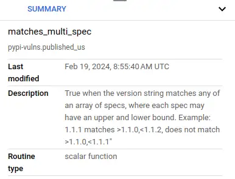
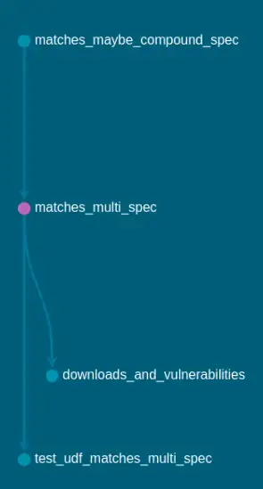

---

## Update August 2025

I've extended this approach to also cover user-defined aggregate functions (UDAFs) and stored procedures. Read more in [the next post in the series](../2025-08-04-udafs-stored-procedures-and-more-in-dbt/index.md).

---

As part of my work on the PyPI downloads dataset, I needed a way of matching package versions to vulnerability report ranges. I didn't find a solution I trusted, so I implemented a solution from spec with decent test coverage and CI/CD automation in user defined functions (UDFs). This post covers a novel approach to incorporate UDFs into the dbt ecosystem that is working really well for me - treating UDFs as dbt models with custom materialization.

--8<-- "ee.md"

<!-- more -->

I first wrote on the subject of UDFs in a DBT [back in March 2022](https://www.equalexperts.com/blog/our-thinking/testing-and-deploying-udfs-with-dbt/), after finding discourse on the subject but a lack of good, easily consumed answers. According to Google Search Console, it's been in the top three pieces of content on [equalexperts.com](https://equalexperts.com) in terms of search performance ever since (which I take great pride in, given the wealth of awesome content by amazing folks on there). I take that as evidence there's still demand for a good solution, given that folks are still searching and engaging with that post.

## What Does Good Look Like?

I'll quick define what how I'd like to interact with UDFs in dbt, in my personal order of importance:

1. my UDFs get automatically deployed when I use the dbt commands that deploy my models like `dbt run`, `dbt build`
2. I can test my UDFs as part of `dbt build` and `dbt test`
3. I can `ref` my UDFs in my models as I would any other dbt object, and dbt translates that into the correct database, schema and name
4. I can apply descriptions to my UDFs that appear in the data warehouse
5. I can `select` and `exclude` my UDFs when I use any dbt command
6. dbt docs includes my UDFs
7. UDFs deploy concurrently with the rest of the graph

My prior solution solved (1), (2) and (4). I worked around (3) by manually interpolating with `target.schema` to get the right schema as I moved between environments. (7) was a fail because my UDF deploy happened in an `on-run-start` hook, which blocked everything until it was done, and strongly incentivised one script with all the UDFs defined in it. The others were but a dream!

## UDF Models

Something occurred to me. I often think of and describe dbt as "Terraform for the data warehouse". That got me thinking about model materialization in a more general sense of deploying database objects, rather than deploying tables and views.

UDFs as a model, with a matching custom materialization, gives me everything I wanted. Instead of defining a UDF like this: [`macros/ensure_udfs.sql`](https://github.com/brabster/pypi_vulnerabilities/blob/dae99822156d4b89146d2595df37027c0c1e54a6/macros/ensure_udfs.sql#L108)
```sql


...lots of other UDFs here...

CREATE OR REPLACE FUNCTION {{ target.schema }}.matches_multi_spec(specs ARRAY<STRING>, version STRING)
RETURNS BOOL
OPTIONS (description='True when the version string matches any of an array of specs, where each spec may have an upper and lower bound. Example: 1.1.1 matches >1.1.0,<1.1.2, does not match >1.1.0,<1.1.1')
AS (
  EXISTS (SELECT 1 FROM UNNEST(specs) spec WHERE {{ target.schema }}.matches_maybe_compound_spec(spec, version))
);

...some more here...


```

I can now define it like this: [`models/published/udfs/matches_multi_spec.sql`](https://github.com/brabster/pypi_vulnerabilities/blob/171dd55d9f4bc2bfab2f403ade325eb82297bef3/models/published/udfs/matches_multi_spec.sql)

```sql
{{ config(
    materialized='udf',
    parameter_list='specs ARRAY<STRING>, version STRING',
    returns='BOOL',
    description='True when the version string matches any of an array of specs, where each spec may have an upper and lower bound. Example: 1.1.1 matches >1.1.0,<1.1.2, does not match >1.1.0,<1.1.1"'
) }}

EXISTS (SELECT 1 FROM UNNEST(specs) spec WHERE {{ ref('matches_maybe_compound_spec') }}(spec, version))
```

It may not look that different (if you ignore the fact that the first one is line 108 of a big mess of SQL wrapped in a macro) but it has a huge impact on how this UDF interacts with dbt. dbt now knows that this bit of SQL is associated with a node in its graph.

Ref-ing is now possible.

- Before: `{{ target.schema }}.matches_multi_spec(specs, package_version) actual`
- After: `{{ ref('matches_multi_spec') }}(specs, package_version) actual`

That means dbt knows what depends on this macro - and what it depends on, as I can now `ref` one macro from another. That fact solves all seven points on my wishlist. I'll take them in an order that suits the evidence.

Here's a snippet from yesterday's GitHub actions run - the workflow just ran `dbt build`.

<figure markdown="span">
  
  <figcaption>GitHub actions workflow log showing the sequence of actions dbt took after dbt build</figcaption>
</figure>

### Do my UDFs get automatically deployed when I use the dbt commands that deploy my models like `dbt run`, `dbt build`?
Yes.

### Do UDFs deploy concurrently with the rest of the graph?
Yes, I have 8 threads in this deployment and you can see udf models deploying alongside view models.

### Can I test my UDFs as part of `dbt build` and `dbt test`?
Yes, I have unit tests defined for every macro and you can see dbt executing them concurrently in the build as their dependencies become satisfied.

### Can I `ref` my UDFs in my models as I would any other dbt object, and dbt translates that into the correct database, schema and name?
Yes, the effects of those refs allow dbt to run the udf deployments and tests alongside the other operations it needs to.

### Can I apply descriptions to my UDFs that appear in the data warehouse?
Yes, here's a screenshot from BigQuery taking advantage of the new BigQuery Studio improved UI.

<figure markdown="span">
  
  <figcaption>The matches_multi_spec UDF in BigQuery console, showing the metadata available including the description I provided</figcaption>
</figure>

### Can I `select` and `exclude` my UDFs when I use any dbt command?
Yes, you can select them like any other model.

### Do dbt docs include my UDFs?
Yes, including correct dependencies in the graph

<div class="grid cards" markdown>
-  dbt docs representation of the UDF
-  dbt docs lineage graph for the udf, showing the udf it depends on and where it it used
</div>

### Do UDFs deploy concurrently with the rest of the graph?
Yes, plenty of evidence for that provided already.

## How It Works

dbt supports custom materializations - there's a [walkthrough](https://docs.getdbt.com/guides/create-new-materializations?step=1) of how to do it. It provides a way of hooking into the dbt model-and-config mechanism. `view`, `table` and `incremental` are the core materialized implementations and they combine SQL with some configuration. SQL-based UDFs work easily with this model - they are just SQL and config.

I moved the implementation of the custom materialization into its own repository, to prove that it worked as a git-sourced package and to have a clean standalone implementation to demo. The materialization template is [dbt_materialized_udf/macros/materializations/udf.sql](https://github.com/brabster/dbt_materialized_udf/blob/f54b2266abeaf788cf7a350f0f0678020d9dedbf/macros/materializations/udf.sql). This is the cleanest, simplest thing that works for me and I haven't invested in any test coverage or such like at this point.

Right now, it looks like this:

```jinja








CREATE OR REPLACE FUNCTION {{ target }}({{ parameter_list }})
RETURNS {{ ret }}
OPTIONS (
  description='{{ description }}'
)
AS (
  {{ sql }}
);



  {{ create_sql }}


{{ return({'relations': []}) }}


```

That's it. Grab some config, build a single SQL statement, run it and you're good. Because UDFs are stateless, the deployment part is really easy - `CREATE OR REPLACE` all the way. Don't need to worrry about `DROP` as dbt doesn't tidy up things that you move or remove anyway. I'll cover my solution for that in a future post, but it's independent of UDF materializations.

The criticism I can maybe see coming is that the other materializations are interchangeable, but you can't swap a UDF for a view. I wouldn't be too concerned by that. Each existing materialization has its own config settings that don't work with the others, so they're not exactly drop-in replacements. I also can't really see a scenario where someone would attempt to alter the materialization from, say, a view to a UDF and expect something sensible to happen, other than an error which they would get with this approach.

Perhaps I'm weird but like I said earlier, I think of dbt as being like Terraform for my data warehouse rather than a weird data thing. With that in mind, "materialization" as a more general concept that covers making types of database concept material **other** than just relations seems quite reasonable and powerful to me - particularly if it helps folks out.

 `¯\_(ツ)_/¯`

## What's Next

UDF nirvana in dbt, obviously.

You can see an example of the changes I made to update the `pypi-vulnerabilities` project to use this new way of doing UDFs [in this PR](https://github.com/brabster/pypi_vulnerabilities/pull/10/files). This approach is currently used in my "production" deployment and I've had no issues with it.

I've split out my experimental and BigQuery-specific materialization into a separate repo [here](https://github.com/brabster/dbt_materialized_udf), so you can have a play with it without having to copy-and-paste. Be aware that right now, I have labelled it experimental and, whilst I'm happy to look at issues and PRs, I provide no warranty or expectation of support - your use of this repo directly in real applications is at your own risk. I've shared this solution on the dbt slack and in a couple of (closed stale, so I missed them until I went looking knowing what I was looking for!) issue threads. If anything useful comes out of that, I'll update here.

I did try the same custom materialization trick with schemas/datasets, and it didn't go so well. I'll try and put a writeup together about that soon.

I'll flag up this work to dbt labs, now I've written it up, and see if they can take anything useful from it forward into dbt. Just sayin' as part of my investigations I found there's at least one dataform user who thinks [decent UDF support might be a discriminator between dbt and dataform](https://github.com/dataform-co/dataform/issues/1289)!
