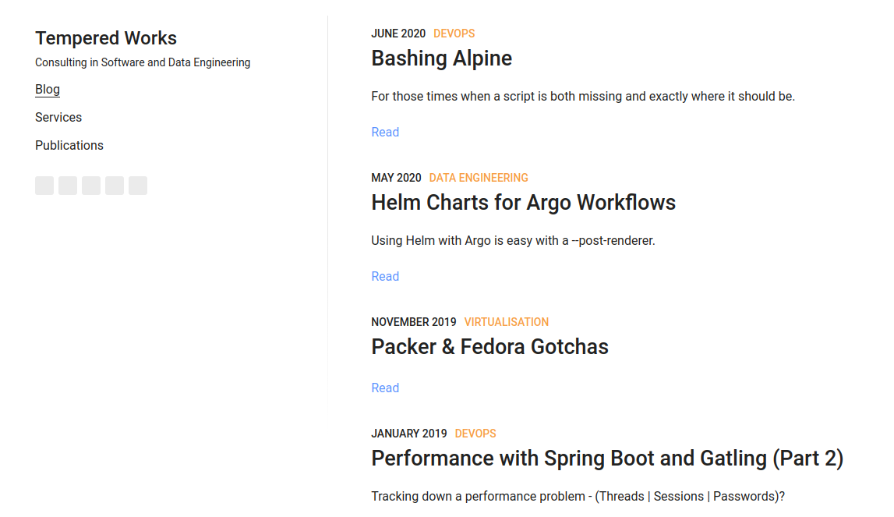
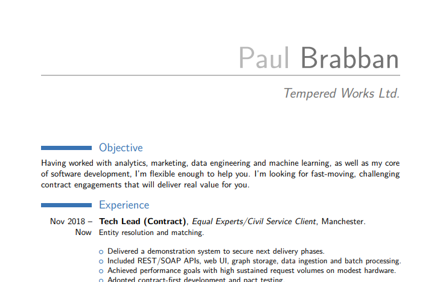
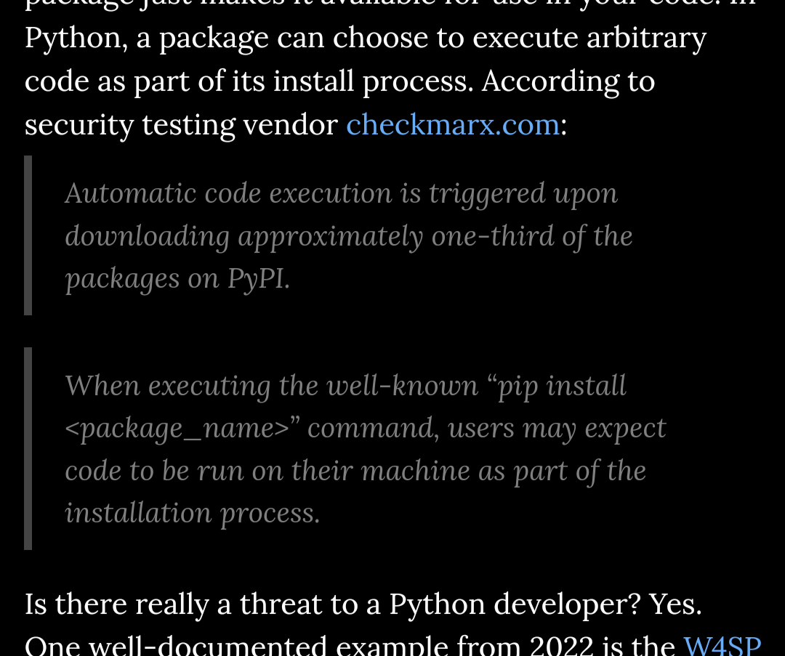
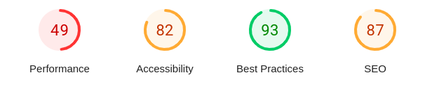
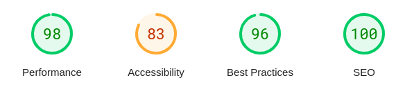

I started with a [custom Gatsby site](../2018-08-19-setting-up-a-gatsby-site/index.md), then switched to Hugo (which I didn't write about). Last weekend, I switched again to mkdocs. Am I addicted to fiddling and changing stuff? Well, maybe... but each of those changes happened because of problems or concerns I had. I hope that mkdocs and mkdocs-material will be my home for a while. Pull up a seat and let's take a look at how and why I ended up here.

<!-- more -->

[Gatsby](#starting-with-gatsby) gave me too much flexibility and work to do, which wasn't a good investment for me. [Hugo with beautifulhugo](#hugo-and-beautifulhugo) theme was a pain in places to get working how I wanted it to, and I saw some accessibility problems. I was unconvinced it was well supported. [mkdocs-material](#mkdocs-and-mkdocs-material) has provided a relatively simple and effective experience so far and the pagespeed numbers speak for themselves. The way the sponsorship support model is put together gives me confidence for the future.

## Starting with Gatsby

<figure markdown="span">
  
  <figcaption>tempered.works in 2020, thanks to the Internet Archive Wayback machine</figcaption>
</figure>

The first original post on this blog covered my original [Gatsby site](../2018-08-19-setting-up-a-gatsby-site/index.md).
The repo for that site is [here](https://github.com/brabster/tw-site).
It was an interesting place to start but was quite complex and needed up-to-date front-end skills to set up.
It also gave me the flexibility to do whatever I wanted.
That might sound like a good thing, but after a while, I realised I was spending more time fiddling with the technology than writing content.

I'm not a professional frontend person - my skills are passable at best, good enough to put together basic internal web-based user interfaces at a push.
I decided that it wasn't a good use of my time to fiddle with front-end tech, and wanted to use something more purpose-built for what I wanted.

What did I want? The Gatsby exercise helped me figure that out.

- somewhere to put my portfolio and company details
- somewhere to host my LaTeX-based CV as a PDF
- a blog, supporting things like syntax highlighting
- a markdown and git-based workflow
- a clean and accessible look and feel, that provides a good experience to a visitor
- no tracking, just server-side traffic metrics to see what was being used and any problems related to URLs

### Sorting the CV

It became clear that my CV didn't work as part of the site build process.
I've had the same basic setup for a long time now - it's a LaTeX document that uses a `moderncv` template.
There's a bunch of dependencies needed to build it and they're nothing to do with my site tech.

<figure markdown="span">
  
  <figcaption>My out-of-date CV, built from its own repo and a Travis CI pipeline to handle the weird and wonderful LaTeX dependencies</figcaption>
</figure>

Eventually, I realised that the obvious thing to do was to put my CV in [its own repository](https://github.com/brabster/tw-site-md) with its own build pipeline.
A side-effect of this approach that I appreciate more these days is that I don't have to install weird and wonderful dependencies on this laptop
to build it. I'll work in a PR and let the hardened environment on the build runner handle my trust issues, thank you.

The update/build process for my CV is independent of my website but that's not turned out to be an issue so far.
It's a bit out of date but easy enough to update as the need arises. As I'm a permie for [Equal Experts](https://equalexperts.com) these days it's not a priority right now!

## Hugo and beautifulhugo

I'd been using [Hugo](https://gohugo.io/)-based static sites with clients for documentation sites supporting automatic docs generation and publishing workflows.
The experience looked like it'd tick more of the things I wanted than my Gatsby experience so I thought I'd give it a go. There are lots of themes to choose from, and I went with [beautifulhugo](https://themes.gohugo.io/themes/beautifulhugo/), a minimalist clean-looking theme that gave me a blog and content pages. My earliest commits on the [repo](https://github.com/brabster/tw-site-hugo) go back to Nov 2020, so it's lasted me over three years. Why did I switch?

I think there were three main reasons, in no particular order.
The theme was dark when I viewed it on my phone, and under that theme, some elements like blockquotes were hard to read.

<figure markdown="span">
  
  <figcaption>beautifulhugo blockquotes, hard to read on my mobile device</figcaption>
</figure>

I never figured out under what circumstances it was dark, but I was not happy with the idea that someone who'd taken the time to try and read a post might have problems doing so.

Next, I had a hard time with [Hugo's programming model](https://gohugo.io/templates/introduction/), and I found myself having to dip in to create shortcodes covering things I do frequently. I felt like I was having to think too hard about basic things like figures, and it was pulling the content away from plain markdown. There were also some theme-related challenges in getting highlighting and other features to work properly - all distractions from actually creating content.

That leads to the third problem - my chosen theme didn't feel very well supported. There are currently [93 issues and 31 PRs outstanding](https://github.com/halogenica/beautifulhugo), with no activity in the last 30 days. I suspect it's someone's enthusiastic side project that turned out to be a lot of work. An example of a more general problem in our industry perhaps, is that we don't really differentiate between sharing a hobby project and offering a product.

Time to look elsewhere. Since 2020, I've worked with new teams who instead used [mkdocs](https://www.mkdocs.org/) - but there's a more fundamental difference than just the underlying framework, that gives me confidence that this switch should see me good for a while.

## mkdocs and mkdocs-material

[mkdocs](https://www.mkdocs.org/) is a pretty lean framework. The capabilities are basic, extended by [plugins](https://www.mkdocs.org/dev-guide/plugins/). What convinced me to switch was the [mkdocs-material](https://squidfunk.github.io/mkdocs-material/) theme.

> Write your documentation in Markdown and create a professional static site in minutes – searchable, customizable, in 60+ languages, for all devices.

It's incredibly fully-featured, doing everything I wanted pretty much out of the box. Everything just seems sensible and works as I'd expect right away. It took me a few hours last weekend from creating the new repository to swapping the domain name over. Every time I needed to find out how to do something, I just searched the documentation and there was the answer.

As you read around the docs, you see references to ["Insiders"](https://squidfunk.github.io/mkdocs-material/insiders/?h=insider#what-is-insiders). As a sponsor, you get early access to new features and access to a few features that aren't available to free users. The restricted features are well-chosen in my opinion - they're quality of life and efficiency stuff. The one I wanted to get my hands on was [the meta plugin](https://squidfunk.github.io/mkdocs-material/plugins/meta/?h=meta) which allows me to apply metadata to everything under a directory. I use it to attribute all my blog content to my author profile, without having to name myself in every post.

The ease of use is one way the approach shines. Another is the technical quality of the work. Let's take a look at pagespeed metrics for my old Hugo site versus my new mkdocs-material site.

<figure markdown="span">
  
  <figcaption>beautifulhugo mobile site pagespeed metrics; performance 49, accessibility 82, best practices 93, SEO 87</figcaption>
</figure>

<figure markdown="span">
  
  <figcaption>mkdocs-material mobile site pagespeed metrics; performance 98, accessibility 83, best practices 96, SEO 100</figcaption>
</figure>

A significant improvement - the worst issue pagespeed highlights is my images not being well-optimised. mkdocs-material provides an [optimize plugin](https://squidfunk.github.io/mkdocs-material/plugins/optimize/) to automatically take care of that but I've not decided if or how to integrate it and its dependencies into the workflow yet.

There's an interesting aspect there. mkdocs-material provides its own plugins for some optional features and mentions (recommends?) specific third-party plugins (like the glightbox or RSS plugins) for others. It feels like the author is taking some responsibility for the availability and safety of those third-party plugins. I'm not sure whether this is really the case, maybe I'll shoot a query over.

I'm very happy to sign up for $15 per month to support this brilliant effort. The project is currently funded to the tune of nearly $15k/month! I appreciate the effort Martin has put into explaining the funding and support model, and it gives me the confidence to hand over my cash - in exchange for a supported product, not for someone to pursue their hobby project.
