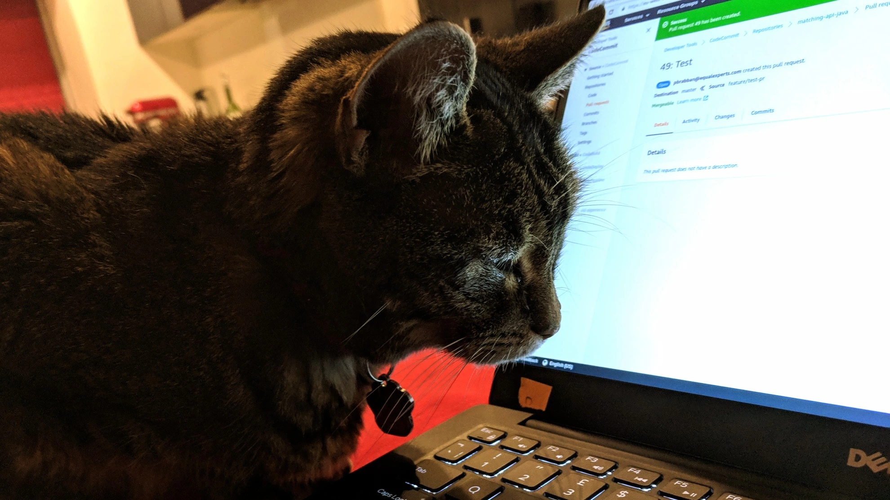

When I wrote about [dangerous advice about installing Python packages last week](../2024-03-23-irresponsible-expertise-install-python-package/index.md), I was curious about the dangers of `setup.py`. How is it exploited? What is the Python community doing to prevent this abuse? What would happen if `setup.py` were neutralised?

<!-- more -->

## Abusing `setup.py`

I started with ["Six Malicious Python Packages in the PyPI Targeting Windows Users"](https://unit42.paloaltonetworks.com/malicious-packages-in-pypi/) from Palo Alto Networks. This article is detailed but approachable and works through exploit code with explanations of what's going on. There are no section headers I can link to but I found the "Malicious Code" section most useful.

I've never created a Python package, so I thought I'd have a go. I want to understand better how the approach works and what it looks like to attackers and victims. Source code for the package is available in [GitHub brabster/blog-setup-py](https://github.com/brabster/blog-setup-py).

## A "Malicious" Package in setup.py

The repo contains a package with some print statements to simulate malicious code. First up, the infamous [setup.py](https://github.com/brabster/blog-setup-py/blob/main/package/setup.py):

```python title="setup.py" hl_lines="3"
from setuptools import setup

print("Hello, I'm malicious in setup.py") # (1)

setup(
    name="demo-package",
    version="1.0.0",
    package_dir = {"": "src"}
)
```

1. if I can run a print statement, I can talk to the internet, read and write the local filesystem, execute OS calls etc.

If I `cd` into the package directory and run `python -m build --sdist` to build a source distribution, I see a final line in the output:

`Successfully built demo-package-1.0.0.tar.gz`

To install this package locally, I can use this tarball. `cd ../victim` to become the victim who will install, activate the `venv` and use `pip install`. I'll add `--force-reinstall` to prevent any use of previously-cached versions of the package.

```console title="pip install: no malicious output"
$ pip install --force-reinstall ../package/dist/demo-package-1.0.0.tar.gz
Processing /home/paul/projects/brabster/example_package_brabster/package/dist/demo-package-1.0.0.tar.gz
  Installing build dependencies ... done
  Getting requirements to build wheel ... done
  Installing backend dependencies ... done
  Preparing metadata (pyproject.toml) ... done
Building wheels for collected packages: demo-package
  Building wheel for demo-package (pyproject.toml) ... done
  Created wheel for demo-package: filename=demo_package-1.0.0-py3-none-any.whl size=1398 sha256=ba903e2c4386ffd626d204ee6129dfebf793738efe85afbbad8806ebf5e06838
  Stored in directory: /home/paul/.cache/pip/wheels/b9/b8/6c/0a18813c919677d4ed10c57f8b8d9fc45674336576166c28f8
Successfully built demo-package
Installing collected packages: demo-package
  Attempting uninstall: demo-package
    Found existing installation: demo-package 1.0.0
    Uninstalling demo-package-1.0.0:
      Successfully uninstalled demo-package-1.0.0
Successfully installed demo-package-1.0.0
```
Wait, what? I don't see `Hello, I'm malicious in setup.py` anywhere! Maybe `setup.py` didn't run? Turns out there's a flag we need:

```console title="pip install -v: there you are" hl_lines="12"
$ pip install -v --force-reinstall ../package/dist/demo-package-1.0.0.tar.gz
Using pip 24.0 from /home/paul/projects/brabster/example_package_brabster/victim/venv/lib/python3.11/site-packages/pip (python 3.11)
Processing /home/paul/projects/brabster/example_package_brabster/package/dist/demo-package-1.0.0.tar.gz
  Running command pip subprocess to install build dependencies
  Collecting setuptools>=43.0.0
    Using cached setuptools-69.2.0-py3-none-any.whl.metadata (6.3 kB)
  Using cached setuptools-69.2.0-py3-none-any.whl (821 kB)
  Installing collected packages: setuptools
  Successfully installed setuptools-69.2.0
  Installing build dependencies ... done
  Running command Getting requirements to build wheel
  Hello, I'm malicious in setup.py
  running egg_info
  writing src/demo_package.egg-info/PKG-INFO
```

Aha. Looks like `pip install` hides print output from the package by default. `setup.py` was running all along.

## Wheel Build & Install

What happens if we use the more modern `wheel` approach? After cleaning out the `dist` directory, I build the package with: `python -m build --wheel`...

`Successfully built demo_package-1.0.0-py3-none-any.whl`

Flipping to the victim and installing:

```console title="pip install wheel"
$ pip install -v --force-reinstall ../package/dist/demo_package-1.0.0-py3-none-any.whl
Using pip 24.0 from /home/paul/projects/brabster/example_package_brabster/victim/venv/lib/python3.11/site-packages/pip (python 3.11)
Processing /home/paul/projects/brabster/example_package_brabster/package/dist/demo_package-1.0.0-py3-none-any.whl
Installing collected packages: demo-package
  Attempting uninstall: demo-package
    Found existing installation: demo-package 1.0.0
    Uninstalling demo-package-1.0.0:
      Removing file or directory /home/paul/projects/brabster/example_package_brabster/victim/venv/lib/python3.11/site-packages/demo_package-1.0.0.dist-info/
      Removing file or directory /home/paul/projects/brabster/example_package_brabster/victim/venv/lib/python3.11/site-packages/mypackage/
      Successfully uninstalled demo-package-1.0.0
Successfully installed demo-package-1.0.0
```

Hmm. As expected, nothing apparently untoward happened there even with the verbose flag set. Are we all good then?

## A World Without `setup.py`

So why doesn't pip just stop installing source distributions, preventing this execute-code-on-install behaviour? The community certainly seems to be looking at that. I found and commented on [Speculative: --only-binary by default?](https://github.com/pypa/pip/issues/9140), then found a long piece by a Python core developer entitled [Why you shouldn't invoke setup.py directly](https://blog.ganssle.io/articles/2021/10/setup-py-deprecated.html) from 2021. That predates the security concerns around `setup.py` that I've seen, but does talk a little about why things are this way:

> For several years I've been telling people not to use setup.py and frequently people are confused as to why so much of setuptools is effectively deprecated, but there are no warnings anywhere, and this policy is not officially documented. This is a genuine failing of the project and hopefully at some point this section of the article will be obsolete because all direct setup.py invocations will come with some sort of warning or will have been removed, but I can at least try to explain why doing so is a bit trickier than it seems

Back to the security story. What if we set the default behaviour of pip to refuse source distributions and require the user to explicitly accept the risk with a command line flag or environment variable? Would that prevent abuse? I don't think so. [My own limited research into popular advice given to beginners](../2024-03-23-irresponsible-expertise-install-python-package/index.md) suggests that by default we'll just see a bunch of tutorial material telling users to pass whatever flags are needed to disable the more secure behaviour without explanation in the name of convenience.

## No Silver Bullet

In my opinion, disabling that behaviour is more a step in the right direction than a solution. Remember that `wheel` distribution I installed a few paragraphs ago? Well, let's start up the Python repl and import that package:

```python title="importing the malicious wheel" hl_lines="5"
$ python
Python 3.11.8 (main, Mar 19 2024, 15:01:47) [GCC 13.2.0] on linux
Type "help", "copyright", "credits" or "license" for more information.
>>> from mypackage import example
Hello, I'm malicious in module example
>>> 
```

I don't see any reason I can't put the same exploit in the package so that it runs when you import it instead of on installation. It's not clear to me why the package install point would be more vulnerable.

```python title="content of src/mypackage/example.py" hl_lines="1"
print("Hello, I'm malicious in module example")

def add_one(number):
    return number + 1
```

That's not to say it wouldn't be worth preventing the execute-on-install behaviour. If you were a malicious actor, why wouldn't you set up your exploit so that you caught your victim as soon as they installed your package instead of waiting until they used it?

Raising the bar might help - but I don't think it's a silver bullet.