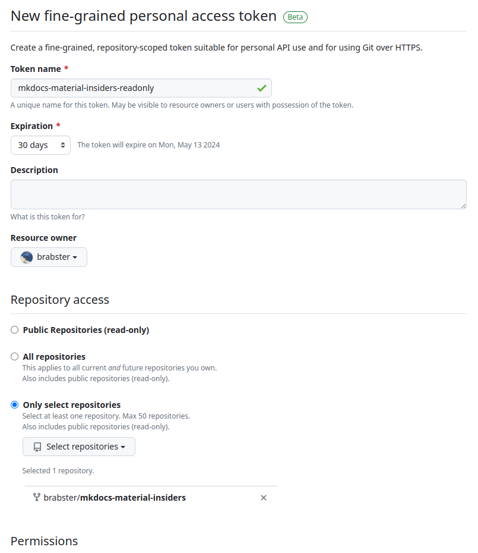
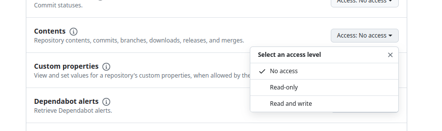

`mkdocs-material-insiders` is the version of `mkdocs-material` with extra sponsor-only features. I wanted to use some of those features, but I didn't like the risk of GitHub classic personal access tokens. I'll describe how fine-grained access tokens, currently in beta, mitigate the risk and how I set up to use them for local development and in CI. The solution works, because that's how I wrote and published this post!

<!-- more -->

## The Insiders Problem

Sponsors of [mkdocs-material](https://squidfunk.github.io/mkdocs-material) get access to the private [mkdocs-material-insiders](https://squidfunk.github.io/mkdocs-material/insiders/) version, which has a few neat value-add features. The setup instructions are clear and easy to follow, but they describe using a ["classic" GitHub personal access token (PAT)](https://docs.github.com/en/authentication/keeping-your-account-and-data-secure/managing-your-personal-access-tokens#personal-access-tokens-classic) to enable installation of the insiders package for local dev and automation.

As GitHub says, these tokens have some security problems being very broad in their scope. There's no way to limit the token to grant access to **just** the specific private Insiders repo, so they represent a risk to all my repositories and those of other organisations I have access to. If one were to get stolen... ouch! Not really a risk I can justify to build my little blog.

The shiny new beta [fine-grained PATs](https://docs.github.com/en/authentication/keeping-your-account-and-data-secure/managing-your-personal-access-tokens#fine-grained-personal-access-tokens), on the other hand, let you control the scope down to specific permissions on specific repos. Awesome, just what we need, right? Not so fast. You can't use them as an outside collaborator on a repo, so no good for read access to the Insiders repo. When you try to set up a fine-grained token, you can't select the `mkdocs-material-insiders` repo because you can only select repos you own.

## The Solution

Yes, I know it's obvious. Fork the insiders repo, dummy! It certainly is a bit more involved, so I'll outline the steps I took here for reference.

### Fork mkdocs-material-insiders

Hit the fork button. It took a while but worked fine, so don't worry if it stalls for a minute or two. That will give you your own private copy of mkdocs-material-insiders, which you **can** create a fine-grained PAT for. Let's do that next.

### Create Fine-Grained PAT

You'll find access tokens under `Settings -> Developer Settings -> Personal access tokens -> Fine-grained tokens` - here's a [link straight there](https://github.com/settings/personal-access-tokens/new). Fill in some details and you'll find your fork available in the repo list for your account.

<figure markdown="span">
  
  <figcaption>Screenshot of GitHub access token settings, with the forked repo selected</figcaption>
</figure>

You then specify the permissions you want the token to have. Read access to repo contents is all that's needed.

<figure markdown="span">
  
  <figcaption>Screenshot of GitHub access token settings, showing the contents read permission required</figcaption>
</figure>

Hit generate token, and you'll get a token back. You'll need to copy it ready for the next step.

<figure markdown="span">
  
  <figcaption>Screenshot of GitHub access token value, deleted straight after the screenshot!</figcaption>
</figure>

### Use the Fine-Grained Token

How you do this will vary depending on how you operate your dev and CI environments.
I'll refer you back to the [Insiders getting started documentation] here, with the following edits:

- your fine-grained token is a drop-in replacement for the classic token and will work where the docs refer to `GH_TOKEN`
- you need to update the repo to your fork, so `squidfunk/mkdocs-material-insiders` to `your-account/mkdocs-material-insiders`

For example, my local pip dependency becomes `git+https://${GH_TOKEN}@github.com/brabster/mkdocs-material-insiders.git`

## Updating the Fork

Hopefully, the limitation where you can't create a fine-grained PAT for a repo you don't own will be lifted at some point, and the need to fork will go away. In the meantime, there's the matter of updates to think about.

By default, your fork will fall behind the upstream insiders build. On your fork, you'll see an option to sync, which you can hit to catch up as needed. GitHub docs with sync options are [here](https://docs.github.com/en/pull-requests/collaborating-with-pull-requests/working-with-forks/syncing-a-fork). There are options to sync automatically, some examples in these [Stackoverflow answers](https://stackoverflow.com/questions/23793062/can-forks-be-synced-automatically-in-github).

I'm deeply lazy and I like being up to date a great deal, so I'll probably automate it... but that's something for another day!