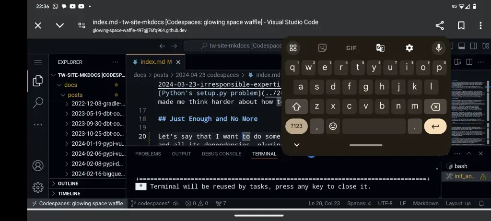
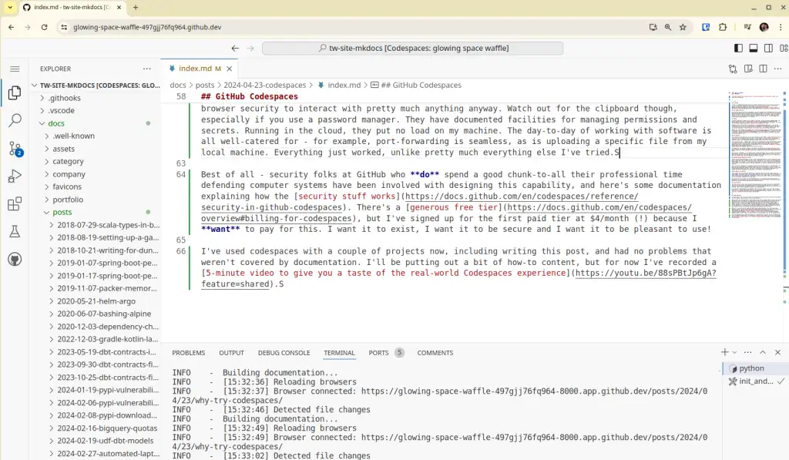

Why I've been trialling GitHub Codespaces as a more secure alternative to local development. I never expected to be pushing changes from my phone!

--8<-- "ee.md"

<!-- more -->

## The Problem

To date, I've worked with software projects by cloning a repository onto my local machine to work with it. I've felt increasingly uncomfortable over the past few years with what this implies - running other people's software on my computer and trusting that it won't do bad things. My recent posts on [irresponsible expertise](../2024-03-23-irresponsible-expertise-install-python-package/index.md) and [Python's setup.py problem](../2024-03-31-exploring-setup-py/index.md) have made me think harder about how to mitigate those risks.

## Just Enough and No More

Let's say that I want to do some work on a repository. I want that software and all its dependencies, plugins, IDE extensions and whatever other weird and wonderful gubbins are involved to have access to just what's needed to work on the software and no more. Running locally as I have been, that's certainly not the case. Any one of those things being compromised could get access to any credentials lying around on my disk, my browser's stored passwords, credentials for any sites I'm currently logged into, and probably even my password manager if it's unlocked. Anything I can see and do, it can see and do by default too.

## Risky Examples

A couple of weeks ago, I wanted to fix my website's RSS plugin. It was incorrectly rendering images, and that was messing up my content on [Equal Experts' Network Blogs page](https://www.equalexperts.com/network-blogs/). The plugin is [mkdocs-rss-plugin](https://github.com/Guts/mkdocs-rss-plugin), so I cloned the repo and followed the instructions to get set to write code and run tests.

Immediately after running `python -m pip install -U -r requirements/development.txt`, as the stream of package installations flew by, I realised that anything nasty in that code or its sprawling network dependencies could have compromised me. By the time I'd thought about it, it would have been too late. (To be clear - I was working on my own laptop rather than the one my employer or my client gave me, so the blast radius was relatively restricted).

Another example - after reading [this LinkedIn post on how the recruitment "tech test" process can be an attack vector](https://www.linkedin.com/feed/update/urn:li:activity:7178644736809836544/), it occurred to me that a "candidate" could pull the same trick **returning** a tech test for review. I've reviewed tech tests in the past and it got me thinking. Even with some defences, like running stuff in containers, I still felt pretty uneasy about the risk.

To be clear - we're not talking about one or two dependencies either. The `requirements.txt` for this site's repo has only three dependencies in it. How many dependencies get installed to `mkdocs serve` this site?

```bash
(venv) @brabster ➜ /workspaces/tw-site-mkdocs (codespaces) $ pip freeze|wc -l
53
```

Fifty-three packages get installed. Who maintains them? What are their motivations? How burnt out and susceptible to an offer of "help" or to take over their package are they all feeling? I know a little about how one of those packages is run, beyond that I have no idea.

Now maybe you're not so concerned. What are the chances something bad will happen to you? How bad would it be? I can't say. My take is simply that if something bad happened and there was something reasonable I knew about and could have done to prevent it... I'd rather not be in that position. The potential impact feels like it far outweighs the risk, so I've been looking for reasonable mitigations.

## Local Defenses?

After spending far too many hours over the years listening to [Steve Gibson's awesome Security Now podcast](https://twit.tv/shows/security-now) (five stars, would recommend), I think my level of paranoia has increased to where it probably should have been all along. There have been some astonishingly inventive and dangerous attacks, often subsequently commoditized and delivered "as-a-service" covered there.

How to stay secure? It's a laughably unfair fight. I have to defend against every possible attack, whereas the attacker only needs to find one chink in the armour. [Qubes](https://www.qubes-os.org/)? Containers? [devcontainers](https://code.visualstudio.com/docs/devcontainers/containers)? VMs? [AppArmor](https://apparmor.net/)? None of these options is straightforward, and we know that [complexity is the enemy of security](https://www.goodreads.com/quotes/7441842-complexity-is-the-worst-enemy-of-security-and-our-systems).

For example, my first attempts a couple of weeks ago to use devcontainers to keep projects away from my local filesystem and services in VSCode met with failure because the extension seems [incompatible with a rootless docker (or rootless anything) install](https://github.com/microsoft/vscode-remote-release/issues/7354).

My day job isn't defending - it's solving problems and delivering value for clients. It's up to me how much time and effort I put into defence and both are limited. I've concluded that attackers, who have spent **their** professional lives attacking computer systems, are going to be way better at attacking than I could possibly be at defending. Any of these things I could try, making my own life more difficult, and still miss something that leaves me exposed.

## Operating System Architecture at Fault?

Consider my up-to-date Android phone. It has a fairly fine-grained permission system. Some app you install wants to read files? Use the camera? Get your location information? It has to ask, and I have consistent options beyond "yes" and "no" like "ask me each time". Even with this, I'm limited to what the permissions system supports - for example, I've not seen any evidence that I can grant an app access to only one file - or make it ask me every time it wants to talk over the network. So I'm still running with more risk than I would like.

Why is it so hard to partition up a single-user machine like my personal laptop? I think the problem lies with the roots and architecture of operating systems. My Linux OS is essentially a multi-user server operating system that has been tweaked to make it more usable as an end-user device. The basic security model is about separating admins from users, and users from one another. Partitioning one application from another and the surrounding user environment isn't something it was designed to do.

## Admin Rights to the Rescue?

I've certainly come across folks who are of the opinion that the risk with software comes from "admin rights". If you don't install it with admin rights it's fine, right? I work from the assumption that **any software that's on my laptop can do anything I can do** on this laptop. I don't think there's much more harm you can do with admin rights than you can do as me.

> Oh, and no, I don't run as admin, and I have neutered sudo to comply with Cyber Essentials. I talked about the hows and whys in my post about [automating my laptop build](https://tempered.works/posts/2024/03/02/living-with-an-automated-laptop-build/#cyber-essentials).

## Virtual Machines

With that in mind, the most robust local partitioning strategy I can think of locally is Virtual Machines. Ignoring [VM escapes](https://en.wikipedia.org/wiki/Virtual_machine_escape) that seems to completely partition off the VM from my user-level resources. I've used VMs before and they are not very convenient to work with. There are some UX challenges and they're pretty resource-heavy.

I can solve the resource heaviness by putting the VM in the cloud. I spent a fair bit of time setting up AWS Workspaces - commoditised virtual desktops in the AWS cloud a couple of years ago - here's a [video series on the workspaces setup](https://youtu.be/rf8moSkS0U4?feature=shared). There was a lot of work to do to get set up and the result was deeply underwhelming in terms of user experience.

## GitHub Codespaces

My experience over the past couple of weeks with [GitHub Codespaces](https://docs.github.com/en/codespaces/overview) suggests they pretty much solve all these problems.

<figure markdown="span">
 
 <figcaption>Screenshot of this blog post being written in a Codespaces browser window</figcaption>
</figure>

### Important Benefits

- They are VMs in the cloud, but they're purpose-built to work from a repository and run an IDE.
- They use the devcontainers spec with extensions to reproducibly provision an appropriately set up environment for the particular project I'm working on.
- They have access to nothing on my local machine.
- The web-based version relies on browser security, but I rely on that to interact with all the stuff I'd want to protect anyway.
- They have documented facilities for managing permissions and secrets.
- Running in the cloud, they put no load on my machine.
- They're pretty cost-effective, free unless you're using them over a hundred hours a month.
- They're integrated with a git-based workflow, handling branching and merging nicely.
- They automatically stop when you're not using them.
- They are automatically deleted after a certain period of inactivity, 30 days by default.

> I really like that last one. A growing concern for me was the proliferation of repositories that I'd cloned, installed dependencies and then stopped using and essentially forgotten about on my computer. Nothing ever updated those little stacks of software or checked them to alert for vulnerabilities. At least my "wipe and start again every six months" approach meant there was a brutal upper limit on how old they could be. How many old directories do you have lying around your computer? How long has it been since they were last updated?

The day-to-day of working with software is all well-catered for - for example, port-forwarding is seamless, as is uploading a specific file from my local machine. Everything just worked, unlike pretty much everything else I've tried. They do support integration with local IDEs if I ever needed that - it does feel a bit less well-defined where the risks are in that case.

Best of all - security folks at GitHub who **do** spend a good chunk-to-all of their professional time defending computer systems have been involved with designing this capability, and here's some documentation explaining how the [security stuff works](https://docs.github.com/en/codespaces/reference/security-in-github-codespaces). There's a [generous free tier](https://docs.github.com/en/codespaces/overview#billing-for-codespaces), but I've signed up for the first paid tier at $4/month (!) because I **want** to pay for this. I want it to exist, I want it to be secure and I want it to be pleasant to use!

### Words of Warning

There are a couple of things I can think of that might cause problems. I'm lucky enough to have fast internet pretty much wherever I am. I don't think Codespaces would need particularly fast or high-bandwidth connectivity but I don't know. One remaining thing I'm not sure what to do about is access to the clipboard. It turns out that I copy-paste quite a lot in the IDE and I don't want to give a Codespace access to the single global clipboard on my laptop - you know, the one that I use with my password manager! That said, it's a huge step forward for THAT to be the one outstanding thing I'm concerned about!

## Alternatives

If you're not using GitHub you're not totally out of luck. I think [Gitpod](https://docs.gitlab.com/ee/integration/gitpod.html) is basically the same idea on GitLab, and I'm sure there are others.

## Bonus - IDE on your Phone

So I PR'd this post, went downstairs to make a cup of tea and noticed a typo whilst reviewing on my phone. Codespaces actually works and it's just about usable on my phone - certainly good enough to fix a typo and upload this screenshot.

<figure markdown="span">
 
 <figcaption>Screenshot of this blog post being written in a Codespaces browser window on my phone</figcaption>
</figure>

This obvious-in-hindsight discovery opens the possibility I gave up on years ago - taking my super small, light, convenient tablet and a little keyboard when I'm away from home and still being able to write software. Imagine...

## Wrapping

I've used codespaces with a couple of projects now, including writing this post, and had no problems that weren't covered by the documentation. I'll be putting out a bit of how-to content, but for now, I've recorded a [5-minute video to give you a taste of the real-world Codespaces experience](https://youtu.be/88sPBtJp6gA?feature=shared) for the short on time!

---
!!! question "Feedback"
    If you want to get in touch with me about the content in this post, you can find me on [LinkedIn](https://www.linkedin.com/in/paulbrabban) or [raise an issue](https://github.com/brabster/tw-site-mkdocs/issues)/[start a discussion](https://github.com/brabster/tw-site-mkdocs/discussions) in the GitHub repo. I'll be happy to credit you for any corrections or additions!