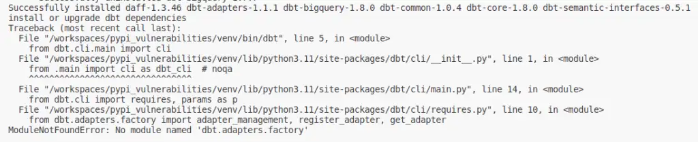

On updating dbt-bigquery to latest 1.8.0: **No module named 'dbt.adapters.factory'**

--8<-- "ee.md"

<!-- more -->

## Issue - dbt 1.8.0 won't run

I spun up a Codespace on [pypi_vulnerabilities](https://github.com/brabster/pypi_vulnerabilities) to resolve a failing build.
My auto-update ran as usual, updating all my Python dependencies to latest stable release and I got dbt-core 1.8.0, [now out of beta as of 2024-05-09](https://github.com/dbt-labs/dbt-core/releases/tag/v1.8.0).

The first thing my auto-update does that depends on dbt - install/update dbt packages - failed.

```console title="dbt 1.8.0 fails to run" hl_lines="13"
Successfully installed daff-1.3.46 dbt-adapters-1.1.1 dbt-bigquery-1.8.0 dbt-common-1.0.4 dbt-core-1.8.0 dbt-semantic-interfaces-0.5.1
install or upgrade dbt dependencies
Traceback (most recent call last):
  File "/workspaces/pypi_vulnerabilities/venv/bin/dbt", line 5, in <module>
    from dbt.cli.main import cli
  File "/workspaces/pypi_vulnerabilities/venv/lib/python3.11/site-packages/dbt/cli/__init__.py", line 1, in <module>
    from .main import cli as dbt_cli  # noqa
    ^^^^^^^^^^^^^^^^^^^^^^^^^^^^^^^^
  File "/workspaces/pypi_vulnerabilities/venv/lib/python3.11/site-packages/dbt/cli/main.py", line 14, in <module>
    from dbt.cli import requires, params as p
  File "/workspaces/pypi_vulnerabilities/venv/lib/python3.11/site-packages/dbt/cli/requires.py", line 10, in <module>
    from dbt.adapters.factory import adapter_management, register_adapter, get_adapter
ModuleNotFoundError: No module named 'dbt.adapters.factory'
```

## Clean Install to Fix

Clearing my `venv` and reinstalling from scratch gets things back up and running. Here's the specific procedure I used:

```session title="venv clear and reinit procedure" hl_lines="3 4 5 6"
$ deactivate # deactivate the venv, if active
$ rm -r venv # recursively delete the venv folder
$ python -m venv venv
$ . venv/bin/activate
$ pip install -U -r requirements.txt
$ dbt deps
```

> I actually ran my [init_and_update.sh](https://github.com/brabster/pypi_vulnerabilities/blob/c056bf3b2a4605a91526b27e0fb5ef93098e3fc4/.dev_scripts/init_and_update.sh) script rather than those highlighted lines, but those are the relevant things it does.

This also explains why my build wasn't breaking (well, not for this reason anyway) - it always starts from scratch.

## Changes in Adapter Dependencies

That's how you can fix the `No module named 'dbt.adapters.factory'` error if it comes up.
As I read the [v1.8 upgrade docs](https://docs.getdbt.com/docs/dbt-versions/core-upgrade/upgrading-to-v1.8) I also learned that dbt Labs intend to change the way Python adapter dependencies work.

> Beginning in v1.8, dbt-core and adapters are decoupled. Going forward, your installations should explicitly include both dbt-core and the desired adapter.

[Scanning through the related technical docs](https://github.com/dbt-labs/dbt-adapters/discussions/87), I think [the auto-update approach I use](../2024-05-01-how-i-do-python-supply-chain-security/index.md#updating-dependencies-automatically) will still work as intended without explicitly specifying the core dependency.

> Up to now adapters have been required release a new minor version to declare compatibility with dbt-core’s minor version. Post dbt-core version 1.8, adapters will not need to do this. Instead maintainers will need to declare their compatibility with dbt-adapters’ versions.

So, if you're **setting your adapter dependency with an open upper bound (eg. `dbt-bigquery>=1.8.0` as mine will be shortly) then you should also get the latest compatible `dbt-core` version each time you run `pip install -U -r requirements.txt`** on your development environment or your build system. I'll post how that shakes out over time.

--8<-- "blog-feedback.md"

