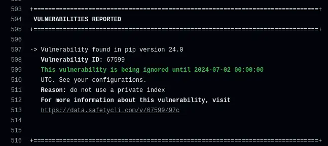
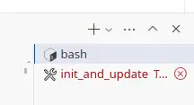
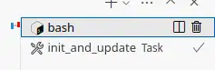

[CVE-2018-20225](https://nvd.nist.gov/vuln/detail/CVE-2018-20225) in all versions of `pip` tripped my vulnerability alerting this morning. If you're scanning for vulnerabilities using Safety, you've probably seen the same alarm. This post captures my reasoning and decision-making process to understand the risk and impact of this vulnerability and then deal with it.

--8<-- "ee.md"

<!-- more -->

## Discovery

When I launched my [pypi-vulnerabilities](https://github.com/brabster/pypi_vulnerabilities) codespace this morning, VSCode ran my [init_and_update](https://github.com/brabster/pypi_vulnerabilities/blob/c056bf3b2a4605a91526b27e0fb5ef93098e3fc4/.dev_scripts/init_and_update.sh) script automatically. This script installs my dependencies and then checks them for known vulnerabilities. The first indication that something was wrong was a red task in the terminal sidebar.

<figure markdown="span">
 
 <figcaption>init_and_update task red with an error indicator in a VSCode sidebar</figcaption>
</figure>

Clicking into that terminal, I see:

`Scan was completed. 1 vulnerability was reported.`

Scrolling up, I get this detail:

```
-> Vulnerability found in pip version 24.0
   Vulnerability ID: 67599
   Affected spec: >=0
   ADVISORY: ** DISPUTED ** An issue was discovered in pip (all versions) because it installs the version with the highest version number, even if the user had
   intended to obtain a private package from a private index. This only affects use of the --extra-index-url option, and exploitation requires that the package does not...
   CVE-2018-20225
   For more information about this vulnerability, visit https://data.safetycli.com/v/67599/97c
   To ignore this vulnerability, use PyUp vulnerability id 67599 in safety’s ignore command-line argument or add the ignore to your safety policy file.
```

## The facts

Or at least, my understanding of the facts. What do I think I know at this point?

- I've installed and updated my dependencies to the latest versions, including [pip](https://github.com/brabster/pypi_vulnerabilities/blob/c056bf3b2a4605a91526b27e0fb5ef93098e3fc4/.dev_scripts/init_and_update.sh#L17).
- I've run `safety check` and it found a known vulnerability, CVE-2018-20225, is present in the updated dependencies.
- There's no known fixed release available, as I would already have it thanks to open upper version bounds and automatic update before checking for vulnerabilities.
- I'm running in a codespace and the only credentials this vulnerability can expose are:
    - write access to the public-read pypi-vulnerabilities repo.
    - BigQuery data editor access to the public PyPI data that I've been working on.
- The same vulnerability will be present in GitHub Actions runs (executed daily and on PRs), which have the same risk exposure as Codespaces.
- As it's a pip vulnerability, any other Python repo I have will currently have the same vulnerability (like this one for my website!)

I'm already ahead of where I used to be before I embraced automation and auto-updating. My automation made sure I was up to date and that I ran a vulnerability scan while I was still daydreaming about fixing the failed GitHub Actions run I got an email about yesterday. I know it's not noise that I can fix by simply updating and I have to take a look and decide what to do next. Running in a codespace lets me relax a little, as it dramatically reduces the scope of things that the vulnerability could exploit or steal.

## Taking action

Two actions spring to mind. First up, look at the vulnerability information and decide what I should do. Let's check out <https://data.safetycli.com/v/67599/97c/>.

> ** DISPUTED ** An issue was discovered in pip (all versions) because it installs the version with the highest version number, even if the user had intended to obtain a private package from a private index. This only affects use of the --extra-index-url option, and exploitation requires that the package does not already exist in the public index (and thus the attacker can put the package there with an arbitrary version number). NOTE: it has been reported that this is intended functionality and the user is responsible for using --extra-index-url securely.

I'm not using private indexes, and I don't use the `--extra-index-url` option. Looks like something I can safely ignore, but my paranoia tells me that I shouldn't do so forever. It's possible, even if I believe it unlikely, that more powerful ways of exploiting this CVE might be found in future. Ideally, I want to ignore it for a while and be prompted again in future if the CVE does not get withdrawn and a fixed release does not become available.

### Safety policy

Safety has come a long way since I first used it. I remember when it only supported passing "ignore" flags to ignore specific vulnerabilities, which was problematic to work with and automate around. Now I see that [Safety supports a "policy file"](https://docs.safetycli.com/safety-2/safety-cli-2-scanner/policy-file), so let's generate one and see what we can do with it.

```console
(venv) @brabster ➜ /workspaces/pypi_vulnerabilities (main) $ safety generate policy_file
A default Safety policy file has been generated! Review the file contents in the path . in the file: .safety-policy.yml
```

Checking out that new file, I see lots of configuration being set. That seems like a pretty bad idea to me. I just want to ignore this one vulnerability for a while, I don't want to hardcode a bunch of configuration options. In doing so, I effectively take responsibility for what their effects are going forward. Nah. *Delete delete delete*. Instead, I'll use [the ignore example given in the documentation](https://docs.safetycli.com/safety-2/safety-cli-2-scanner/policy-file#structure-of-the-policy-file) to **just** configure what I want to happen for this specific vulnerability. The other Safety defaults are fine going forward, thanks.

Here's what I end up with in my [.safety-policy.yml](https://github.com/brabster/pypi_vulnerabilities/blob/515e6d1070902e581b5b71a3872bb5c9eab34c74/.safety-policy.yml)...

```yaml
security:
  ignore-vulnerabilities:
    '67599':
      reason: do not use a private index
      expires: 2024-07-02
```

Running `safety check` now...

```console
-> Vulnerability found in pip version 24.0
   Vulnerability ID: 67599
   This vulnerability is being ignored until 2024-07-02 00:00:00 UTC. See your configurations.
   Reason: do not use a private index
   For more information about this vulnerability, visit https://data.safetycli.com/v/67599/97c
### snip ###
 Scan was completed using a safety policy file. 0 vulnerabilities were reported. 1 vulnerability from 1 package was ignored.
```

Seems to be working fine, ignoring the expected vulnerability until the correct date. Nice confirmation in the output too :white_check_mark:. I'm expecting it to return successfully instead of an error status so that my automation is all good. Does it?

```console
(venv) @brabster ➜ /workspaces/pypi_vulnerabilities (main) $ echo $?
0
```

Yes (['0' means OK](https://www.cyberciti.biz/faq/linux-bash-exit-status-set-exit-statusin-bash/), it would be pretty dumb if it returned an error!). Let's just check that it returns to being an error when the date is in the past. Updating the policy file to set the date to yesterday (2024-05-17) and running `safety check` again... yes, no ignore information is printed to the output and the status code is '64', so an error :raised_hands:.

### Confirming measures are effective

I'll set the date back to 2024-07-02. Why? The free safety database is updated monthly on the 1st, and I'm pretty relaxed about the risk for this one. I'll give it the rest of May and June before checking back in. Does my `init_and_update` task work cleanly now?

<figure markdown="span">
 
 <figcaption>init_and_update task with no colour and checkmark indicating success</figcaption>
</figure>

Yes. Obviously, it was going to work, but I guess I've worked with software for long enough that I have trust issues. I don't believe it 'til I see it :shrug:. I'll commit that policy file back with the commit message "Ignore low-risk pip vuln <https://data.safetycli.com/v/67599/97c>" and check that the resulting Actions workflow is also clean.

<figure markdown="span">
 
 <figcaption>GitHub Actions update and safety run logs ignore and succeeds</figcaption>
</figure>

The Actions run still fails though - oh yes, that's why I was launching the workspace in the first place! Before I get back to that though, I said **two** actions didn't I?

### Ignoring at scale

The other action relates to the other repositories I have that are going to be affected by the same vulnerability. Every repo that checks for vulnerabilities from this point until this vulnerability is withdrawn or fixed will raise the alarm. The safety policy file is local to `pypi-vulnerabilities`, so that's no help. How to manage this sort of vulnerability scanning and alerting at any sort of scale?

To be honest, that's a problem I've had in every role I've taken on in the past decade, employee and consultant alike. I've not had a good solution to date and I end up just working through the repos applying whatever ignore solution I had at the time. Given that I have stuff I'm maintaining in the public domain now, and a reason to blog about it, I'm going to give it a little thought this time and see if I can come up with something better.

What do you do to solve this problem? Feedback details follow, as usual...

--8<-- "blog-feedback.md"

