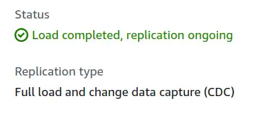
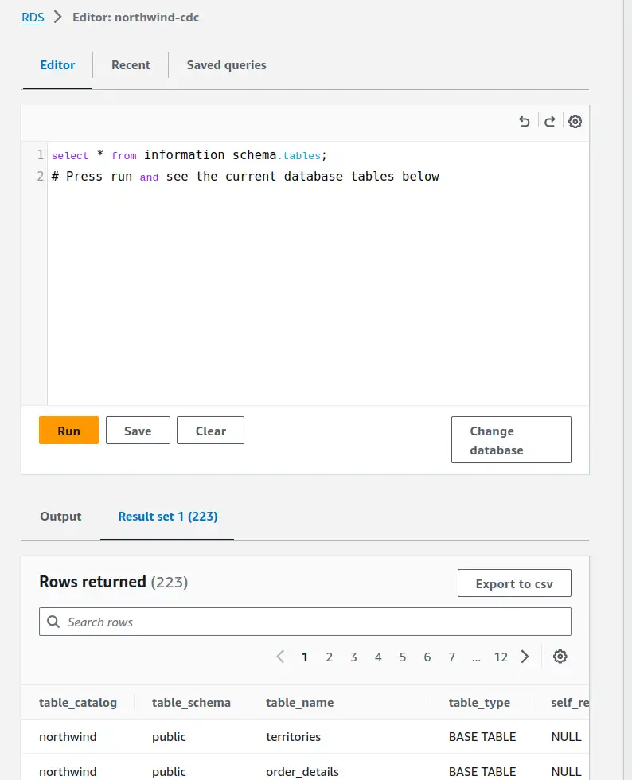
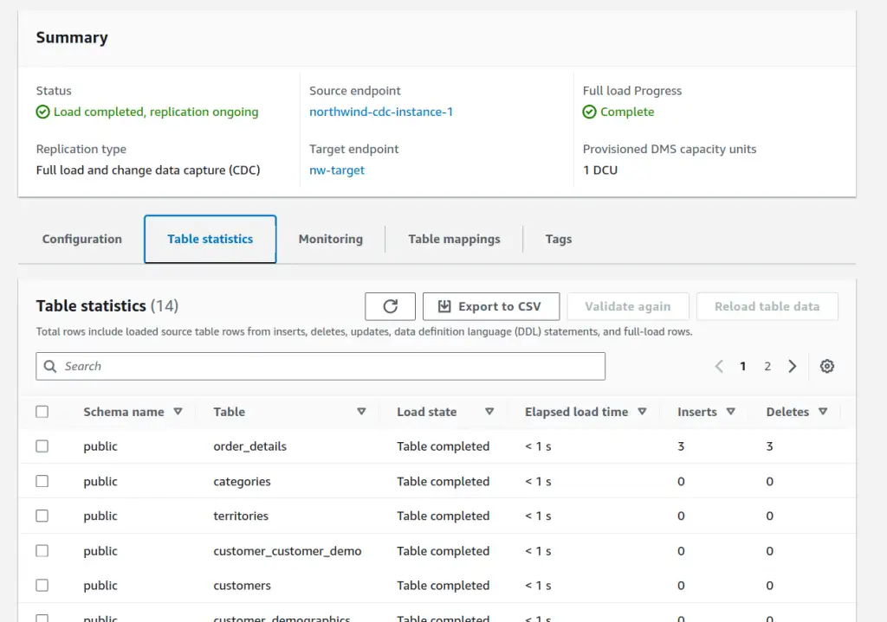
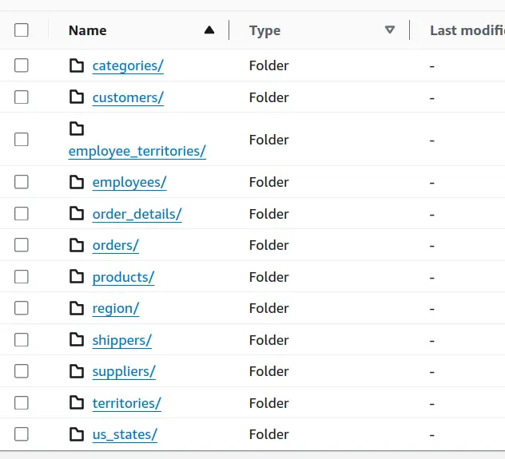
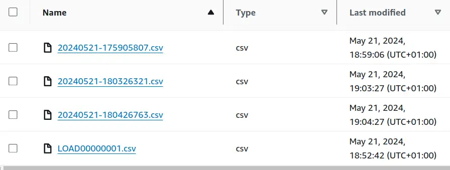

Setting up Change Data Capture from Aurora Serverless PostgreSQL to S3 via the AWS DMS service. I'll walk through the demo setup, using the venerable Northwind dataset, calling out the problems and solutions on the way. The next post in this series will show the challenges we hit trying to work with this kind of CDC data and how we dealt with them.

--8<-- "ee.md"

<!-- more -->

## Change Data Capture

[Change Data Capture (CDC)](https://en.wikipedia.org/wiki/Change_data_capture), is the process of replicating changes in a database to somewhere else. I've recently been working with the data produced by [AWS Database Migration Service (DMS)](https://aws.amazon.com/dms/), a managed service in the AWS Cloud to perform this replication. This process replicated changes from source databases like Oracle and DB2 to AWS S3, where I was processing the data with SQL in [AWS Athena](https://aws.amazon.com/athena/) to perform analytics.

CDC can take different forms, but the pattern I'm talking about here is replicating transaction-by-transaction changes, via whatever commit log the source database produces. I was surprised by how tricky the data landing in S3 was to work with, given how common the approach is - so I thought I'd write about the problems and the solutions my team and I came up with. The solutions all worked well enough to get us over the line, but they're more complex than I'd have hoped.

Specific challenges I'll be talking about:

- disambiguating the result of the set of operations in a transaction
- deduplicating records
- assembling multiple tables into a single chronology of changes

I have the feeling it'll take more than one post! As always, feedback on improvements or better approaches is much appreciated, how to feedback at the end of the post.

!!! warning
    I've taken shortcuts here, exposing me to risks that I'm comfortable with as the AWS account is my own, the dataset is public and the whole thing is transient and will be deleted when I'm done. I'll call out where the dangers I can see are, but you must assess risks for yourself. Trying to be a more [responsible expert](../2024-03-23-irresponsible-expertise-install-python-package/index.md).

## Demo RDS Setup

I needed a simple, standalone setup to replicate the kinds of challenges I've seen in the data. Over in my own AWS account, I spun up an Aurora Serverless (v2) PostgreSQL instance and deployed the Northwind database as a starting point. My [Northwind bootstrap script came from this repository](https://github.com/pthom/northwind_psql/blob/master/northwind.sql) and worked without issue.

Setting up the Aurora instance was fairly straightforward but cost me time in a few places.
I create it from the console, as it's a one-off demo thing. Here are the highlights:

- `us-east-1` region
- `Standard create` to get an up-to-date version of PostgreSQL (15.4) that could support DMS.
- Dev/Test template
- Self-managed credentials (admin username and password, Secrets Manager access and private VPCs/DMS were fiddly and unnecessary for this demo)
- Serverless V2 config
- Default VPC setup, private access
- Enable the RDS Data API

!!! warning
    I would not accept the risk of self-managed credentials shortcut here if confidentiality and robustness of the database mattered.

## RDS Query Editor

[RDS has a web-based query editor](https://aws.amazon.com/about-aws/whats-new/2020/05/amazon-rds-data-api-and-query-editor-available-additional-regions/), allowing execution of SQL without needing command line access or tools.

<figure markdown="span">
 
 <figcaption>Screenshot of RDS Query Editor, showing an information schema query and results</figcaption>
</figure>

### Aurora Data API Limitations

There are a few gotchas though. It needs the RDS Data API, and whilst the API and Query Editor are available in my go-to region of `eu-west-2`, the ability to enable the API on the Aurora instance is not. For this public data, I just burned my EU instance and moved to the `us-east-1` region for simplicity.

!!! warning
    Most real-world systems, especially those handling sensitive information, are constrained by regulatory compliance requirements and cannot be run in a different legal jurisdiction without careful consideration.

### Bootstrapping a Database

You also need to specify a database to launch the Query Editor (along with the RDS instance, username and password). That was a roadblock because my RDS instance had no database to use yet, so I couldn't bootstrap from the Query Editor. After a bit of messing about with VPC settings, I ended up just making the instance publicly accessible for a few minutes so I could log in with psql in CloudShell and run the `CREATE DATABASE northwind` command I wanted to run. Once done, I made the RDS instance private again and opened Query Editor to continue.

!!! warning
    I would not be comfortable making the database public for **any** length of time if the data were sensitive or the service important.

### Disabling Autocommit

Lastly, there is an autocommit setting in the Query Editor, hiding in the settings cogwheel top-right of that screenshot.
I specifically wanted to simulate multi-statement transactions and it did confuse me for a while why `BEGIN TRANSACTION;` didn't seem to have any effect! Turn off autocommit in the UI for the win.

## RDS Setup for DMS

Lastly, there were some customisations I needed to make to get DMS up and running in Full Load and then CDC mode.
I needed a custom Parameter Group based on the default 15.4 parameter group and [AWS DMS documentation for Aurora as source](https://docs.aws.amazon.com/dms/latest/userguide/CHAP_Source.PostgreSQL.html#CHAP_Source.PostgreSQL.RDSPostgreSQL):

- `rds.logical_replication` set to `1`
- `wal_sender_timeout` set to `0`
- `shared_preload_libraries` set to `pglogical,pg_stat_statements` (Adding pglogical to the default)

After rebooting, I needed to run `create extension pglogical;` in the Query Editor.

## DMS Setup

Now on to the DMS setup. I'll need some IAM roles so I'll start there.

### IAM Roles

A role with access to the target S3 bucket that trusts the appropriate DMS service. For me, that was:

```json
{
    "Version": "2012-10-17",
    "Statement": [
        {
            "Sid": "",
            "Effect": "Allow",
            "Principal": {
                "Service": "dms.us-east-1.amazonaws.com"
            },
            "Action": "sts:AssumeRole"
        }
    ]
}
```

Another is for DMS VPC access to get to the RDS instance. [It must be called `dms-vpc-role`](https://docs.aws.amazon.com/managedservices/latest/ctref/deployment-advanced-database-migration-service-dms-create-replication-subnet-group.html). There's a managed policy `AmazonDMSVPCManagementRole` to add to this one. Trust for this one did not need the region-specific service principal.

```json
{
    "Version": "2012-10-17",
    "Statement": [
        {
            "Sid": "",
            "Effect": "Allow",
            "Principal": {
                "Service": "dms.amazonaws.com"
            },
            "Action": "sts:AssumeRole"
        }
    ]
}
```

### Endpoints

Once these roles are set up, the DMS endpoints can be created. A source endpoint referencing the RDS cluster, credentials and database name, and a target referencing the bucket.

The S3 endpoint has some options around partitioning and transactions. I added `"TimestampColumnName": "txn_commit_timestamp"` to my S3 settings to add a commit timestamp column to each captured row, replicating what I've seen in my real-world use cases.

### Serverless Replication

Finally, we can create a "serverless replication".
This references the two endpoints. I set the replication type to "Full load and change data capture" to capture up new transactions as they happen.

In table mappings, I picked `Enter a schema` and entered `public` as that's the default schema in the `northwind` database that I used. Defaults for other settings, apart from `Single-AZ` as I don't need any failover capability for this demo.

## DMS Mapping Rules

After some experimentation, I added an element to the serverless replication.

The following "mapping rule" has DMS add a column to the replicated data that captures transaction ID information. That's not something I'd seen in my real-world data, so I'll be checking whether it's available for the sources needed there. [AR_H_CHANGE_SEQ Documentation](https://docs.aws.amazon.com/dms/latest/userguide/CHAP_Tasks.CustomizingTasks.TableMapping.SelectionTransformation.Expressions.html).

> A unique incrementing number from the source database that consists of a timestamp and an auto-incrementing number. The value depends on the source database system.

```json
{
    "rule-type": "transformation",
    "rule-id": "2",
    "rule-name": "2",
    "rule-target": "column",
    "object-locator": {
        "schema-name": "%",
        "table-name": "%"
    },
    "rule-action": "add-column",
    "value": "transact_id",
    "expression": "$AR_H_CHANGE_SEQ",
    "data-type": {
        "type": "string",
        "length": 50
    }
}
```

## Enabling CDC

Starting the serverless replication is a click. I lost a couple of hours here on VPC settings and Secrets Manager access because it took a while - on the order of 10-15 minutes to fail if the problem is VPC access. A 15-minute feedback loop sucks up time fast - which is why I gave up and just went with username/password, cutting secrets manager out. Once I'd ironed out the kinks...

<figure markdown="span">
 
 <figcaption>Screenshot of DMS Table Statistics in AWS console, showing load completed and replication ongoing</figcaption>
</figure>

The result of all this work is a bunch of data in S3.

<figure markdown="span">
 
 <figcaption>Screenshot of S3 bucket, showing a directory per table in the source system</figcaption>
</figure>

Within each directory (feels odd typing that, we used to call them prefixes) is at least one file for the initial snapshot load. If there were any transactions after initial load, CDC dropped them into timestamped files.

<figure markdown="span">
 
 <figcaption>Screenshot of orders directory in S3, showing a LOAD csv file and three timestamped transaction files</figcaption>
</figure>

## Next Time

Running some transactions through the system to capture the DMS output. Then we can talk about the challenges it presents and the solutions my team and I came up with.

--8<-- "blog-feedback.md"

