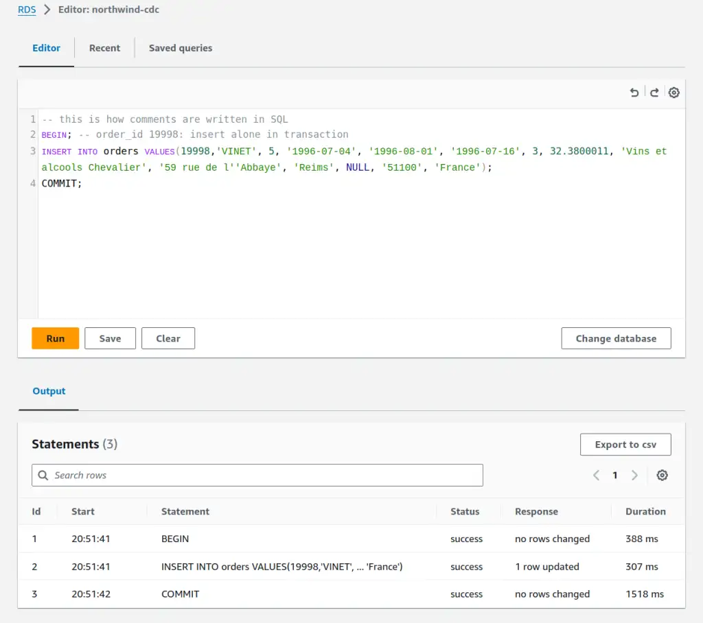
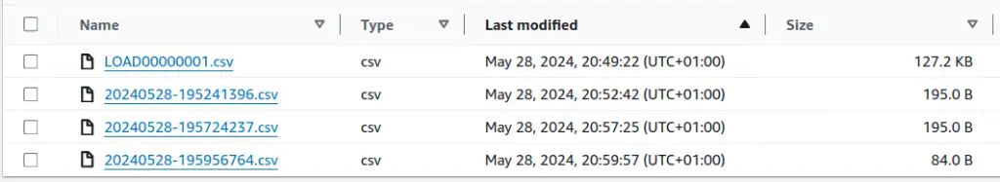

Last time, I set up a CDC system using AWS RDS and DMS services. Now, I'll run some operations through the source database and show what that looks like in the CDC output. I'll introduce some metadata fields that are critical to figuring out what this CDC output means and set us up to look at the specific challenges I've had with interpreting these CDC outputs robustly to solve real-world problems reliably.

--8<-- "ee.md"

<!-- more -->

## Transactions in a Database

Database systems typically support [transactions](https://en.wikipedia.org/wiki/Database_transaction).
That Wikipedia article covers the broader ideas behind transactions, but I think the important aspect for Change Data Capture (CDC) is that they allow a developer to queue up a sequence of operations - inserts, deletes, updates - and then commit them as a single atomic unit. If something goes wrong, everything in the transaction "rolls back" as if nothing had happened at all. What does that look like in CDC output? Let's take a look.

## Single-Statement Transactions

Transactions that contain a single statement are the simplest place to start. This is the default for working at the AWS Query Editor console and is common in interactive tooling, so if you're trying to reproduce this stuff yourself you'll need to turn off any autocommit in your tooling. I covered [how to turn off forced autocommit in the AWS Query Editor](../2024-05-21-cdc-with-aws-dms/index.md#disabling-autocommit) last time.

Let's `BEGIN`:

```sql
-- this is how comments are written in SQL
BEGIN; -- order_id 19998: insert alone in transaction
INSERT INTO orders VALUES(19998,'VINET', 5, '1996-07-04', '1996-08-01', '1996-07-16', 3, 32.3800011, 'Vins et alcools Chevalier', '59 rue de l''Abbaye', 'Reims', NULL, '51100', 'France');
COMMIT;
```

This statement starts a new transaction with `BEGIN;`, `INSERT`s a single record into the `orders` table, then `COMMIT;` tells the database to go ahead and run the statement. If you're in the correct database at the Query Editor you can just copy-paste the statement straight in and hit `Run`.

<figure markdown="span">
 
 <figcaption>Screenshot of RDS Query Editor in AWS console, showing the last transaction completed successfully</figcaption>
</figure>

Next, an update in its own transaction.

```sql
BEGIN; -- order_id 19998: update alone in transaction
UPDATE orders SET shipped_date = DATE '1996-07-17' WHERE order_id = 19998;
COMMIT;
```

Let's delete that order record from the database. Perhaps it was inserted in error, or it was an order that was cancelled before completion.

```sql
BEGIN; -- order_id 19998: delete alone in transaction
DELETE FROM orders WHERE order_id = 19998;
COMMIT;
```

## Single-Statement Transactions in CDC

Time to take a look at what was produced by the CDC process that was monitoring the database while those transactions were executed. Updates in the `orders` table are replicated to files under `cdc/public/orders/` in my target S3 bucket. That's the schema `public` and the table `orders`.

<figure markdown="span">
 
 <figcaption>S3 screenshot showing files written by the CDC DMS service</figcaption>
</figure>

There are four files in that directory in total. `LOAD00000001.csv` is a copy of all records in the table when the CDC process started up a Full Load. There are then three further files, written a couple of minutes apart. Each will contain one of the transactions I ran above, in the order I ran them. Had I run them more quickly, they might have ended up in the same file - it's not a one-transaction-to-one-file relationship. A quick look at what's in those `.csv` files:

```csv
I,2024-05-28 19:51:41.388146,19998,VINET,...snip...,France,20240528195141380000000000000000061
U,2024-05-28 19:56:24.227529,19998,VINET,...snip...,France,20240528195624220000000000000000073
D,2024-05-28 19:58:56.758486,19998,,...snip...,,20240528195856750000000000000000085
```

- column 1: operation. `I` = `INSERT`, `U` = `UPDATE`, `D` = `DELETE`
- column 2: transaction commit timestamp. We added [this `transaction_commit_timestamp` column via endpoint configuration](../2024-05-21-cdc-with-aws-dms/index.md#endpoints) in the previous post 
- column 3: the first column containing data from the table - in this case the `order_id` column
- column 4+: more data columns
- last column: the other column we added, called [`transaction_sequence_number` via DMS mapping rules](../2024-05-21-cdc-with-aws-dms/index.md#dms-mapping-rules) in the previous post

## Multi-Statement Transactions in CDC

I can compare the previous output with what happens when I pack all those changes into a single transaction.

```sql
BEGIN; -- order_id 19998: insert, update, delete. Effectively a no-op as the row ends up deleted
INSERT INTO orders VALUES(19998,'VINET', 5, '1996-07-04', '1996-08-01', '1996-07-16', 3, 32.3800011, 'Vins et alcools Chevalier', '59 rue de l''Abbaye', 'Reims', NULL, '51100', 'France');
UPDATE orders SET shipped_date = DATE '1996-07-17' WHERE order_id = 19998;
DELETE FROM orders WHERE order_id = 19998;
COMMIT;
```

<figure markdown="span">
 
 <figcaption>The query editor showing the previous statements with a begin and commit transaction wrapper in the output</figcaption>
</figure>

The CDC output looks pretty similar to before, but careful inspection shows some differences that can really matter.

```csv
I,2024-05-28 20:21:48.298940,19998,VINET,...snip...,France,20240528202148290000000000000000133
U,2024-05-28 20:21:48.298940,19998,VINET,...snip...,France,20240528202148290000000000000000137
D,2024-05-28 20:21:48.298940,19998,,...snip...,,20240528202148290000000000000000141
```

- column 2, the transaction commit time, contains identical values
- the last column, `transaction_sequence_number`, contains a value with the same prefix but a suffix that increases in value as the transaction proceeds.

It's not much fun working with these `.csv` files natively, so I'll lay an external table in Amazon Athena over it so that we can work with the data in SQL. Variations on this are basically how I interacted with DMS CDC data in the past. You could point Spark, AWS Redshift, GCP BigQuery or Snowflake at the data in S3 in much the same way, given appropriate permissions.

## Querying CDC Data with Amazon Athena

If you've not used Amazon Athena before, there's a [Getting Started guide in the AWS documentation](https://docs.aws.amazon.com/athena/latest/ug/getting-started.html). It will help set up S3 and a workgroup to run queries. I'll take over back here when it gets to the `CREATE DATABASE` command. One of Athena's many (in my opinion) faults is that it uses the terms "database" and "schema" interchangeably. More on Athena's problems another day, but it is useful, effective and cheap if nothing better is available. Let's create a database/schema in the Athena query editor. It behaves much like the RDS editor.


```sql
CREATE SCHEMA northwind_cdc
```

Having done that, the next statement creates an "external table" over the CDC `orders` data we just created in S3. It tells Athena what columns it should expect are present, their types, the format of the underlying files and where they are in S3. If you make a mistake, `DROP` the table and try again. The underlying data in S3 won't be modified.

!!! note
    Configuration option `GlueCatalogGeneration` tells Athena to generate a Glue catalogue entry for you, avoiding this step. If I used that option, I'd consider how schema evolution will happen and how I can prevent breaking schema changes from publishing automatically and causing problems for consumers of the data. My previous post on [SQL Data Contracts](../2023-05-19-dbt-contracts-in-sql/index.md) talks more about the product thinking behind my reasoning.

```sql
CREATE EXTERNAL TABLE northwind_cdc.orders (
 cdc_operation STRING,
 transaction_commit_timestamp STRING,
 order_id INTEGER,
 customer_id STRING,
 employee_id INTEGER,
 order_date STRING,
 required_date STRING,
 shipped_date STRING,
 ship_via INTEGER,
 freight FLOAT,
 ship_name STRING,
 ship_address STRING,
 ship_city STRING,
 ship_region STRING,
 ship_postal_code STRING,
 ship_country STRING,
 transaction_sequence_number STRING
)
ROW FORMAT SERDE 'org.apache.hadoop.hive.serde2.OpenCSVSerde'
LOCATION 's3://your-target-bucket/cdc/public/orders/'
```

!!! warn
    The default Athena CSV implementation for Athena doesn't handle quoted CSV fields containing things like commas, so I use the [OpenCSV SerDe here as per the documentation](https://docs.aws.amazon.com/athena/latest/ug/csv-serde.html). Another little tripwire to carefully step over.

Once the table exists, we can query it...

```sql
SELECT
 cdc_operation,
 transaction_commit_timestamp,
 order_id,
 shipped_date,
 transaction_sequence_number
FROM orders
ORDER BY transaction_sequence_number DESC
```

<figure markdown="span">
 
 <figcaption>Athena query editor showing the query results for selecting rows from orders by transaction_sequence_number</figcaption>
</figure>

!!! note
    OK, so I messed up the first time around. When the CDC load operation happens, by default the operation column is omitted. That means, for the `.csv` format at least, the schema of the initial load and subsequent update files are different, with the initial load files missing the first column. (Using the Parquet format the column probably exists with value `NULL`, much less troublesome). I went back and added `includeOpForFullLoad=true` to my DMS S3 endpoint settings to have it put a column there containing `I` on load. That's also why the timestamps in the screenshots are more recent than in the `.csv` outputs. Have a gold star if you were paying enough attention to spot that!

Ordering by `transaction_sequence_number DESC` I get the most recent statements executed in the database first. As I'd expect, the most recent three share the same `transaction_commit_timestamp` as they executed in the same transaction - but they have different and ordered `transaction_sequence_number`s, so we get them in the right order - `INSERT` first, `DELETE` last. The preceding three rows are the same statements executed in separate transactions - so `transaction_commit_timestamp` varies as well as `transaction_sequence_number`. Before that, we see `INSERT` for different `order_id`s, which is the end of the initial full load operation.

## Next Time

I've set up a CDC system, run some transactions through it, and set up Athena to query the raw data. I've seen how some metadata fields `cdc_operation`, `transaction_commit_timestamp` and `transaction_sequence_number` work with source database statements and transactions. Next time, I'll get on with sharing the kinds of challenges, along with my solutions, that come up with using this data to solve real problems.

--8<-- "blog-feedback.md"
