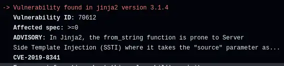

Yesterday, Safety told me about CVE-2019-8341, a security issue affecting Jinja2. I'll walk through how I investigated and assessed the risk to my website and a dbt pipeline I operate in the public domain. I finish up with a commentary on why I think this vulnerability is real and should be fixed, and how we need to risk breaking potentially insecure usage to make infosec manageable in the real world.

--8<-- "ee.md"

<!-- more -->

## About CVE-2019-8341

[CVE-2019-8341](https://data.safetycli.com/v/70612/97c/) affects the Python [Jinja2 templating system](https://jinja.palletsprojects.com/en/3.1.x/). It uses templates to generate text and is heavily used by other packages. According to libraries.io, [there are over 10,000 other packages that depend on Jinja2](https://libraries.io/pypi/Jinja2). Anyone who uses any of those libraries and ran a scan with Safety as of 1st June 2024 will be alerted to this vulnerability. If you are being alerted to it, it's likely to be due to a transitive dependency - one that a package you are using depends on, rather than something that's explicitly in your dependency list.

The vulnerability affects [the `from_string` function](https://jinja.palletsprojects.com/en/3.0.x/api/#jinja2.Environment.from_string) that will render templates it is passed in parameters. If an attacker can control any of the parameters. then by default, they can execute arbitrary code - a powerful tool for an attacker.

There's no fix available. According to Safety, ["The maintainer and multiple third parties believe that this vulnerability isn't valid because users shouldn't use untrusted templates without sandboxing"](https://data.safetycli.com/v/70612/97c/).

## How I Found Out

I was alerted to this vulnerability yesterday morning by my [daily GitHub Actions workflow for my pypi-vulnerabilities repository](https://github.com/brabster/pypi_vulnerabilities/actions/runs/9335474237/job/25694899788) as Jinja2 is used by dbt. I then saw it again in the repo for this website when I spun up a Codespace to write this post, as it's a dependency of mkdocs, too.

What should I do, as an indirect consumer of Jinja2 with alarms going off about this?

## Mitigation

Jinja2 docs have a section on their [SandboxedEnvironment and other security considerations](https://jinja.palletsprojects.com/en/3.1.x/sandbox/#sandbox). It's a special section you have to go and read though. If I were writing code using Jinja, I can imagine I might not think to go looking for it. What I am likely to look at is the API docs I need to use the functionality. As I write this, security is not mentioned in the [docs for `load_string`](https://jinja.palletsprojects.com/en/3.1.x/api/#jinja2.Environment.from_string), nor [Template](https://jinja.palletsprojects.com/en/3.1.x/api/#jinja2.Template), nor, surprisingly, in the docs for [Environment](https://jinja.palletsprojects.com/en/3.1.x/api/#jinja2.Environment). Safe to assume that package authors might not be aware of the issue and mitigations.

My takeaway is that there are three things to consider in my risk assessment right now.

1. if a package author is using the safer SandboxedEnvironment, then the issue is mitigated but the package author can't indicate that they're not affected. I can ignore the vulnerability.
2. if I can guarantee that template rendering is never exposed to input outside my control, then I can safely ignore the vulnerability
3. if the impact of a compromise is low enough, I can ignore the vulnerability

All of that assumes that a would-be attacker hasn't found an unexpected aspect of the vulnerability or a way to chain this vulnerability with others, that I'm not considering. It feels impossible to say with certainty that a vulnerability doesn't pose any risk at all, only that the risk is acceptable or not.

## My Assessment

### Use of Environment()

I started out looking through the dependency graph for instances of Jinja2 `from_string` use. I'm not super-confident that the absence of the string `from_string` in the source code really means that it's not being used in some way though, nor that it means other functions like `render_template` are immune. I found what looks like the [unsandboxed environment in mkdocs-rss-plugin](https://github.com/Guts/mkdocs-rss-plugin/blob/e2699554cbfcf14f90eaf0d12af171f46565a99a/mkdocs_rss_plugin/plugin.py#L365) anyway, so I'll assume that my use of mkdocs at least could be vulnerable.

### User-Supplied Input

OK, for mkdocs I run my site compile and then serve that static site - so I'm confident that I'm not exposed to any risk of someone attacking me through the site itself. I can't think of any content involved that I'm not in control of - environment variables, config. A malicious mkdocs plugin or other package could probably exploit it but there are lots of other ways a malicious package could hurt me, so not a new risk there.

For dbt, same risks from dbt and Python packages but again, I'm already exposed to equal or greater risk there so already accepted. Although dbt might appear to process externally supplied input in the form of the source data to the pipelines, it's not processing that itself. dbt uses templates to generate SQL, and that plain SQL is what actually interacts with the external data. I think it's basically the same as mkdocs, then, that the only inputs to template processing come from my own source code and the environments in which I run dbt.

So - I don't think I process user-supplied input with Jinja2, but I'm aware that I've only considered the obvious ways in which Jinja2 is used in these two projects. It's always possible I missed something.

### Impact

This site and `pypi_vulnerabilities` deal with public data, so I don't see any risk of a data breach. The worst-case scenarios I can think of are:

- running up a big bill for my dbt-based project, and I have active controls in place to block that
- manipulating the data in my dbt-based project to give incorrect results, but I make no promises about correctness
- mucking about with the content on this site, which I hope I would notice
- inserting malware into this site to compromise you, dear reader, but you take responsibility for your own risk management as you traverse the wilds of the internet
- getting access to the laptop I'm running on, mitigated by running in a Codespace so these projects are never installed on this laptop
- getting access to the Codespace environment, which is responsibly operated and has extremely limited permissions
- getting access to the GitHub Actions environment, which is responsibly operated and has extremely limited permissions
- getting access to the Netlify build environment, which is responsibly operated and has even fewer permissions

Looking at that list, I guess it's the same base list regardless of the specific vulnerability, as getting compromised is getting compromised.

### Decision

I'll ignore the vulnerability. I could choose to shut down this site and the `pypi_vulnerabilities` GitHub Actions if I felt there was a significant risk to myself or others. I don't think there is a significant risk, as I don't think I process untrusted external data, the impacts are fairly well mitigated and I don't see an incentive for an attacker to invest the time and effort to compromise and then exploit these projects.

There's always a residual risk, but I feel that's a defensible decision if something bad did happen. Is this the right decision? Did I miss anything important? You can feedback, instructions at the end of the post.

## Actions

I'll add an ignore to my `.safety_policy.yml` in these repositories, with an expiration date in July. That will ensure I review the decision based on any new information that emerges in the meantime.

It would have been a lot easier to just assume I wasn't vulnerable on reading the vulnerability details, but as I dug into it I learned or reflected a few things about my dependencies which seems like a worthwhile exercise. I certainly feel that investing an hour or two digging and writing something down means I can defend the decision, especially compared to "Well, I read the safety output and it didn't sound like a problem".

I will also raise the issue for advice with direct dependency maintainers. This issue [asks dbt maintainers for confirmation that this vulnerability can be safely ignored by dbt users](https://github.com/dbt-labs/dbt-core/issues/10250).

It also helps me understand (and share with you) more of the problems with how vulnerability management works in the real world. The big question in my mind right now is why the Jinja2 maintainers don't remove or disable the dangerous functionality.

## To Fix Or Not To Fix?

Unless Jinja2 maintainers do something, we're left with a stark choice.

Remove the vulnerability notice? Alarms aren't going off everywhere indefinitely for a vulnerability that won't be fixed. It seems clear to me that using Jinja2 in this way **is an important security issue**, and shutting off the alarms isn't the right thing to do.

Leave it in place? Consuming package authors and, importantly, end users of Jinja2 through transitive dependencies have to try and figure out their risk and whether to use the only tool they have - ignore the issue - because only a change in Jinja2 itself could really prevent any harm occurring.

### Taking Responsibility

According to the vulnerability notice the maintainers argue that it's not a vulnerability "because users shouldn't use untrusted templates without sandboxing". That's a lot to put on users, especially when the documentation I've seen doesn't do much to ensure awareness. There's no way for a package like dbt to declare that it uses Jinja2 in a manner that is not vulnerable. (I'm not sure it'd be a good idea if package maintainers **could** do that, to be honest) The impact and decision making responsibility falls to the end users - a large, diverse group.

As I've shown in this post, trying to determine your risk from a vulnerability like this is not simple or straightforward for me and I'm left with doubt. I've got over a decade of active experience across multiple technical specialisms including software development. I don't think it's reasonable for our industry to just delegate this to end users where there's an option to make a well-informed choice erring on the side of safety on their behalf.

### Fixing It

If I were a Jinja2 maintainer, I'd advocate for removing the unsafe functionality from the public API. Interim steps marking it as deprecated, then requiring an opt-in to the behaviour that clearly labels it as unsafe and breaking otherwise gives existing users of the functionality a way of transitioning without significant code changes before removal. At that point, the whole user community knows that, regardless of awareness and competence in consumers and transitive consumers, the risk is mitigated.

Some things might break - lots of blog posts and tutorials showing newbies how to use the unsafe-but-slightly-simpler functionality and never mentioning the risk, for a start. Any that are being maintained can be fixed to use the more secure version, along with any real-world applications that might be affected.

--8<-- "blog-feedback.md"

