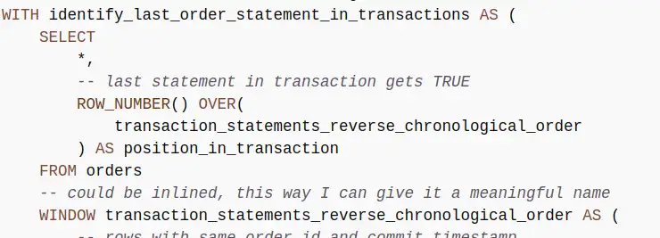
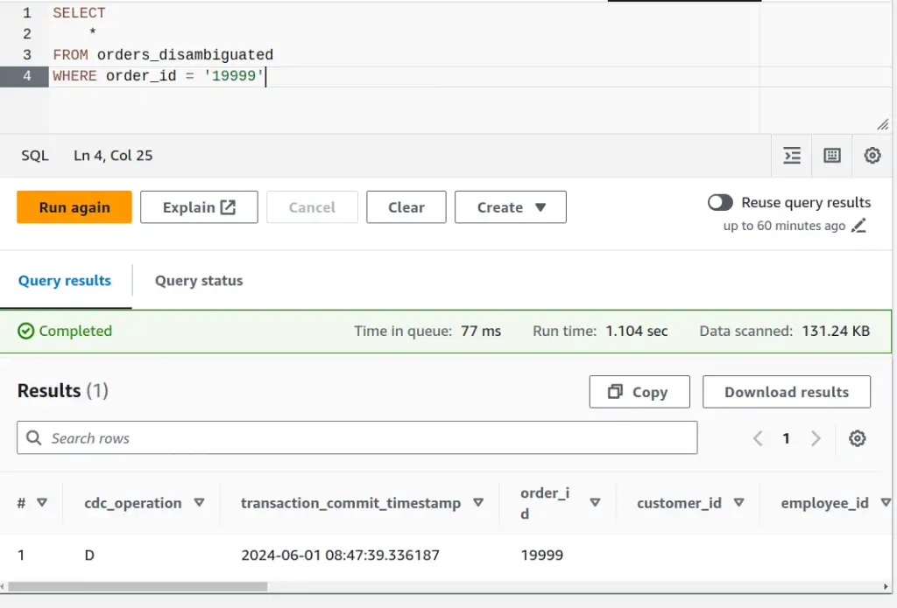
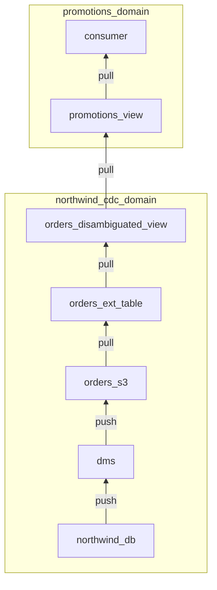

In the CDC output, I get a row for each statement executing in the transaction. Each row reflects the state of the database when that statement is executed. How do I filter out all the transient statements to get the final state of the row when a transaction has finished?

--8<-- "ee.md"

<!-- more -->

I call this process "disambiguation" because I don't initially know which row to use and I eliminate that ambiguity. You could also think of it as a kind of deduplication.

## Example usecase - promotions

Here's an example of the kind of problem we might be able to solve with a bit of SQL that might otherwise need significant changes to software. Be aware that I am making the use case up, so please be prepared to suspend your disbelief accordingly. I'll only be focusing on aspects of the problem that I think show interesting challenges in CDC data.

### Problem statement

We want to encourage customers to allow us plenty of time to fulfil their orders. We'll incentivise that with a promotion. Each month, we'll enter qualifying orders into a raffle to win some swag. "Qualifying" orders give more than 28 days notice between `order_date` and `required_date` when the order ships.

### Discussion

Can I find the qualifying orders using the CDC feed? I think so - we can run a query at the end of each month to find eligible orders, I could even pick a winner from those - `ORDER BY RANDOM() LIMIT 1`?

The Northwind database represents the backend of a sales system, and we'll focus on the `orders` table for this post. As we saw last time, each row in the `orders` table represents an order. There are about 14 columns, and it seems likely that there's a subset that is interesting for this use case:

- `order_id` - a unique identifier for an order
- `order_date` - the date the order was placed
- `required_date` - the date the order is required by
- `shipped_date` - the date the order shipped

I'll need to time-travel back to 1996, when I first went to university and still had hair because those are the dates in the data.

## Case: initial load

I'll take a look at orders that were already shipped when we did our CDC full load, one that qualifies and one not. I'll pick those out of the existing historical data to help get a feel for the basic query I need. I've done a reload so the only records in the data are from the initial load. Here are a couple of example records, from the perspective of a run in August 1996.

```sql
WITH order_urgency AS (
    SELECT
        order_id,
        order_date,
        required_date,
        shipped_date,
        DATE_DIFF('day', DATE(order_date), DATE(required_date)) notice_period_days
    FROM orders
)

SELECT
    *,
    notice_period_days > 28 qualifies_for_promotion
FROM order_urgency
WHERE (shipped_date >= '1996-07-01' AND shipped_date < '1996-08-01')
    AND order_id IN ('10249', '10253')
```

??? note "DATE vs. STRING"
    Although I needed to deal with `order_date` and `required_date` as DATE types do perform calendar arithmetic, I didn't parse the `shipped_date` at this point. It's not clear what the benefit is and how to handle error cases, like dates that can't be parsed, at this point. I find in real life it'll become clear what to do when whatever is consuming the output gets involved. The string representations sort correctly (a valuable feature of [ISO8601](https://en.wikipedia.org/wiki/ISO_8601) & the more restrictive [RFC3339](https://datatracker.ietf.org/doc/html/rfc3339)) so I'll leave them as plain strings for now.

??? note "Inequalities vs. BETWEEN"
    `BETWEEN` isn't just for dates and times. It'll work on any type, and `shipped_date BETWEEN '1996-07-01' AND '1996-08-01'` would be valid but inclusive of the upper bound too. Using the inequalities is clear about the intent, avoids any misunderstandings about inclusivity and avoids unexpected behaviour when datetimes are involved. I only wrap the two date bounds in parentheses to make it clear that they function as a unit.

|order_id|order_date|required_date|shipped_date|notice_period_days|qualifies_for_promotion|
|--------|----------|-------------|------------|------------------|-----------------------|
|10249|1996-07-05|1996-08-16|1996-07-10|42|true|
|10253|1996-07-10|1996-07-24|1996-07-16|14|false|

42 days between order and required means the order `10249` would have qualified and `10253`, leaving only 14 days, would not.

## From query to view

Having this logic in a query is going to be a pain to work with. The case above is an example - my promotions logic and my test case details are mixed up in the same query. To separate them, I'll [refactor](https://refactoring.com/) to put the logic in a view instead - then I can query that view to debug and test my logic.

??? note "From Query to Data Pipeline"
    This is the first step from a query to a data pipeline and opens up lots of flexibility and power to build up complex, robust solutions from simpler, well-tested pieces. Plain SQL will quickly become problematic, in the same way that trying to build a Java application just using plain text files containing code would. Tooling like `dbt`, `dataform` et al. help to deal with the emergent complexity and needs in much the same way that `Maven` or `Gradle` do for Java applications.

```sql title="Promotions logic is more general"
CREATE OR REPLACE VIEW promotions AS
WITH order_urgency AS (
    SELECT
        *,
        DATE_DIFF('day', DATE(order_date), DATE(required_date)) notice_period_days
    FROM orders
)

SELECT
    *,
    notice_period_days > 28 qualifies_for_promotion
FROM order_urgency
```

Now, my exploratory query is much simpler, the important conditions are clearer and it gives the same results as before.

```sql title="Query captures specifics of the current question"
SELECT
    *
FROM promotions
WHERE (shipped_date >= '1996-07-01' AND shipped_date < '1996-08-01')
     AND order_id IN ('10249', '10253')
```

??? note "Is `SELECT *` bad practise?"
    `SELECT *` is often a bad idea in queries, usually referenced in the "best practice" advice from the data warehouse vendor, like number 10 in the [Athena top 10 performance tuning tips](https://aws.amazon.com/blogs/big-data/top-10-performance-tuning-tips-for-amazon-athena/). This is important general advice, but there are exceptions.

    - if the dataset is small, or you can guarantee that you're only scanning a small amount of data with the `SELECT *`, then it can be really helpful for exploratory analysis.
    - if you're working in a view, the backing data is columnar (native tables, Parquet et al. are) and the data warehouse supports predicate pushdown (modern data warehouses do) then `SELECT *` has no direct performance impact. Only the columns mentioned in a query against the view will be scanned and processed, so I can make more information available to consumers without incurring unnecessary overhead, or having to repeat lists of column names.

    This case ticks the first criterion.

## Case: multi-statement transaction

We've had a look at the single-row case from the initial load. This is the simplest case, where we just have a single CDC output row involved in determining eligibility. 
It gets more interesting when we start running transactions through the system. I'll take the [multi-statement transaction from the last post](../2024-05-28-exploring-transactions-in-cdc/index.md#multi-statement-transactions-in-cdc) and run it to see how that looks with our logic.

```sql title="Find the three statements involved in the example transaction"
SELECT
    *
FROM promotions
WHERE order_id = '19999'
```

Ah. `INVALID_CAST_ARGUMENT: Value cannot be cast to date:`. Our transaction ended with a `DELETE` operation, and as everything else is from the CDC full load, this is the first `DELETE` we've seen.

What does the CDC data look like?

```sql title="Find the three statements involved in the example transaction"
SELECT
    *
FROM orders
WHERE order_id = '19999'
```

|cdc_operation|transaction_commit_timestamp|order_id|order_date|required_date|transaction_sequence_number|
|-------------|----------------------------|--------|----------|-------------|---------------------------|
|I|2024-05-31 20:09:45.208234|19999|1996-07-04|1996-08-01|20240531200945200000000000000000061|
|U|2024-05-31 20:09:45.208234|19999|1996-07-04|1996-08-01|20240531200945200000000000000000065|
|D|2024-05-31 20:09:45.208234|19999|||20240531200945200000000000000000069|

OK, when `cdc_operation=D` for delete, we get `NULL` or the empty string back in the data fields other than the `order_id`. I can't tell the difference in the Athena UI, but `DATE(NULL) = NULL` so it must be the empty string, as we get a parse error. Why the empty string? Probably because the source data is `.csv`, so there's no notion of `NULL`-ness distinct from the empty string. Using the alternative Parquet format is a better choice, as it would provide a way of expressing `NULL`, as well as more metadata, like column type information.

??? note "SQL Interface as REPL"
    I use the SQL UI in whatever database I'm using to answer questions I have about how functions behave in these kinds of scenarios. `SELECT DATE(NULL)` is a valid SQL statement and returns `NULL`. `SELECT DATE('')` is also a valid statement but returns the parse error, confirming my suspicion. When I learned that I don't need a `FROM` clause I gained a superpower, turning the SQL interface into a kind of REPL!

I'll modify the `notice_period_days` calculation to handle the delete case.

```sql hl_lines="5-8 14" title="Handling DELETE operations"
CREATE OR REPLACE VIEW promotions AS
WITH order_urgency AS (
    SELECT
        *,
        CASE
            WHEN cdc_operation = 'D' THEN NULL
            ELSE DATE_DIFF('day', DATE(order_date), DATE(required_date))
        END notice_period_days
    FROM orders
)

SELECT
    *,
    COALESCE(notice_period_days > 28, FALSE) qualifies_for_promotion
FROM order_urgency
```

As usual, there are other ways to express that logic but I think it's a fairly clear expression of what's going on. I won't filter the delete operations out yet as I might need them before I'm done.

I get three rows out of the query, one for each statement in the original transaction. Two of those rows represent "work in progress" and aren't useful for this use case (or any other interesting use case I can think of, to be honest. If you know of one, please enlighten me via feedback via instructions at the bottom of the post). What I need is a single row representing the state of the database for this order at the end of the transaction.

## Simple disambiguation

I'm sure it's possible to use `GROUP BY` to do this but it's not going to be clear or straightforward. `GROUP BY` **summarises** groups of rows, column by column. I want to **filter out** the rows before the last one in each transaction group. I can use a window function to label the last row in each transaction group and then use that label to filter out the other rows.

Building the window function: for each row, the "window" is the other rows in the same transaction: `PARTITION BY order_id, transaction_commit_timestamp`, in reverse chronological order: `ORDER BY transaction_sequence_number DESC`.

That ordering puts the most recent row first. I use the `ROW_NUMBER()` function with this window to label each row with its position in the transaction so that the latest row gets the value `1`. It's now easy to filter out the rows that have values other than `1`.

### Importance of primary key

If a transaction for two different orders happened to commit at the exact same time, or a transaction updated multiple rows, I'd only get one row out, which means I'd filter out some order updates completely!

Partitioning by the primary key for the table (`order_id` in this case) as well as `transaction_commit_timestamp` mitigates that risk, now I'd need two transactions for the same order committing at the same time to have a problem - the kind of edge case that's unlikely enough that we can probably accept the risk and not try to handle it.

### Implementing disambiguation

I think this logic is all about the application's database interaction logic and the CDC mechanism rather than the promotions use case I'm working on. I'll add a view over the orders table to do this work and keep the complexity away from my promotions logic.

```sql title="Disambiguated order transactions view"
CREATE OR REPLACE VIEW orders_disambiguated AS
WITH identify_last_order_statement_in_transactions AS (
    SELECT
        *,
        -- last statement in transaction gets TRUE
        ROW_NUMBER() OVER(
            transaction_statements_reverse_chronological_order
        ) AS position_in_transaction
    FROM orders
    -- could be inlined, this way I can give it a meaningful name
    WINDOW transaction_statements_reverse_chronological_order AS (
        -- rows with same order_id and commit timestamp
        -- are in the same transaction
        PARTITION BY order_id, transaction_commit_timestamp
        ORDER BY transaction_sequence_number DESC
    )
)

SELECT
    *
FROM identify_last_order_statement_in_transactions
-- filter in only the last statements in each transaction
WHERE position_in_transaction = 1
```

Running the same query from the `orders_disambiguated` view instead of the `orders` table returns only the `DELETE` row we want.

<figure markdown="span">
 
 <figcaption>Screenshot of Athena output of one row for disambiguated transaction</figcaption>
</figure>

??? note "Simplifying with QUALIFY"
    Many data warehouse systems, like [BigQuery, have a `QUALIFY` clause](https://cloud.google.com/bigquery/docs/reference/standard-sql/query-syntax#qualify_clause). That allows you to add the clause `QUALIFY position_in_transaction = 1` to the CTE instead of needing a separate query to do that filtering. Athena/Trino does not support the `QUALIFY` clause.

### Disambiguated promotions

I can update the promotions logic now to take advantage of the disambiguated view.

```sql hl_lines="9" title="Promotions logic from disambiguated orders data"
CREATE OR REPLACE VIEW promotions AS
WITH order_urgency AS (
    SELECT
        *,
        CASE
            WHEN cdc_operation = 'D' THEN NULL
            ELSE DATE_DIFF('day', DATE(order_date), DATE(required_date))
        END notice_period_days
    FROM orders_disambiguated
)

SELECT
    *,
    COALESCE(notice_period_days > 28, FALSE) qualifies_for_promotion
FROM order_urgency
```

Checking that previously troublesome transaction `19999` shows a single row reflecting the final deleted state of the transaction. That's correct and we see that this deleted order now does not qualify for the promotion.

|cdc_operation|transaction_commit_timestamp|order_id|qualifies_for_promotion|
|-------------|----------------------------|--------|-----------------------|
|D|2024-06-01 08:47:39.336187|19999|false|

## Case: complex multi-statement transaction

Based on my experience, a common design pattern that's used in user interfaces is to queue up a series of `ALTER` statements as a user navigates an interface making multiple changes. That makes the transactions larger and more complex, so I'll simulate that to check the disambiguation logic still works.

```sql title="Simulating an interactive session queuing statements and commiting on save"
-- simulates queuing of statements in a transaction as the user makes edits
BEGIN;
-- create record
INSERT INTO orders VALUES(20002,'VINET', 5, '1996-07-04', '1996-07-05', '1996-08-02', 3, 32.3800011, 'Vins et alcools Chevalier', '59 rue de l''Abbaye', 'Reims', NULL, '51100', 'France');
-- user selects required_date field and changes it
UPDATE orders SET required_date = '1996-09-01' WHERE order_id = 20002;
-- user selects required_date field and changes it again
UPDATE orders SET required_date = '1996-08-25' WHERE order_id = 20002;
-- user selects ship_address field and changes it
UPDATE orders SET ship_address = '60 rue de l''Abbaye' WHERE order_id = 20002;
-- user sets the shipped_date
UPDATE orders SET shipped_date = '1996-08-01' WHERE order_id = 20002;
-- user hits save
COMMIT;
```

### Before/after disambiguation

Before disambiguation, I see each statement in the transaction.

|order_id|order_date|required_date|shipped_date|notice_period_days|qualifies_for_promotion|
|--------|----------|-------------|------------|------------------|-----------------------|
|20002|1996-07-04|1996-07-05|1996-08-02|1|false|
|20002|1996-07-04|1996-09-01|1996-08-02|59|true|
|20002|1996-07-04|1996-08-25|1996-08-01|52|true|
|20002|1996-07-04|1996-08-25|1996-08-02|52|true|
|20002|1996-07-04|1996-08-25|1996-08-02|52|true|

Row number three in the table above has the updated shipping date - that's the row that represents the final state of the transaction. Querying the `promotions` view to take advantage of the transaction disambiguation:

|order_id|order_date|required_date|shipped_date|notice_period_days|qualifies_for_promotion|
|--------|----------|-------------|------------|------------------|-----------------------|
|20002|1996-07-04|1996-08-25|1996-08-01|52|true|

That's the right row!

## Data pipeline

I've created a couple of views now, and it might be hard to visualise. I'll recap what the data pipeline looks like. The arrows indicate the flow of data, labelled for whether the underlying mechanism is actively pushing or passively pulling.

I've indicated domains as I've described them in the narrative. I've been using ["domain" in the Domain-Driven Design sense](https://www.techtarget.com/whatis/definition/domain-driven-design#:~:text=Domain%2Ddriven%20design%20(DDD)%20is%20a%20software%20development%20philosophy,software%20application%20is%20being%20developed.). `northwind_cdc_domain` requires knowledge of the source data and semantics, the CDC process and the CDC-centric disambiguation method. `promotions_domain` requires detailed knowledge of the promotions concept and the interface exposed by the `northwind_cdc_domain`.



## Sense check

Taking a step back, there's one simple check I can do to find any glaring issues. There should be some examples in the `orders` table for the same transaction that have more than one row. There should be none in the `orders_disambiguated` table. Is that the case?

```sql title="Find multi-row transactions in the orders table"
SELECT
    order_id,
    transaction_commit_timestamp,
    COUNT(1) record_count
FROM orders
GROUP BY order_id, transaction_commit_timestamp
HAVING COUNT(1) > 1
```

Results: Two. `order_id 19999` has a transaction with three rows, `order_id 20002` has one with six.

Same query, but `FROM orders_disambiguated`?

`No results`. Great - there are no obviously ambiguous rows left when we apply our disambiguation logic!

## Importance of `transaction_sequence_number`

`transaction_sequence_number` is crucial to the solution above. Great if you have it available, but there are a couple of other scenarios worth mentioning.

### CSV line number order

[AWS documentation indicates that DMS writes lines to these `.csv` files in transaction order](https://docs.aws.amazon.com/dms/latest/userguide/CHAP_Target.S3.html) - and it looks like the rows come out in the right order when we query, so why bother with `transaction_sequence_number`? We could talk about the drawbacks of depending implicitly on the line ordering in the source files, but in the same docs, AWS tell us that the row order is not meaningful in Parquet. As Parquet is much more likely and advisable in real-world scenarios, depending on line order isn't an option anyway.

### No `transaction_sequence_number`?

That `transaction_sequence_number` is pretty important, and it wasn't there by default. I had to explicitly [add that column to the defaults as part of the setup](../2024-05-21-cdc-with-aws-dms/index.md#dms-mapping-rules). Can you still disambiguate transactions reliably if you **don't** have that column available?

This is the tricky scenario my team faced in a recent engagement - and we were working with Parquet, so depending on source file line order wasn't an option even if we'd wanted to. After picking the problem apart with other experts in the team, we came up with a plan. We implemented some heuristics, based on how CDC worked and what we knew about the source application and database.

- if the ambiguous transaction contained an `INSERT`, then anything else should have happened afterwards and we can ignore the insert
- if the ambiguous transaction contained a `DELETE`, then that should have been the last thing that happened and we can ignore everything else
- for the remaining cases
    - for each column, collect the possible values and if there's more than one, subtract the previous transaction's value from the options
- after applying those heuristics, take the values that are left for each column, adding a new column that indicates whether any columns haven't resolved down to a single value. This column can be used to find and manually check any remaining ambiguous rows.

It's not satisfying or pretty, but after a couple of days of work, a lot of tests and a LOT of automated and manual validation, we couldn't find any remaining ambiguous cases. If I get time, I'll recap the specifics of how we did it.

## Next time

Are we done? Let's try this transaction and check out the promotions view...

```sql title="A subsequent edit saved on the order"
BEGIN;
-- user goes back into the record and makes another update
UPDATE orders SET required_date = '1996-07-10' WHERE order_id = 20002;
-- then saves
COMMIT;
```

|order_id|order_date|required_date|shipped_date|notice_period_days|qualifies_for_promotion|
|--------|----------|-------------|------------|------------------|-----------------------|
|20002|1996-07-04|1996-08-25|1996-08-01|52|true|
|20002|1996-07-04|1996-07-10|1996-08-01|6|false|

You guessed it. There's a second row, because we have a separate transaction now. Next time, I'll show how we can assemble a chronology across transactions, tables and systems to solve the use case.


--8<-- "blog-feedback.md"

