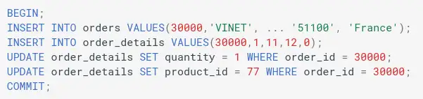
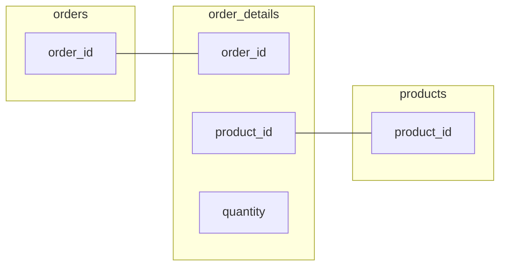

My work on dealing with multiple tables was interrupted when I discovered a subtle scenario that leads to DMS CDC output that cannot be correctly interpreted. I was unable to find a solution, but I will update this post if new information emerges.

--8<-- "ee.md"

<!-- more -->

## Fortunately Thoughtless

A later post in this series tackles changes across multiple tables. One of the examples I fired at the database was this innocent-looking set of transactions - and without it I might have happily finished off the series without noticing this problem!

Bonus points if you can tell what the problem will be.

```sql title="Just another transaction..."
BEGIN;
INSERT INTO orders VALUES(30000,'VINET', ... '51100', 'France');
INSERT INTO order_details VALUES(30000,1,11,12,0);
UPDATE order_details SET quantity = 1 WHERE order_id = 30000;
UPDATE order_details SET product_id = 77 WHERE order_id = 30000;
COMMIT;
```

## `order_details`

The `order_details` table connects `orders` and `products`. Rows represent the presence of a particular product in a particular order.



There's no single column that defines a unique entity in this table. A row represents a unique connection between an order and a product, so the pair of columns (`order_id`, `product_id`) are needed to uniquely identify a connection.

This is a **primary key** in the table and as you'd expect there's [a primary key constraint in the source database](https://github.com/pthom/northwind_psql/blob/3d271b23f3357532e63f92ffb10c4f258dfd20af/northwind.sql#L3745) to prevent duplicates.

```sql title="Primary key constraint in source database"
ALTER TABLE ONLY order_details
    ADD CONSTRAINT pk_order_details PRIMARY KEY (order_id, product_id);
```

## CDC External Table

I'll need to lay a table over the raw CSV files for `order_details` to query the CDC data.

```sql title="External table over the order_details CDC files"
CREATE EXTERNAL TABLE northwind_cdc.order_details (
  cdc_operation string,
  transaction_commit_timestamp string,
  order_id string, 
  product_id string, 
  unit_price string, 
  quantity string, 
  discount string,
  transaction_sequence_number string)
ROW FORMAT SERDE 'org.apache.hadoop.hive.serde2.OpenCSVSerde' 
LOCATION 's3://your-target-bucket/cdc/public/order_details'
```

## Clearer Example

That exact transaction is quite tricky to work with in CDC without disambiguation logic, and I'll avoid complicating things with that just yet. Here's a clearer illustration.

```sql title="Clearer example of the problem" linenums="1"
BEGIN;
-- insert new order '30004'
INSERT INTO orders VALUES(30004, 'VINET', ..., 'France');
COMMIT;

BEGIN;
-- insert an order detail for this order and product_id '1'
INSERT INTO order_details VALUES(30004,1,11,12,0);
COMMIT;

BEGIN;
-- insert an order detail for this order and product_id '2'
INSERT INTO order_details VALUES(30004,2,11,12,0);

-- update the order detail for product_id '1' to product_id '66'
UPDATE order_details SET product_id = 66 WHERE order_id = 30004 AND product_id = 1;

-- insert an order detail for this order and product_id '3'
INSERT INTO order_details VALUES(30004,3,11,12,0);
COMMIT;

BEGIN;
-- update the order details for product_id '2' to product_id '77'
UPDATE order_details SET product_id = 77 WHERE order_id = 30004 AND product_id = 2;
COMMIT;
```

What do rows in the source database look like for order `30004` at the end of all this? (ignoring uninteresting columns)

|order_id|product_id|quantity|
|--------|----------|--------|
|30004   |66        |12      |
|30004   |77        |12      |
|30004   |3         |12      |

I need to be able to reconstruct this state from my CDC records. What do I have in CDC?

```sql title="CDC order_details records for transaction 30004"
SELECT
    cdc_operation,
    transaction_commit_timestamp,
    order_id,
    product_id,
    quantity
FROM order_details
WHERE order_id = '30004'
ORDER BY transaction_commit_timestamp
```

|cdc_operation|transaction_commit_timestamp|order_id|product_id|quantity|
|-------------|----------------------------|--------|----------|--------|
|I|2024-06-12 14:43:09.325299|30004|1|12|
|I|2024-06-12 14:43:09.702809|30004|2|12|
|U|2024-06-12 14:43:09.834742|30004|66|12|
|I|2024-06-12 14:43:10.048971|30004|3|12|
|U|2024-06-12 14:43:10.589195|30004|77|12|

See it yet? How do I get to that final state?

I can't see any way to know that the row with `product_id=66` actually replaced the row with `product_id=1`!

I'm looking at five rows that don't make a lot of sense. They only include row values at the end of the transaction, and so look like independent (`order_id`, `product_id`) pairs, that is, five unique order-product connections. The CDC `U` update records give a clue - there's no corresponding insert for those.

## Deletions

I've run transactions through that end in the deletion of the `order_details` row and they are fine. You do see the primary key columns in the deleted record, so you can still tie it back to the row that was deleted.

## Singular Primary Keys

I've just shut down my RDS instance as it was running me up a bill - more on that in the last part of this series. I've not run a transaction through that updated a singular primary key column - for example, `UPDATE orders SET order_id = 2 WHERE order_id = 2;`. I see no reason that an update operation like that would behave any differently to the compound key in `order_details`.

I'd expect it to commit successfully if `2` was unique in the table, and then see an `UPDATE` CDC record for `order_id=2` with no way of telling it was an update on `order_id=1`.

## Solutions

You got me on this one. I don't see anything useful in the CDC data I have. Nothing in the [AWS DMS S3 target settings](https://docs.aws.amazon.com/dms/latest/userguide/CHAP_Target.S3.html) that I can turn on to get more information. Nor can I see any mention of the problem in the [AWS DMS Best Practices documentation](https://docs.aws.amazon.com/dms/latest/userguide/CHAP_BestPractices.html).

Presumably, the information needed to correctly apply the changes is present in the commit logs, or things like read replicas wouldn't work. For whatever reason that information is not present or available in the CDC output. [I've asked on AWS re:Post to see if I've missed anything](https://repost.aws/questions/QUfXtCkhI9SGepdNLbsqTzjQ/how-to-determine-which-record-was-updated-when-primary-key-is-updated).

If whatever source application is writing to the database never updates primary key values anywhere then I guess you wouldn't see this problem. I don't recall seeing a best practice called out to never update primary key values, and database-level constraints don't typically make primary key columns immutable. Even if the application doesn't make these kinds of updates, there's the possibility that manual troubleshooting or automation outside the application might.

## Post-Script

I ran this discovery past a couple of colleagues to check I wasn't missing something obvious, including [Nathan Carney](https://www.linkedin.com/in/nathan-carney-88aabb7) who pointed me to [MS SQL Server documentation](https://learn.microsoft.com/en-us/sql/relational-databases/system-tables/cdc-change-tables-transact-sql?view=sql-server-ver16) that says:

> After change data capture is enabled, no modification is allowed on the primary key.

--8<-- "blog-feedback.md"

