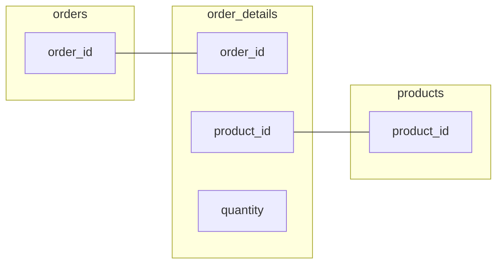

My work on dealing with multiple tables was interrupted when I discovered a subtle scenario that leads to DMS CDC output that cannot be correctly interpreted. I was unable to find a solution, but I will update this post if new information emerges.

--8<-- "ee.md"

<!-- more -->

## Accidental discovery

A later post in this series tackles changes across multiple tables. As I was writing it, one of the examples I fired at the database was this innocent-looking set of statements - and without it I might have happily finished off the series without noticing this problem!

Bonus points if you can tell what the problem will be.

```sql title="Just another transaction..."
BEGIN;
INSERT INTO orders VALUES(30000,'VINET', ... '51100', 'France');
INSERT INTO order_details VALUES(30000,1,11,12,0);
UPDATE order_details SET quantity = 1 WHERE order_id = 30000;
UPDATE order_details SET product_id = 77 WHERE order_id = 30000;
COMMIT;
```

## The `order_details` table

The `order_details` table connects `orders` and `products`. Rows represent the presence of a particular product in a particular order and record properties like quantity of the product.



There's no single column that defines a unique entity in this table. A row represents a unique connection between an order and a product, so the pair of columns (`order_id`, `product_id`) are needed to uniquely identify a connection.

This is a **primary key** in the table and as you'd expect there's [a primary key constraint in the source database](https://github.com/pthom/northwind_psql/blob/3d271b23f3357532e63f92ffb10c4f258dfd20af/northwind.sql#L3745) to prevent duplicates.

```sql title="Primary key constraint in source database"
ALTER TABLE ONLY order_details
    ADD CONSTRAINT pk_order_details PRIMARY KEY (order_id, product_id);
```

### An Athena table for `order_details`

I'll need to lay a table over the raw CSV files for `order_details` to query the CDC data.

```sql title="External table over the order_details CDC files"
CREATE EXTERNAL TABLE northwind_cdc.order_details (
  cdc_operation string,
  transaction_commit_timestamp string,
  order_id string, 
  product_id string, 
  unit_price string, 
  quantity string, 
  discount string,
  transaction_sequence_number string)
ROW FORMAT SERDE 'org.apache.hadoop.hive.serde2.OpenCSVSerde' 
LOCATION 's3://your-target-bucket/cdc/public/order_details'
```

### A clearer example

That exact transaction that led to discovery is quite tricky to work with in CDC without disambiguation logic, and I'll defer that complication for the next post. Here's a clearer illustration.

```sql title="Clearer example of the problem" linenums="1"
BEGIN;
-- insert new order '30004'
INSERT INTO orders VALUES(30004, 'VINET', ..., 'France');
COMMIT;

BEGIN;
-- insert an order detail for this order and product_id '1'
INSERT INTO order_details VALUES(30004,1,11,12,0);
COMMIT;

BEGIN;
-- insert an order detail for this order and product_id '2'
INSERT INTO order_details VALUES(30004,2,11,12,0);

-- update the order detail for product_id '1' to product_id '66'
UPDATE order_details SET product_id = 66 WHERE order_id = 30004 AND product_id = 1;

-- insert an order detail for this order and product_id '3'
INSERT INTO order_details VALUES(30004,3,11,12,0);
COMMIT;

BEGIN;
-- update the order details for product_id '2' to product_id '77'
UPDATE order_details SET product_id = 77 WHERE order_id = 30004 AND product_id = 2;
COMMIT;
```

What do rows in the source database look like for order `30004` at the end of all this? (ignoring uninteresting columns)

|order_id|product_id|quantity|
|--------|----------|--------|
|30004   |66        |12      |
|30004   |77        |12      |
|30004   |3         |12      |

I need to be able to reconstruct this state from my CDC records. What do I have in CDC?

```sql title="CDC order_details records for transaction 30004"
SELECT
    cdc_operation,
    order_id,
    product_id,
    quantity
FROM order_details
WHERE order_id = '30004'
ORDER BY transaction_commit_timestamp
```

|cdc_operation|order_id|product_id|quantity|
|-------------|--------|----------|--------|
|I|30004|1|12|
|I|30004|2|12|
|U|30004|66|12|
|I|30004|3|12|
|U|30004|77|12|

Do you see it yet? How do I get to that final state?

I can't see any way to know that the row with `product_id=66` actually replaced the row with `product_id=1`, and that there is no longer a row with `product_id=1`!

It looks like there are five products in `order_id=30004`, instead of the correct three, and the rows that are there don't make a lot of sense. They only include row values at the end of the transaction, and so look like independent (`order_id`, `product_id`) pairs, that is, five unique order-product connections.

The CDC `U` update records have no corresponding insert for those. Querying for `UPDATE`s without corresponding `INSERT` records looks like a good way of detecting and quantifying the problem.

## Singular primary keys

What about single-column primary keys? We can probably guess but I'll check. Here's a quick insert of `order_id 30005`, followed by an update of the primary key to `30006`. 

```sql title="Single-column insert and update primary key" linenums="1"
BEGIN;
-- create new order 30005
INSERT INTO orders VALUES(30005, 'VINET', ... , 'France');
COMMIT;

BEGIN;
-- update order 30005 to be order 30006
UPDATE orders SET order_id = 30006 WHERE order_id = 30005
COMMIT;
```

When these transactions come through the CDC pipeline, we have what looks like two orders, instead of one. `order_id 30005` no longer exists in the source database, and we see the same signature update-without-an-insert pattern.

```sql title="CDC output for updated primary key"
SELECT
    cdc_operation,
    transaction_commit_timestamp,
    order_date,
    order_id
FROM orders
WHERE order_id IN ('30005', '30006')
```

|cdc_operation|transaction_commit_timestamp|order_date|order_id|
|-------------|----------------------------|----------|--------|
|I|2024-06-16 09:40:36.854638|2024-05-07|30005|
|U|2024-06-16 09:40:51.026101|2024-05-07|30006|

Ouch.

## Deletions

I've run transactions through where an `order_details` row is deleted after an update. You do see the primary key columns in the deleted record, so you can still tie it back to the row that was deleted, but it doesn't help with the original update. If I deleted the `order_details` row with `order_id=66` in the example above, I'd be able to tidy up the corresponding `UPDATE`, but as you'd expect there's still no way to associate the `DELETE` with the `INSERT` with `order_id=1` is left behind.

## Solutions

I didn't see any further useful metadata in the CDC data I have. Nothing in the [AWS DMS S3 target settings](https://docs.aws.amazon.com/dms/latest/userguide/CHAP_Target.S3.html) that I can turn on to get more information. Nor can I see any mention of the problem in the [AWS DMS Best Practices documentation](https://docs.aws.amazon.com/dms/latest/userguide/CHAP_BestPractices.html).

[I asked on AWS re:Post to see if I've missed anything](https://repost.aws/questions/QUfXtCkhI9SGepdNLbsqTzjQ/how-to-determine-which-record-was-updated-when-primary-key-is-updated), and got a solution from an AWS support engineer. I can add a transformation to the CDC feed to add columns containing the previous values of primary key columns when those values are updated.

### Adding primary key before columns

Following the approach suggested on re:Post, I added a transformation rule with action `add-before-image-columns` to [append before images for primary key columns to the tables, using my CloudFormation template](https://github.com/brabster/northwind_dms_cdc/blob/482c74a5dbfce1742654cb94dfed8a4a04cc5d8a/cloudformation/rds_dms.yml#L254). I then re-ran the example transactions above and saw new values appended to the CSV files.

To inspect the new values with SQL, I updated the external table definitions to include the new columns, specifically: 

- append `before_order_id STRING` to the `orders` table column list
- append `before_order_id STRING, before_product_id STRING` to the `orders` table column list

[Full updated table definitions are available in the supporting GitHub repository](https://github.com/brabster/northwind_dms_cdc/tree/main/athena). Revisiting the last Athena query now (when I re-ran the transactions, I adjusted the `order_ids` to avoid confusion with the previous transactions)):

```sql title="CDC output for updated primary key with before image"
SELECT
    cdc_operation,
    transaction_commit_timestamp,
    order_date,
    order_id,
    before_order_id
FROM orders
WHERE order_id IN ('30015', '30016')
```

|cdc_operation|transaction_commit_timestamp|order_date|order_id|before_order_id|
|-------------|----------------------------|----------|--------|---------------|
|I|2024-07-05 20:11:22.407658|2024-05-26|30015||
|U|2024-07-05 20:11:40.463515|2024-05-26|30016|30015|

Great, I can now see that `order_id=30016` resulted from a primary key update on `order_id=30015`. How best to use this information may depend on what your usecase needs. For my promotions usecase, I could just ignore the problem altogether and accept the risk of an order qualifying more than once. Alternatively, I could ignore any rows with primary key updates by filtering out those that have a value in `before_order_id`.

If nothing else, having these "before" values aids the team in understanding what's going on. They show how these strange-looking updates without inserts occurred, and connects apparently new orders to their original IDs.

## Postscript

If whatever source application is writing to the database never updates primary key values anywhere then you wouldn't see this problem. Updates without corresponding inserts could indicate that the source application is behaving this way. I don't recall seeing a best practice called out to never update primary key values, and I don't know of database-level constraints that would prevent updates to primary key columns. Even if the source application doesn't make these kinds of updates as part of its normal operations, there's the possibility that manual troubleshooting or automation outside the application might.

I ran this discovery past a couple of colleagues to check I wasn't missing something obvious, including [Nathan Carney](https://www.linkedin.com/in/nathan-carney-88aabb7). He had a look round and amongst other things pointed me to [MS SQL Server documentation](https://learn.microsoft.com/en-us/sql/relational-databases/system-tables/cdc-change-tables-transact-sql?view=sql-server-ver16) that says:

> After change data capture is enabled, no modification is allowed on the primary key.

That's the SQL Server specific CDC, not DMS.

--8<-- "blog-feedback.md"

