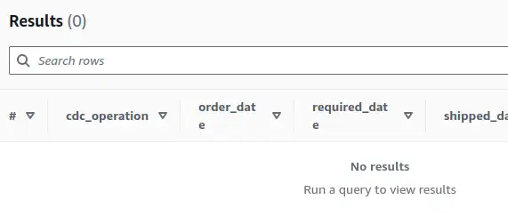

In previous posts, I [disambiguated transactions by filtering out any transient statements](../2024-06-04-disambiguating-transactions-in-change-data-capture/index.md) and noted that [changes in primary key values cause big problems](../2024-06-12-breaking-cdc-with-primary-keys/index.md). Now I can start to answer useful questions about the current and historical changes in a source table.

--8<-- "ee.md"

<!-- more -->

## Revisiting promotions

Earlier in the series, I made up [a use case related to running a promotion](../2024-06-04-disambiguating-transactions-in-change-data-capture/index.md#example-usecase---promotions):

> Each month, we'll enter qualifying orders into a raffle to win some swag. "Qualifying" orders give more than 28 days notice between `order_date` and `required_date` when the order ships.

I need to check each month, so I'll run a query to select candidate orders each month for the previous month. Using the `promotions` view I've already set up, which uses `orders_disambiguated`, and a current date of `1996-09-01` I'll try:

```sql title="Promotion candidate order query"
SELECT
  *
FROM northwind_cdc.promotions
WHERE ('1996-08-01' <= shipped_date AND shipped_date < '1996-09-01')
```

We get a few rows back, mostly records from the initial full load - so one row per order. Each order shipped in August 1996 as expected, and none were modified after the load so it's nice and straightforward. One row, one answer - qualifies or not.

One of the examples from last time, order `20002`, returns two rows.  This example set the `shipped date`, and then updated the required date in the next transaction. That explains the two rows - the last two rows in the history of this order both have a `shipped_date` set that falls within the range.

|cdc_operation|order_date|required_date|shipped_date|notice_period_days|qualifies_for_promotion|transaction_commit_timestamp|
|-------------|----------|-------------|------------|------------------|-----------------------|----------------------------|
|U|1996-07-04|1996-08-25|1996-08-01|52|true|2024-06-12 10:30:30.041474|
|U|1996-07-04|1996-07-10|1996-08-01|6|false|2024-06-12 10:30:30.412977|

When shipped_date is first set, there are 52 days between order and required, so it qualifies. After the next transaction, there are only 6 days between, so it doesn't. Which should we use?

## Strange behaviour happens

This behaviour might seem odd and contrived, but I've seen things far weirder. How an application uses its database can be unintuitive, even more so for applications that have been around for a while and perhaps accumulated a few layers of changes. It can get even more confusing - the behaviour and meaning of specific database interactions might change over time, one-off corrective activity can occur to address problems, and integration efforts can lead to odd things happening as systems try to keep in sync.

In a nutshell - strange-looking sequences of activity can surface in CDC data. The only way I know of to be confident of what these things mean and how to deal with them is to talk to people who know the systems and processes well - teams that support the application and folks performing business analysis roles.

One application I recall was updating the same field in a row anywhere from once to dozens of times almost instantaneously. After some head scratching, the best guess was a job synchronising state from another system that maybe had a bug that perhaps never been noticed and certainly never been fixed! It's also worth remembering to be pragmatic - in that case, we adjusted our approach so that we could ignore that effectively useless column.

## Picking the right state

The guidance is that the last update in the month of the `shipped_date` should be used to determine qualification. Any updates that might occur after that can be ignored. Updates of the `shipped_date` that might mean an order qualifies in more than one month are expected to be rare corrective activity. Let's say we'll monitor that and accept the risk for now.

### Window function in view approach

I tried using a variant of the same window function approach that we used to disambiguate transactions, but I found a problem and learned something about window functions along the way. Here's the view, modifying the window function window to partition by `order_id` alone and order by the commit timestamp.

```sql title="Last state of an order for qualification, first attempt"
CREATE OR REPLACE VIEW "orders_disambiguated_latest" AS 
WITH identify_last_transaction AS (
  SELECT
    *,
    ROW_NUMBER() OVER (transactions_reverse_chronological_order) position_in_chronology
  FROM orders_disambiguated
  WINDOW transactions_reverse_chronological_order AS (PARTITION BY order_id ORDER BY transaction_commit_timestamp DESC)
)

SELECT *
FROM identify_last_transaction
WHERE (position_in_chronology = 1)
```

Before moving `promotions` to use this view, I'll take a look at the data. Selecting `order_id 20002`:

|cdc_operation|order_date|required_date|shipped_date|transaction_commit_timestamp|
|-------------|----------|-------------|------------|----------------------------|
|U|1996-07-04|1996-07-10|1996-08-01|2024-06-12 10:30:30.412977|


That's the right row, at the commit timestamp ending `412977` and with only 6 days in the notice period. So far so good - but what happens if I try to time-travel back to immediately before this transaction? I'll confirm I get the same result with a `transaction_commit_timestamp` set to include the timestamp of this transaction:

```sql title="Time-travelling with transaction_commit_timestamp"
WHERE ('1996-08-01' <= shipped_date AND shipped_date < '1996-09-01')
  AND transaction_commit_timestamp <= '2024-06-12 10:30:30.412977'
  AND order_id = '20002'
```

Yes, the same row comes out. Now let's set the commit timestamp to right before `2024-06-12 10:30:30.412977` and hopefully I'll see the previous row instead. Just need to change the condition from `<=` to `<`.

```sql title=""
  AND transaction_commit_timestamp < '2024-06-12 10:30:30.412977'
```

No results. Huh? I know there's a row in there with the timestamp `2024-06-12 10:30:30.041474` which should match! Where is it?

### Why you can't time-travel

After a bit of head scratching I thought I had figured out what was going on. When a window function is used in a view or common table expression (CTE), the "frame" is filtered by the `WHERE` clause in the view or CTE, not the calling query. Any `WHERE` conditions in the query will affect the rows you see, but not the values computed in window functions. That's not very clear from the documentation I'd seen, so I wanted to confirm the hypothesis. Back to using the SQL interface like a REPL.

??? note "Views and Common Table Expressions"
    [Common Table Expressions using the WITH clause](https://trino.io/docs/current/sql/select.html#with-clause) allow a sub-query to be extracted and named. It's a powerful way of simplifying your queries without persisting anything in the database. Views have basically the same function, but they are persisted to the database and can be used by other views and other queries. Views can contain CTEs to simplify them, too. I think of views and CTEs as largely interchangeable and pick based on whether I want to persist the logic to the database or not.

```sql title="Simple example of window function filtering in CTEs"
-- a single column, with a row for values 1-5 in place of a timestamp
WITH timestamps AS (
    SELECT 1 AS timestamp
    UNION ALL SELECT 2
    UNION ALL SELECT 3
    UNION ALL SELECT 4
    UNION ALL SELECT 5
),

-- add a column for the row number based on ts descending
reverse_row_numbers AS (
    SELECT
        timestamp,
        -- no PARTITION BY so the "frame" is all the rows after any filtering
        ROW_NUMBER() OVER (ORDER BY timestamp DESC) row_number
    FROM timestamps
)

SELECT
    *
FROM reverse_row_numbers
ORDER BY timestamp
```

We have an initial table containing one column, with values 1-5 standing in for timestamps. We then augment that table, adding a column computed by a window function. The value in the new column is the position of the current row in reverse order so that the row with the biggest timestamp gets row number 1.

|timestamp|row_number|
|---------|----------|
|1|5|
|2|4|
|3|3|
|4|2|
|5|1|

So far so good. Let's time-travel back to timestamp `3`, adding a condition to the query like this:

```sql title="Time-travel back to timestamp 3"
SELECT
    *
FROM reverse_row_numbers
WHERE timestamp <= 3
ORDER BY timestamp
```

|timestamp|row_number|
|---------|----------|
|1|5|
|2|4|
|3|3|

Wait, what? I'd expected to see `3,2,1` in the `row_number` column. Despite restricting the rows in my query, the window functions in the common table expression are still seeing the whole table, with five rows! If I move the condition up into the common table expression where the window function is:

```sql title="Applying condition in the window function CTE"
SELECT
    timestamp,
    ROW_NUMBER() OVER (ORDER BY timestamp DESC) row_number
FROM timestamps
WHERE timestamp <= 3
```

|timestamp|row_number|
|---------|----------|
|1|3|
|2|2|
|3|1|

That's what I'd expected to see with my condition in the outer query, but it turns out that's not how window functions work. I wondered if this was a behaviour peculiar to Athena/Trino, so I copy-pasted my example to BigQuery and found the same behaviour. I can't see a way to influence the window frame in a common table expression or view from a query's `WHERE` clause.

??? note "Efficiency impacts"
    This behaviour might lead to unexpected scan costs in queries involving window functions too. If you are expecting your `WHERE` clause to limit the data scanned, for example by predicate pushdown and partition pruning, you might be in for a nasty surprise when the window functions scan the whole dataset anyway. Keep an eye on those scan or cost estimates and actuals!

## What now?

That little detour explains why I don't see a row in my earlier query when I limit `transaction_commit_timestamp < '2024-06-12 10:30:30.412977'`. The row I'd expect to see still has `position_in_chronology=2`, as the window function can still see the subsequent transaction :facepalm:. A solution for day-to-day operation is to avoid an upper time bound on your query.

In the last usecase I worked on, the system whose job it was to make the query did not set any high bound, but recorded the most recent timestamp in the results as a low-bound for the next query. That functions as a rudimentary [watermark](https://beam.apache.org/documentation/basics/#watermark) with the risk of late-arriving data ignored. To make things a bit more challenging in that system, the tables we were interested in did not have useful timestamps like `shipped_date` and we had to effectively use the transaction commit time to infer the time at which important events were occurring.

To use this solution, I update my `promotions` view to select from `orders_disambiguated_latest`. Running my query for August 1996, I get one row for each order, and each one gets the correct value for qualification. So long as I don't need to inspect the state of the system at some point in the past, I should be OK.

Whilst it might not be a problem in the expected operation of the system, ideally I'd like to be able to inspect what the system looked like at a particular point in time before "now", as it can be useful to explain unexpected behaviour.

I could also pack the logic to find the latest row into the query I run, effectively moving the window function to where the condition is. I'd rather keep the logic in a view where I can more easily inspect, document and test it if possible. I'll look at improving the approach next time.

