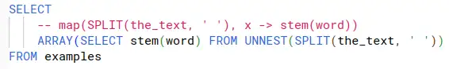

This walkthrough shows how I can use my functional programming techniques `map` and `filter` in SQL engines like BigQuery. These techniques give me a lot of power to keep processing efficiently at scale whilst keeping my SQL simple and relatively easy to understand.

<!-- more -->

BigQuery supports array-typed columns but doesn't provide an obvious `map` or a `filter` function. I missed these functions until I realised that you can use these functional programming concepts, it's not just not obvious how.

## Why `map` over an array in BigQuery?

An associate recently mentioned that they'd found a problem with a SQL pipeline I'd written some time ago. I'd used some fiddly [open source JavaScript code to implement a Porter stemmer](https://github.com/kristopolous/Porter-Stemmer/blob/master/PorterStemmer1980.js) as [a JavaScript UDF](https://cloud.google.com/bigquery/docs/user-defined-functions#javascript-udf-structure). The text I was stemming was often multiple words, and I'd assumed the stemmer would stem all the words.

Nope. It turns out that the stemmer code I'd used would stem whatever text was given as one word. For example, if the text to stem was "connecting connected connections", then it got stemmed to "connecting connected connect" instead of
"connect connect connect".

Oops. Sorry, person who had to clean up my mess. The solution? Break the text up on whitespace, then `map` the stemming function over the words.

It doesn't matter what the function we're going to `map` over the array actually does, so rather than complicate things with a custom stemmer, I'll use a built-in function for this example. I'll use [the LEFT function to simulate a stemmer](https://cloud.google.com/bigquery/docs/reference/standard-sql/string_functions#left).

## How to `map` in BigQuery

First - a couple of example strings

```sql
WITH examples AS (
    -- stemmed version is 'connect connect connect'
    SELECT 'connecting connected connections' AS the_text
    -- stemmed version is 'eardrum eardrum'
    UNION ALL SELECT 'eardrummed eardrums'
)

SELECT
    the_text
FROM examples
```

|the_text|
|--------|
|connecting connected connections|
|eardrummed eardrums|


### Split the text to get an array

```sql
SELECT
    SPLIT(the_text, ' ') words
FROM examples
```

|words|
|-----|
|[connecting,connected,connections]|
|[eardrummed,eardrums]|

### UNNEST and SELECT

I think about the next step as making a little table out of the array.

```sql
SELECT word FROM UNNEST(['connecting', 'connected', 'connections']) AS word
```

`UNNEST` turns the array into a table, and I have aliased the resulting rows as `word`. Then, I can select `word`, which maps the identity function over the array. If I put that back into my query...

```sql
SELECT
    (SELECT word FROM UNNEST(SPLIT(the_text, ' ')) AS word) AS words
FROM examples
```

I get an error `Scalar subquery produced more than one element`. That's because I haven't collected the little table back up into an array yet. That's easy to do:

```sql
SELECT
    ARRAY(SELECT word FROM UNNEST(SPLIT(the_text, ' ')) AS word) AS words
FROM examples
```

Now we have the table we started with back:

|words|
|-----|
|[connecting,connected,connections]|
|[eardrummed,eardrums]|

### Mapping the dummy stemmer

The next step is straightforward, using `LEFT(text, 7)` as a dummy stemmer:

```sql
SELECT
    ARRAY(SELECT LEFT(word, 7) FROM UNNEST(SPLIT(the_text, ' ')) AS word) AS words
FROM examples
```

Which produces the output we want:

|words|
|-----|
|[connect,connect,connect]|
|[eardrum,eardrum]|

## Bonus - `filter`

You've already figured this out, but once I've unnested my array into a table, I can use `WHERE` to filter.

```sql
SELECT
    ARRAY(SELECT word FROM UNNEST(SPLIT(the_text, ' ')) AS word WHERE word != 'connected') AS words
FROM examples
```

Which filters out the word 'connected' from my arrays.

|words|stemmed|
|-----|-------|
|[connecting,connections]|
|[eardrummed,eardrums]|

Naturally, I can combine map and filter operations in the same statement.

## Summary

I showed how to "map" the functional programming `map` and `filter` concepts to BigQuery by thinking in terms of little embedded SQL statements over unnested arrays as tables. I've not yet had any need to use `reduce`, the other function that springs to mind, so I'll update this if I ever need it.

This approach seems to work generally across SQL engines with minimal dialect variation. Some data warehouses provide functions that implement these capabilities more directly and naturally. For example, the Trino (was Presto) engine under AWS Athena provides [transform (for map)](https://trino.io/docs/current/functions/array.html#transform), [filter](https://trino.io/docs/current/functions/array.html#filter) and [reduce](https://trino.io/docs/current/functions/array.html#reduce) functions over arrays.