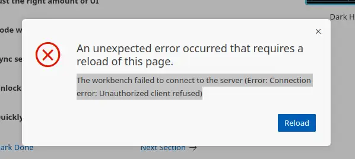
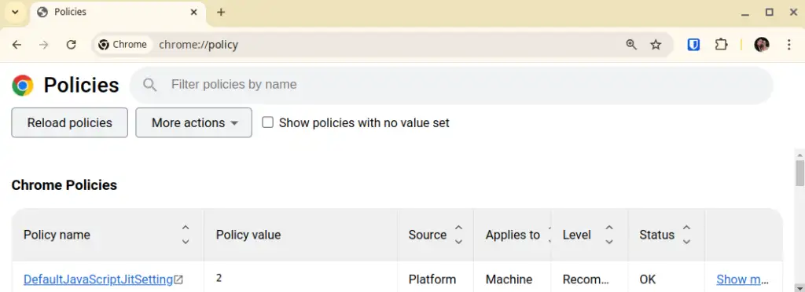
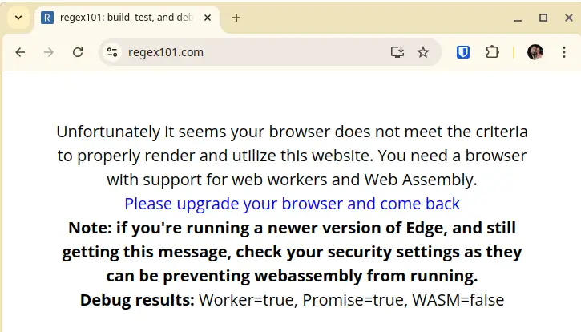
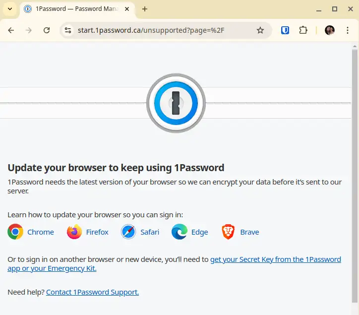
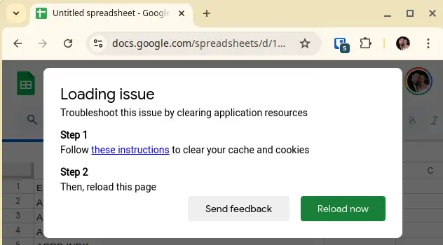

The Oct 15, 2024 update of Google Chrome stable (130.0.6723.58) suddenly broke some sites, such as GitHub Codespaces and 1Password, due to a JavaScript-related setting.

<!-- more -->

## Discovery

> Connection error: unauthorised client refused

This was the error message I was greeted with on Friday 18th Oct when I tried to get back to work in my GitHub Codespace after a four-day break. Everything was just fine when I pushed my last PR from the ferry in Europoort Rotterdam on Monday morning! Could it be something to do with the [six-monthly rebuild](../2024-02-27-automated-laptop-build-intro/index.md) I'd just done? A problem with GitHub? Was there a Chrome update between Monday morning when I shut down and Friday morning when I ran my usual start of day `sudo update`?

The short version: there's a Chrome setting `DefaultJavaScriptJitSetting` that disables the JS JIT compiler when set to value `2`. [`DefaultJavaScriptJitSetting` is documented in the Chrome enterprise policies](https://chromeenterprise.google/intl/en_uk/policies/#DefaultJavaScriptJitSetting). 

You can check the effective settings on your browser by navigating to chrome://policy.

<figure markdown="span">
 
 <figcaption>Chrome policies showing DefaultJavaScriptJitSetting</figcaption>
</figure>

Setting this value to `1` allows JIT on all sites, or you can add exceptions on a site-by-site basis. I've updated my installation to [allow JIT on the specific sites I need](https://github.com/brabster/xubuntu-workstation/blob/7bb3d528e62f4cc79bcc6a8f7e1c1fd03ef3ee27/roles/chrome-browser/files/recommended.json#L8) for now, and here's the relevant snippet from my Chrome policies file.

```json
{
    "DefaultJavaScriptJitSetting": 2,
    "JavaScriptJitAllowedForSites": [
        "[*.]github.dev",
        "[*.]1password.eu",
        "[*.]1password.com"
 ]
}
```

I've [raised an issue against Chromium](https://issues.chromium.org/issues/374469562) which has been reproduced successfully. Hopefully, the problem will be resolved soon and the exceptions will no longer be needed.

## Remote codespace in local VSCode

I didn't make much progress against it on Friday other than discovering that I could plug my local VSCode installation into the remote Codespace successfully. Microsoft provide [how-to documentation](https://docs.github.com/en/codespaces/developing-in-a-codespace/using-github-codespaces-in-visual-studio-code) and you need the GitHub Codespaces extension installed locally to do that - but it's provided by Microsoft, who also provide the VSCode application and GitHub Codespaces service, so there's no additional supply chain exposure there. It's nice to know this option is available and works well, and it pointed very clearly at a problem with Google Chrome (my browser of choice, again for reasons of supply chain trust).

## Investigation

I eventually narrowed the issue down to a privacy-related Chrome setting I use.

I needed to sort the problem out - there's a ton of client work to do and it's going to hurt to have my productivity impacted. I'm also worried about any implications for the choices I've made to use this browser and services like Codespaces, so I dug into the problem on Friday night.

I spun up my Xubuntu install USB stick. When you boot into it you have a working, ephemeral Xubuntu installation with root privileges, unlike my locked-down persistent installation. Between this and other testing, I established that:

- The issue was reproducible on multiple machines.
- The issue only manifested when I applied my policy settings. The vanilla browser was fine, which would explain why others weren't seeing the problem. Just me with my rather risk-averse settings.
- A process of elimination narrowed the problem down to a specific setting.
- Firefox manifested the same issue on Codespaces. Turned out to be a different privacy-related setting, [EnableTrackingProtection](https://github.com/brabster/xubuntu-workstation/blob/7bb3d528e62f4cc79bcc6a8f7e1c1fd03ef3ee27/roles/firefox/files/policies.json#L8). That was pretty confusing.
- The issue is present in beta and dev channels for Chrome, not just current stable.

## Other affected sites

I also found issues with [regex101.com](https://regex101.com), [1password](https://start.1password.com) and even [Google Sheets](https://sheets.google.com).

<figure markdown="span">
 
 <figcaption>"Unfortunately it seems your browser does not meet the criteria to properly render and utilize this website." regex101.com not working on the latest Chrome</figcaption>
</figure>

<figure markdown="span">
 
 <figcaption>"Update your browser to keep using 1password" 1password not working on latest Chrome</figcaption>
</figure>

<figure markdown="span">
 
 <figcaption>"Troubleshoot this issue by clearing application resources" Google Sheets not working on latest Chrome</figcaption>
</figure>

WebAssembly seems to be mentioned in error messages more often than coincidence would suggest, and it might make sense for an issue related to compilation and WebAssembly to manifest like this. We'll see, but at least there's a workaround, even if it does involve "dropping the shields" on some sites.

I already have to place significant trust in GitHub Codespaces and 1password by the nature of the service they provide. Sorry, but I can live without regex101.com - I'm using [regexr.com](https://regexr.com) instead for now.

--8<-- "blog-feedback.md"

