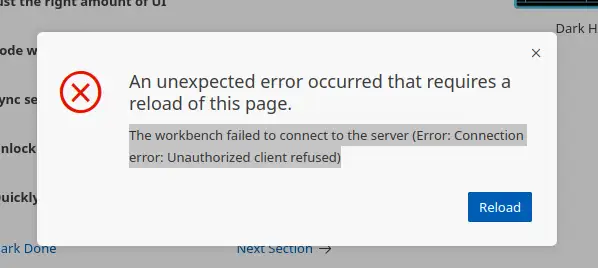

Codespaces stopped working for me on Friday. The evidence I've found strongly suggests an update in the Oct 15 update of Google Chrome (130.0.6723.58) causes a JavaScript-related setting to suddenly break some sites like GitHub Codespaces and 1Password.

--8<-- "ee.md"

<!-- more -->

## Header 1

<figure markdown="span">
 
 <figcaption>template figure</figcaption>
</figure>

--8<-- "blog-feedback.md"

