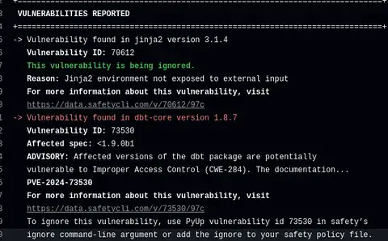

I noticed failing builds this week, with a dbt-core vulnerability flagged by SafetyCLI as the culprit. There was no actionable information in the command line output, so here's what I found and my action.

--8<-- "ee.md"

<!-- more -->

## Update 2024-11-17

My free SafetyCLI account started working the following day. Unfortunately, I was still unable to see any more information on the advisory, with the page inviting me sign in despite already being signed in. I've also had no response from dbt Labs about the security advisory I raised, so I'm left guessing. [Snyk currently reports no issues with dbt-core latest](https://snyk.io/advisor/python/dbt-core) so I'm going to set this one to ignored indefinitely. I suspect it's an erroneous signal for an old issue.

As a slight aside, I've been impressed with Snyk's offering and I've been planning give it a whirl anyway. When I've done that you can expect a comparison with my experiences on SafetyCLI (and the OWASP Dependency Checker before that).

## About PVE-2024-73530

[PVE-2024-73530](https://data.safetycli.com/v/73530/97c/) is, I believe, an identifier assigned by SafetyCLI themselves. Information is limited without a SafetyCLI account. I tried to sign up for an account this morning, but I'm getting errors back, so I can't actually see the specific issues and remediations. I raised the issue to SafetyCLI.

What we can see says it's related to ["improper access control", CWE-284](https://cwe.mitre.org/data/definitions/284.html). A link from the linked page points to [this commit from May 2024](https://github.com/dbt-labs/dbt-core/commit/0c08d7a19ad1740be3cb0b2e6d9d64f6537176f7), which addressed a risk related to how the local web server associated with `dbt docs serve` was configured. I can't see anything wrong in there. I can also see that the issue was created on October 1st, just over a month ago - so if there is a significant risk, we've already been exposed to it for a month.

Looking at Snyk, I can't find any indication of an issue there. If I were just using Snyk, I don't think I'd have any indication of a security problem at this point.

Finally, I looked on the dbt-core repo for any indications of what the issue might be and came up empty. The issue is in the public domain as it's flagged by SafetyCLI, but I've raised a private security disclosure with dbt Labs to ensure awareness and get any advice they might have.

So... not a lot to go on, and not the best position to be in, given that I have to make decisions about what to do.

## Actions

Given the lack of information, I do feel a bit exposed. Hopefully, SafetyCLI or dbt Labs will be able to share more information with me soon, and I'll update the post accordingly.

For now, it seems the only choices are to either not use dbt or "ignore" the vulnerability until more information is available.

If I choose to ignore it, I can add that to the `.safety-policy.yml` files to expire tomorrow, which will allow work to continue but force a review when I try to use dbt after that point, whether that's locally, in Codespaces or CI/CD automation.

It's easy to say "vulnerability management process" but the day-to-day reality is tricky...

--8<-- "blog-feedback.md"

