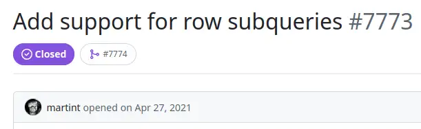

There is more than one way to build a `ROW` in AWS Athena and the underlying Trino engine. It turns out I was doing it the verbose, brittle and really annoying way. Row subqueries are so much better!

--8<-- "ee.md"

<!-- more -->

## Structured data in modern data warehouses

Modern data warehouse technology supports more than the scalar values I recall from my earlier career exposure to SQL. Alongside [arrays](https://trino.io/docs/current/language/types.html#array) and [maps](https://trino.io/docs/current/language/types.html#map), data structures that translate directly into JSON-style objects with properties and values are available. They are incredibly useful in combination, allowing efficient production of data that's ready to use without extra external logic. [In BigQuery, these are STRUCTs](https://cloud.google.com/bigquery/docs/reference/standard-sql/data-types#struct_type). [In Trino and Athena, they're ROWs](https://trino.io/docs/current/language/types.html#row).

Let's build a quick `ROW` to show how it works.

```sql
SELECT CAST(ROW('hello world', 2024) AS ROW(greeting VARCHAR, year INT)) AS a_row
```

|a_row|
|-----|
|`{greeting=hello world, year=2024}`|

As you'll see in the next section, that's useful to collect rich, specific details as we summarise records. I've also found it to be really helpful in directly producing JSON-compatible output, reducing the need for complexity and coupling in external consumers of the data.

```sql
WITH example AS (
    SELECT CAST(ROW('hello world', 2024) AS ROW(greeting VARCHAR, year INT)) AS a_row
    UNION ALL SELECT CAST(ROW('elbow bump', 2021) AS ROW(greeting VARCHAR, year INT))
)

SELECT
    CAST(a_row AS JSON) AS json_row
FROM example
```

|json_row|
|--------|
|`{"greeting":"hello world","year":2024}`|
|`{"greeting":"elbow bump","year":2021}`|

See? Told you it was JSON. These examples are all well and good, but it gets verbose and redundant in real life. What I usually want to do is build these structures in an array aggregation.


## The problem with CAST(ROW(...) AS ROW(...))

I'll take an example from my writing on CDC using Northwind source data. In that dataset I have a table of `orders`, and a table of `order_details`. What I'd like to do is collect together a subset of order details information for each order. The simple case is to accumulate a set of product IDs for the line items in each order.

```sql
SELECT
    order_id,
    ARRAY_AGG(product_id) line_items
FROM order_details_windowed
WHERE order_id IN ('10253', '10255', '10256')
GROUP BY order_id
```

|order_id|line_items|
|--------|----------|
|10253|`[49, 31, 39]`|
|10255|`[59, 16, 36, 2]`|
|10256|`[53, 77]`|

Now, to add the quantities:

```sql
SELECT
    order_id,
    ARRAY_AGG(CAST(
        ROW(
            product_id,
            quantity
        ) AS ROW(
            product_id VARCHAR,
            quantity VARCHAR
        )
    )) line_items
FROM order_details_windowed
WHERE order_id IN ('10253', '10255', '10256')
GROUP BY order_id
```

|order_id|line_items|
|--------|----------|
|10253|`[{product_id=39, quantity=42}, {product_id=31, quantity=20}, {product_id=49, quantity=40}]`|
|10255|`[{product_id=2, quantity=20}, {product_id=59, quantity=30}, {product_id=16, quantity=35}, {product_id=36, quantity=25}]`|
|10256|`[{product_id=77, quantity=12}, {product_id=53, quantity=15}]`|

Not appealing. I have to type a lot of characters and repeat myself both for the column names and the types of the row properties. If I don't explicitly `CAST` to `ROW` like this, I get tuples `[{39, 42}, {31, 20}, {49, 40}]` instead of named properties `{product_id=39, quantity=42}, {product_id=31, quantity=20}, {product_id=49, quantity=40}`.

Adding all that redundant information about the row schema makes me itch - it's brittle, and changes to the underlying data need to copied up to the row schema. It all feels quite unnecessarily unpleasant!

## The vastly better way

My searches for a better way came up empty for the past couple of years. Then, last week I noticed [Trino issue #7773](https://github.com/trinodb/trino/issues/7773) from May 2021. There's another way to build a `ROW`. Use `SELECT`. :facepalm:

```sql
SELECT
    order_id,
    ARRAY_AGG((SELECT
        product_id,
        quantity
    )) line_items
FROM order_details_windowed
WHERE order_id IN ('10253', '10255', '10256')
GROUP BY order_id
```

|order_id|line_items|
|--------|----------|
|10253|`[{product_id=39, quantity=42}, {product_id=31, quantity=20}, {product_id=49, quantity=40}]`|
|10255|`[{product_id=2, quantity=20}, {product_id=59, quantity=30}, {product_id=16, quantity=35}, {product_id=36, quantity=25}]`|
|10256|`[{product_id=77, quantity=12}, {product_id=53, quantity=15}]`|

Much better. Exactly the output I want. No repetition of the property names. No brittle re-specification of the array row schema. Thank you [@martint](https://github.com/martint)!

--8<-- "blog-feedback.md"

