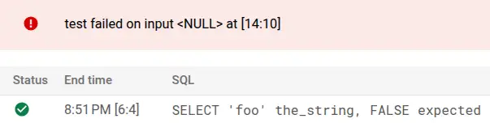
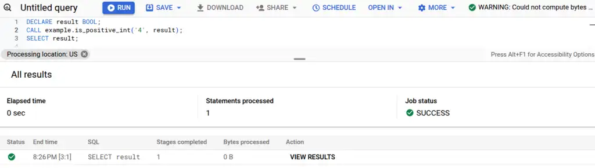
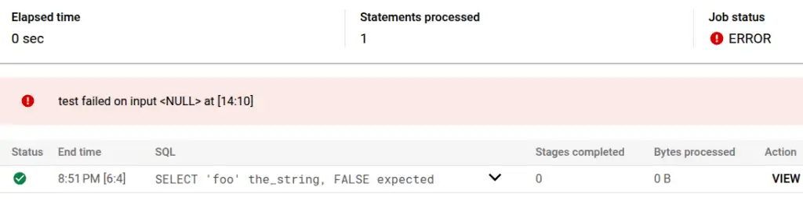

Whilst I've used and written about UDFs a lot, I can't recall ever having a reason to work with stored procedures. When I was asked how I'd go about wrapping them in automation and testing, I thought it'd be a good excuse to take a look and see how I might go about testing them!

<!-- more -->

## On stored procedures

According to Wikipedia, [stored procedures have been part of the SQL standards since the 1990s](https://en.wikipedia.org/wiki/Stored_procedure). My understanding after an hour or so is that they're a scripting language for SQL. You can use them to run multiple SQL statements, use variables and control structures like loops, and change the state and structure of the database using DML (`INSERT`, `UPDATE` et al.) and DDL (`ALTER`, `CREATE` et al.). You can also make SQL itself more dynamic because you can generate SQL on the fly and execute it.

UDFs are very limited in comparison. They are just functions - they take arguments and produce an output value. No state manipulation, no scripting. That simplicity makes [testing UDFs pretty easy and maintainable, with or without dbt](https://www.equalexperts.com/blog/our-thinking/testing-and-deploying-udfs-with-dbt/). They're also pretty easy to integrate into dbt, either as a "hook", or as [a custom materialization for a faster, more maintainable and better integrated experience](https://tempered.works/posts/2024/02/19/materialized-udfs-in-a-dbt-world/).

Very powerful. My gut also says probably very dangerous, easy to use inappropriately and hard to test, especially because of the state and structural manipulation capabilities. I think I've inadvertently avoided them to date because the combination of views, UDFs and dbt-style tooling can cover most of the things I'd otherwise have wanted to do with stored procedures. There may well be cases where they're the right choice in 2024 but none I've personally seen come to mind.

A brief look around the internet, like ["Unit test if most logic written in Stored Procedures" on Reddit](https://www.reddit.com/r/dotnet/comments/1533c0t/unit_test_if_most_logic_written_in_stored/), suggests it's going to be challenging. Still - let's see what we can do.

## Examples in BigQuery

I'll use BigQuery as it's convenient for me. I would expect what I talk about here to translate to other databases and warehouses given that stored procedures have been part of the SQL standards for so long.

### Recap is_positive_int example

First, I tried to replicate the example I wrote for my Equal Experts article. I'll reproduce the original here with better formatting.

```sql
CREATE OR REPLACE FUNCTION my_schema.is_positive_int(a_string STRING)
RETURNS BOOLEAN
AS (
  REGEXP_CONTAINS(a_string, r'^[0-9]+$')
);
```

I test that UDF with a CTE (with dbt templating in an appropriate dataset with `target.schema`), like this:

```sql
WITH examples AS (
  SELECT 'foo' the_string, FALSE expected
  UNION ALL SELECT '1111', TRUE
  UNION ALL SELECT '5 not this', FALSE
  UNION ALL SELECT 'still not this 5', FALSE
  UNION ALL SELECT NULL, NULL
)

, test AS (
  SELECT
    *,
    {{ target.schema }}.is_positive_int(the_string) actual
  FROM examples
)

SELECT * FROM test WHERE actual IS DISTINCT FROM expected
```

- No rows returned in the test query? Test passed :heavy_check_mark:.
- Any rows returned? Test failed :x:, and the rows include the values in each column that led to the failure.

Variations on this sort of test exist in pretty much every data processing pipeline I've written in the past few years. They get run by my CI/CD system when people propose changes. Can I use the same strategy for testing a stored procedure? What follows is the result of a couple of hours' investigation - if you can see any improvements or better approaches I'd love to hear about it! Please get in touch, contact details are at the bottom of the post!

### is_positive_int as a stored procedure

Here's the closest and simplest stored procedure I can make to replicate the functionality of the UDF example above. It's probably not a great example of a real-life stored procedure given that it's better implemented as a UDF, but it illustrates the machinery involved and how a broadly equivalent testing strategy might work.

The stored procedure that follows takes `the_string` like the UDF, and an `OUT` parameter of `result`, allowing the result to be passed back to the caller.

```sql
CREATE OR REPLACE PROCEDURE example.is_positive_int(a_string STRING, OUT result BOOL)
BEGIN
  SET result = REGEXP_CONTAINS(a_string, r'^[0-9]+$');
END
```

Calling it to use the result requires a [multi-statement query](https://cloud.google.com/bigquery/docs/multi-statement-queries) to capture the result.

```sql
DECLARE result BOOL; -- I need to declare the out variable
CALL example.is_positive_int('4', result); -- call the procedure
SELECT result; -- select the out variable
```

<figure markdown="span">
 
 <figcaption>Calling the stored procedure. The results panel shows that it was successful.</figcaption>
</figure>

Usability issues compared to UDFs and views are apparent. I can't see the result I selected - I must click the "SHOW RESULTS" button. The other usability issue that jumps out to me is that I can't see an estimate of the processing cost (top right) for multi-statement queries.

At the command line (I have legacy SQL and default project set already to save space...):

```console
$ bq query 'DECLARE result BOOL; CALL example.is_positive_int("4", result); SELECT result;'
Waiting on bqjob_r3280a32952dbd70d_000001948050c444_1 ... (0s) Current status: DONE   
SELECT result; -- at [1:65]
+--------+
| result |
+--------+
|   true |
+--------+
```

### A test for is_positive_int

To replicate the example-based test I had before, I came up with this multi-statement query. Instead of a CTE, it loops over the examples, calling the procedure on each, capturing the out-variable and checking the expected value against the actual. I'll set the last example incorrectly (it should expect `NULL` on a `NULL` input) to force a failure.

```sql
BEGIN
DECLARE actual BOOL;

FOR record IN
 (SELECT 'foo' the_string, FALSE expected
    UNION ALL SELECT '1111', TRUE
    UNION ALL SELECT '5 not this', FALSE
    UNION ALL SELECT 'still not this 5', FALSE
    UNION ALL SELECT NULL, TRUE)
DO
  CALL example.is_positive_int(record.the_string, actual);
  IF record.expected IS DISTINCT FROM actual
    -- attempting to log the NULL directly causes an error; so COALESCE to a string representation
    THEN RAISE USING MESSAGE = 'test failed on input ' || COALESCE(record.the_string, '<NULL>');
  END IF;
END FOR;
END
```

Running in the console:

<figure markdown="span">
 
 <figcaption>Calling the stored procedure. The results panel shows that it was successful.</figcaption>
</figure>

It's not practical to copy-paste all that on the command line, so I've wrapped the test in its own stored procedure `test_is_positive_int()`. I could have copied the test into a file (or used tooling like dbt) to avoid the need to persist the test procedure into the database.

```console
$ bq query 'CALL example.test_is_positive_int()'
Waiting on bqjob_r4755639fbdc4211b_00000194805e6b2b_1 ... (1s) Current status: DONE   
Error in query string: Error processing job 'the-project:bqjob_r4755639fbdc4211b_00000194805e6b2b_1':
 test failed on input <NULL> at [the-project.example.test_is_positive_int:13:10]
```

## More complex stored procedures

I'm aware that real-world stored procedures are usually going to be more complex than this. We're already on a 6-minute read and I don't have time to invest in a thorough exploration of more complex examples now. I think the basic machinery I have here suggests that more complex procedures may yield to a testing strategy. [The BigQuery documentation provides an example stored procedure that modifies data in the database](https://cloud.google.com/bigquery/docs/procedures#pass_a_value_in_with_an_input_parameter):

```sql
CREATE OR REPLACE PROCEDURE mydataset.create_customer(name STRING)
BEGIN
DECLARE id STRING;
SET id = GENERATE_UUID();
INSERT INTO mydataset.customers (customer_id, name)
  VALUES(id, name);
SELECT FORMAT("Created customer %s (%s)", id, name);
END
```

This example `INSERTS` a row into the database. We could use a similar test fixture as described above to check what was inserted under test conditions.

BigQuery supports default project and dataset IDs, meaning that we can likely avoid hardcoding the dataset into the procedure. That should allow the procedure to be run against test data or even temporary tables by changing the way it's called, without changing the content of the procedure itself. If that's not an option, then templating out those details (or even the entire content of the procedure) with custom code or tooling like `dbt` will be able to do the job.

Another thought that occurs to me is to use a testing solution that suits the application that uses the database - for example [JUnit](https://junit.org/junit5/). I can imagine that route might get tricky and risky without some of the techniques I've already mentioned. I think without them you might be left with using transaction management to run a state-modifying test and roll back against a test or (horror!) real database. I do find that idea a bit alarming, but still probably better than not having a testing capability at all!

## Conclusion

After a few hours poking at the practicalities of stored procedures, I don't see anything I've missed in my own experiences to date! It does look like testing strategies are possible that can help document how a procedure is supposed to behave and help catch regressions before they affect the production system (also known as :facepalm:facepalm-proofing!). I hope this post can help you get started if you're scratching your head, and please do get in touch if you have any thoughts or feedback!

--8<-- "blog-feedback.md"

