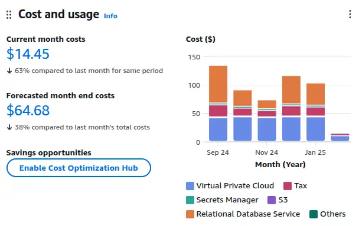
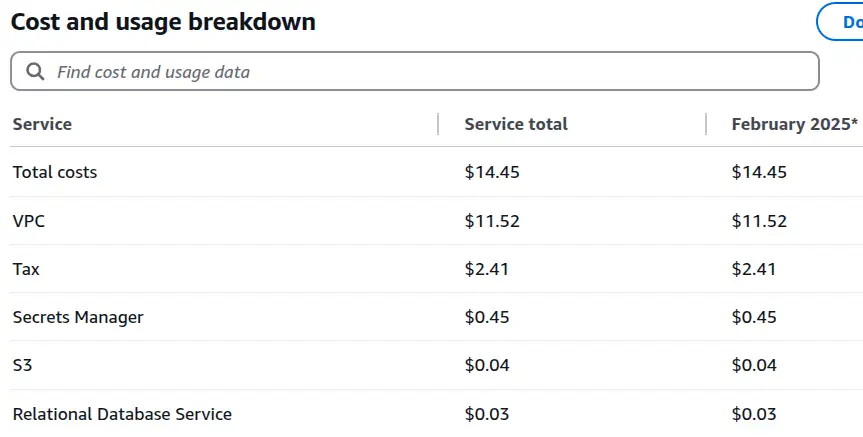
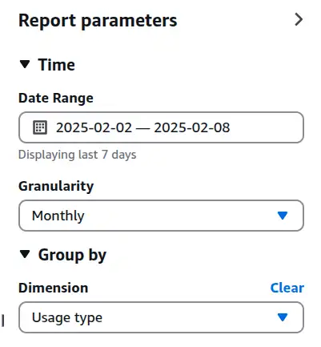
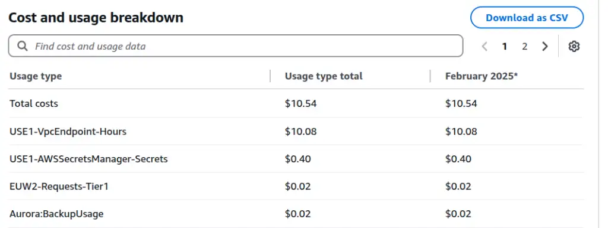
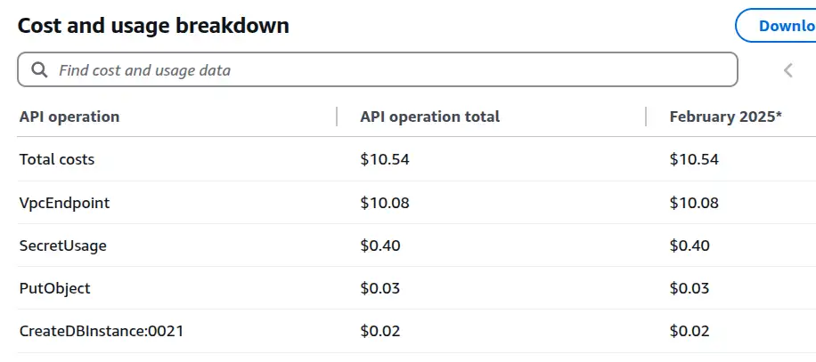

My AWS bill was higher than I expected, and it wasn't immediately clear what was driving the cost. Here's how I tracked down the culprits.

<!-- more -->

## The mystery bill

I'd been running an [RDS + DMS CloudFormation stack](https://github.com/brabster/northwind_dms_cdc/tree/main/cloudformation) for a few months as part of my CDC writing. Expect a post at some point going over the obvious and most subtle costs involved. When I tore the stack down in January 2025, I was still getting a bill of a couple of dollars a day and I wasn't sure why.

<figure markdown="span">
 
 <figcaption>Cost and usage report showing current month costs at $14.45 and forecasted end costs at $64.68. Includes bar chart of various service costs across five months.</figcaption>
</figure>

When I tore the stack down, one resource was left behind - the AWS bucket that DMS wrote the change data capture stream into. It contains very little data though, so it shouldn't be running up a noticeable bill. I could do without a $64-per-month bill for nothing. How can I find these resources?

## Billing - cost explorer

My next step is to click the offending dollar value on the homepage, which takes me to the cost explorer. Here, I see a fairly useless chart of the current month's costs, with a very useful list of costs by service.

!!! note "Being cost-curious"
    I've learned a lot over the years by being curious about costs - and I've used that knowledge to save clients money. If you can see these actual/predicted cost numbers when you head to the homepage, I'd recommend clicking in and taking a look around. It'll help you understand what's expensive and what's not, and there's a chance you'll spot something consuming money for nothing - a prime target for quick and easy cost-efficiency improvements. If you can't see these numbers and would like to, try clicking the AWS console home link (Top left in the console) or asking your administrator.

<figure markdown="span">
 
 <figcaption>Cost breakdown table showing current month expenses for various services, including VPC, tax, Secrets Manager, S3, and Relational Database Service.</figcaption>
</figure>

This view is a useful first step. The costs are in the VPC service, ruling out the S3 bucket as the cause. Unfortunately, VPC covers a lot of different kinds of resources - how do I track down the ones that are costing me money?

## Tag editor

AWS is a big, complex beast and I've had problems sometimes tracking down deployed resources that cost money - particularly tricky when the resources are deployed in a region you're not expecting! The [Tag Editor](https://docs.aws.amazon.com/tag-editor/latest/userguide/tagging.html) allows the enumeration of resources across regions, but as far as I know, it's not straightforward to use to track down these resources. I have very little deployed into this account, but when I search across all regions for all resources, I see the following:

<figure markdown="span">
 
 <figcaption>The top six resource search results are listed in Tag Editor, showing items with identifiers, types, and regions. Types include Stack, Trail, and DHCPOptions. Regions include eu-west-1, 2 and 3. There are no tags assigned to the resources.</figcaption>
</figure>

The vast majority of the resources I see are, I believe, network-related resources that AWS deploys by default into all regions for my account. Perhaps I should go through and delete all that stuff, assuming it won't cause any problems in my account. There are no tags against any resources other than the S3 bucket I already know about and an account I custom-tagged with a client identifier. None of it helps me understand what's costing me this money.

!!! note "Should I just tag all the things?"
    I have had the thought that maybe I should be tagging stuff to help in this kind of situation. Whilst it might help, I don't think it would guarantee anything - I suspect there would still be resources that get created automatically as part of my efforts that don't get tagged. Whilst custom tagging might be useful, I still need a way of finding stuff that falls outside or pre-dates my tagging strategy anyway.

## Back to cost explorer

I've found the most effective tool to track down these resources is back in the billing console. I switch the breakdown to usage type in the report parameters section, like this:

<figure markdown="span">
 
 <figcaption>Interface showing report parameters: Date range set to the last week; monthly granularity; grouped by usage type.</figcaption>
</figure>

Again, the chart isn't very useful, but the breakdown panel underneath is.

<figure markdown="span">
 
 <figcaption>Table showing cost and usage breakdown with totals for various AWS usage types. The usage types reveal specific information about exactly what resources in which regions are driving the cost.</figcaption>
</figure>

Aha. This table is packed with useful information.

`USE1-VpcEndpoint-Hours` is responsible for almost all the cost -  VPC endpoints in `us-east-1`. That makes sense - I had to have private endpoints to get from the RDS database locked away in a private VPC to the S3 and Secrets Manager services. I expected them to get cleaned up as part of my CloudFormation destroy operation, but it seems they did not.

I'm also paying for `USE1-AWSSecretsManager-Secrets` - makes sense, I had a secret in there, the RDS database password, which hasn't been cleaned up in the destroy. `Aurora:BackupUsage` also makes sense - I have some backups of the RDS database. Aside from being in `eu-west-2`, the culprit behind `EUW2-Requests-Tier1` isn't clear - but I can switch the breakdown from "Usage type" to "API operation" to get another useful perspective.

<figure markdown="span">
 
 <figcaption>Table displaying API cost breakdown, with total costs and individual operation expenses listed.</figcaption>
</figure>

`PutObject` and `CreateDBInstance:0021` look like possible culprits. There's no region information available here, so I find API operation and usage type work well together to shed actionable insights on costs. I either get pointed at the exact culprit, or I get specific information about where to go and look next.

## Summary

AWS Billing's cost explorer reporting is packed with actionable information to track down costs, including service, region and API operation usage. Using these different perspectives together can help quickly find the resources responsible, regardness of which region or service they're hiding in.

--8<-- "blog-feedback.md"

--8<-- "ee.md"
