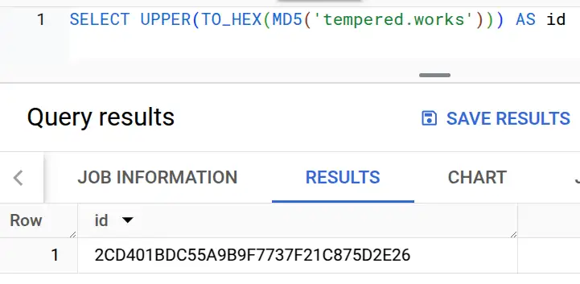

I'll share how I generate unique identifiers from data in 2025, avoiding the pitfalls I've seen along the way.

--8<-- "ee.md"

<!-- more -->

## The problem I'm solving

I have some chunk of data, often a string of text, but it can be more complex like an array or a JSON dictionary. I want to produce a value that I can use to refer to this data in user-friendly ways.

## TL;DR

I'm using [MD5](https://en.wikipedia.org/wiki/MD5) to produce a digest from a string or bytes value, then I'm using plain old [hexadecimal](https://en.wikipedia.org/wiki/Hexadecimal) encoding of that digest, specifying upper or lowercase for the alpha characters. This solution best meets the needs I describe next.

### User-facing needs

- It produces clean-looking URLs and copy-pastes easily.
: The value might end up in front of users in a URL or an API endpoint. That means it might end up being copy-pasted into messaging systems, tickets, spreadsheets and the like, so I want it to be easy and convenient to copy-paste the full value correctly. [Characters that require URL-encoding](https://en.wikipedia.org/wiki/Percent-encoding) are bad. Characters that require click/tap-and-drag to select across are also bad - double-click or tap-and-hold should select the whole value.
- It doesn't carry any inappropriate meaning.
: I don't want any confusion about the value being an identifier. It should not be likely that the value could be confused with, for example, a natural language word.
- It isn't possible to reverse the process to reveal the original value.
: I don't need cryptographic protection from this kind of reverse engineering, but I would prefer to hide how the value is computed in case there are details in the original value that should not be available to inspect. Being able to compute and compare the identifier, given a candidate value, isn't a problem.

### Implementation needs

In addition to these more user-facing needs, I have a couple of constraints to ensure the solution doesn't create problems down the road.

- It must be deterministic and stable over time.
: These values might end up being stored directly in other systems that interface with the system I'm working on, or internally between different parts of the system. An example would be a feature where a user can "favourite" something this value refers to. We don't want those values to change!
- It can generate identifiers for other data structures than strings.
: Sometimes I need to make an ID for an array of values, a JSON dictionary, an image, and so on.
- It doesn't create lock-in.
: I would like to avoid locking into whatever ecosystem I'm using today so that ID generation does not become a factor in future decisions. I should be able to generate the same value for the same input over as broad a range of technology as possible.
- It avoids depending on new software supply chains.
: Software supply chains bring multiple types of risk, which I talk about a little in an earlier post touching on [supply chain security](../2024-05-01-how-i-do-python-supply-chain-security/index.md#assessing-dependency-risk). I'd rather not trust any source of software that I can avoid.
- Collisions are very unlikely.
: It needs to be unlikely that two different pieces of data produce the same identifier. I can design the system to make this scenario an irritation rather than a catastrophe, but the less likely it is, the better.
- It's efficient.
: I'd like an efficient solution that meets the other constraints. I don't want significant latency, nor do I want to waste compute power without good reason.

Quite the list for such an apparently simple problem!

## Solution

The general solution I use is to first produce a hash from the value, then encode the hash in a way that meets my usability needs. I'll quickly summarise the steps.

### Hashing the value

The general solution I use first produces a hash from the value. [Hashing is a bit of computing magic that takes a chunk of data of any size and produces a fixed-size output](https://en.wikipedia.org/wiki/Hash_function). Information is lost in the process, so you can't "undo" a hash to retrieve the original value. The idea has been around forever, and I've yet to come across a computing platform that doesn't support the concept. Which hash function to choose? There are many [hash functions](https://en.wikipedia.org/wiki/List_of_hash_functions), and most would break my portability and supply chain needs.

I've fallen into this trap before. I needed to generate hashes in [AWS Athena](https://docs.aws.amazon.com/athena/) (based on the [Trino open-source engine](https://trino.io/)), so I followed the advice in the [Trino hashing functions documentation](https://trino.io/docs/current/functions/binary.html#hashing-functions):

> For general purpose hashing, use `xxhash64()`, as it is much faster and produces a better quality hash.

Unfortunately, when we migrated to BigQuery, `xxhash64` was not natively available! I could have used a Javascript UDF, but that would have introduced complexity and new supply chains, so... no. I switched to a hashing algorithm that BigQuery did support, then generated a mapping table for existing xxhash64-based IDs in Athena until all the original values had been found and replaced.

Learning from that experience I use [MD5 hashing](https://en.wikipedia.org/wiki/MD5) now. MD5 has been around since the 1990s and is supported everywhere I've looked. MD5 might be a poor choice for use in crypto, but I see no reason why it's not suitable for the purpose of producing a fixed-length identifier. [MD5: The broken algorithm](https://www.avira.com/en/blog/md5-the-broken-algorithm) suggests that the chance of an accidental collision between two values is on the order of 10<sup>-29</sup>.

> But, as you can imagine, the probability of collision of hashes even for MD5 is terribly low. That probability is lower than the number of water drops contained in all the oceans of the earth together.

That's small enough that I'm not going to worry about it. I've certainly never seen an accidental hash collision in real life in the last 25 years of my career. The same article also says that MD5 is the faster algorithm compared to SHA1 and SHA256, although not by enough that I'd consider it a factor. The last benefit of MD5 over those other algorithms for my purposes is that it produces a shorter value - 16 bytes compared to 20 or 32. The shorter the value is, the shorter the identifier will be.

That brings us neatly to part two - encoding.

### Encoding the hashed value

Hash functions produce a "digest" - a little blob, with a specific length, of binary data. For example running: `SELECT MD5('tempered.works')` on BigQuery produces (in binary): `00101100110101000000000110111101110001010101101010011011100111110111011100110111111100100001110010000111010111010010111000100110`

Not a great identifier, as it is so long! The second part of the process is to encode this value in a larger alphabet than ones and zeroes to get something a bit easier to work with. This is where I hit the next two facepalm moments. Firstly, not all encodings meet my usability needs. The obvious choice (and indeed the default representation if you run that query in BigQuery) is [Base64 encoding](https://en.wikipedia.org/wiki/Base64), which produces `LNQBvcVam593N/Ich10uJg==`.

That value is not user-friendly - try selecting it! The `/` character breaks the selection in the middle, as does the `==` padding at the end. It also causes usability issues if those values end up as [keys in S3-like storage systems](https://docs.aws.amazon.com/AmazonS3/latest/userguide/object-keys.html) - yes, I hit that one too. On top of that it needs encoding again to be used as a URL:

```sql
SELECT bqutil.fn_eu.cw_url_encode(TO_BASE64(MD5('tempered.works')))

LNQBvcVam593N%2FIch10uJg%3D%3D
```

So Base64 is a bad choice, despite being commonly available in databases and programming languages. [Base32](https://en.wikipedia.org/wiki/Base32) works better, being an alphabet without those funny symbols. It still has the problem of those equals symbols padding the end, but there's a worse problem - it's not very portable. Again, Base32 isn't available on BigQuery, for example.

So the encoding I've chosen is boring old hexadecimal. It's available everywhere, only includes the characters 0-9 and a-f, and produces values of a manageable size. One last gotcha - hex conversion functions may return upper or lowercase a-f, so be aware of the need to pick one and upper/lower accordingly. The non-SQL examples in the following table require imports, but the modules are part of the runtime, not third-party dependencies.

|Ecosystem|Expression|Output|
|---------|----------|------|
|BigQuery|`SELECT UPPER(TO_HEX(MD5('tempered.works')))`|`2CD401BDC55A9B9F7737F21C875D2E26`|
|Athena/Trino|`SELECT TO_HEX(MD5(TO_UTF8('tempered.works')))`|`2CD401BDC55A9B9F7737F21C875D2E26`|
|Snowflake|`SELECT UPPER(MD5('tempered.works'))`|`2CD401BDC55A9B9F7737F21C875D2E26`|
|Python|`hashlib.md5(b'tempered.works').hexdigest().upper()`|`2CD401BDC55A9B9F7737F21C875D2E26`|
|NodeJS|`crypto.createHash('md5').update('tempered.works').digest('hex').toUpperCase()`|`2CD401BDC55A9B9F7737F21C875D2E26`|

Pretty portable!

## Summary

So how does this solution compare to my list of needs?

- It produces clean-looking URLs and copy-pastes easily ✓
- It doesn't carry any inappropriate meaning ✓
- It isn't possible to reverse the process to reveal the original value ✓
- It must be deterministic and stable over time ✓
- It can generate identifiers for other data structures than strings ✓
- It doesn't create lock-in ✓
- It avoids depending on new software supply chains ✓
- Collisions are very unlikely ✓
- It's efficient ✓

Looking good. I'll update this post if I come across any drawbacks in the future.

--8<-- "blog-feedback.md"

