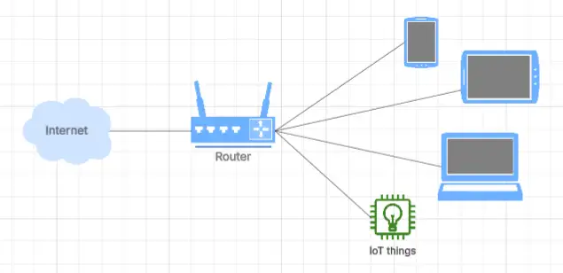
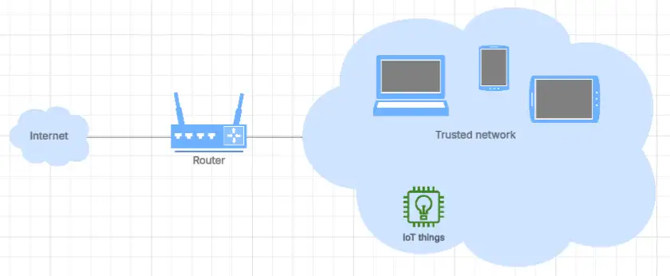
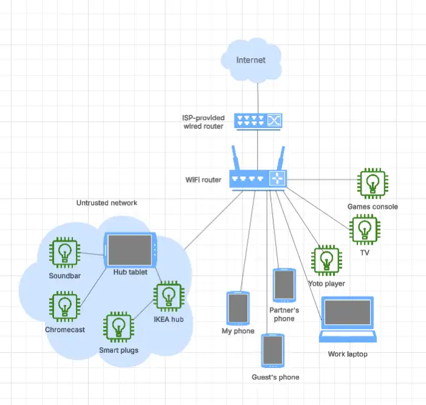

I believe that making my guest network my default network reduces the potential harm a compromised app or device can cause. What was my "trusted" network is now my "untrusted" network, with only a few low-risk devices that **really** need local network connectivity connected to it, isolated from other devices that matter like my phone and work laptop.

It's a simple change in how I use my home network, and does not require in-depth knowledge and experience. Having operated this way at home for a few months now, I've found little impact on day-to-day usability, but it's really helped me sleep better at night. I'll explain what I changed, why, and how I've adjusted my wider thinking on my home network security to take better advantage of this approach.

--8<-- "ee.md"

<!-- more -->

## What's a "guest" network?

Modern routers generally support a "guest" network, alongside the "trusted" network. The purpose of this guest network is to allow untrusted devices to use your fast and cheap internet connectivity without giving them any access to devices on your home network. ["What’s a guest Wi-Fi network, and why do you need one?"](https://www.kaspersky.co.uk/blog/guest-wifi/14446/) via Kaspersky describes the risk that this setup mitigates.

> Many pieces of malware are able to spread themselves over a local network, and if an infected device is connected to your Wi-Fi, it will try to contaminate everything in its range.

That article also walks through typical guest network setup if you currently don't have one - it should be a simple thing to set up. I visualise the guest network as devices that are connected to the internet via my router but are not aware of one another. They can call out to the internet but can't see one another.

<figure markdown="span">
 
 <figcaption>The devices on the guest network can call out to the internet, but cannot see one another.</figcaption>
</figure>

The trusted network looks quite different. These devices can also call out to the internet, but can also see and try to interact with other devices that are on the same network. That means that a compromised device on this network has an easier time spreading than on the guest network.

<figure markdown="span">
 
 <figcaption>The devices on the trusted network can call out to the internet, but can also see one another.</figcaption>
</figure>

Every description of a guest network I've seen, including [the guest network description provided by the Eero devices I use](https://support.eero.com/hc/en-us/articles/207895123-How-do-I-share-my-eero-network-with-guests), is very specific about the kinds of devices you should use the guest network for: "sharing your home WiFi with others".

I now believe it makes sense to use the guest network for **everything** that does not need local network connectivity, and that nearly every device I have falls into that category.

## Reducing trust

The guest network allows "untrusted" devices to use my home internet connectivity - but why should I trust any device unless I have to? Are those I own more resilient to attack than those belonging to people who visit my house? What about my partner and child's devices? Modern network security principles advocate for a zero-trust approach, and I'll let [Cloudflare sum up the reasons for zero-trust](https://www.cloudflare.com/learning/security/glossary/what-is-zero-trust/) better than I could.

> everyone inside the network is trusted by default. The problem with this approach is that once an attacker gains access to the network, they have free rein over everything inside.

Good point, right? Particularly if you work from home as I do, where your home network security could provide attackers a way into your employer or client!

So, applying a more zero-trust approach, neither network is "trusted" and the risk profile is exchanged.

- the "guest" network is now my **default network**, where it's harder for an attacker to move between devices and compromise the things that matter. I use this network for everything I can.
- the other network that I've referred to as "trusted" is actually **less trusted** than the guest network, where a compromised device can more easily affect other the devices on that network. Only devices that must have local network access are on this network, and my new rule is they must have no access to systems and data that could harm me, my family or my professional life. **I'll refer to this the "high risk" network** from here.

High-risk network: low-risk devices.

## What did I do?

I just started using my guest network for all my devices, instead of just visitors' devices. That involved going round existing devices, connecting them to the guest network, and having them forget the original "trusted" network. I unplugged the couple of devices that were hard-wired into my ISP's router, and reconnected them to the guest WiFi network.

Almost everything worked just as well on the guest network. I'll talk about those devices that didn't now.

## Which devices need local network connectivity?

I've found local network connectivity is rarely needed - the only devices I have that I believe need it are:

- Google chromecast
- Sonos soundbar
- IKEA dirigera hub and connected IoT devices

I think they're fairly easy to identify up front as the instructions say or imply you need to be on the same network as the device to use it - which can only work on the high-risk network. The good news is that these devices don't **need** any access to anything that matters, so I can have them connected to my high-risk network without too much worry.

### Adding an isolated home hub

To control them, I registered a new Google account specifically for our home, and bought a tablet to function as a portable hub. I presume the same "create a dedicated account" approach would work with other ecosystems like Apple - let me know if not. If I'd had an old tablet or phone that was still getting updates, I'd have used that. After installing the relevant apps on this hub, I removed them from my phone. 

[Malicious apps with millions of downloads are generating lots of coverage today](https://www.google.com/search?q=android+app+malicious+millions+of+downloads+recent), so deleting those apps felt pretty good. Not only have I reduced the impact of one of these devices being compromised, but I've also eliminated the risk these apps posed on my phone.

I felt it important to register a new Google account as part of the process. Had I used my own personal Google account, a compromised device could have gained access to my Gmail, which then could have been used to start logging into things and resetting passwords and more broadly compromising things that matter. The password for the hub's Google account is locked away in my password manager, so I don't have any new passwords to remember.

A separate Google account can be shared with my family, and we can still explicitly choose to share things with that hub account identity. In fact, we've added it to of [our Google family](https://families.google/families/) so it has access to digital things we've bought like books and apps. The same convenience with less risk if something goes wrong.

## What's on my guest network?

So what's on my "guest" network? My phone, tablet, personal laptop, work laptop, my partner's personal and work devices, my child's Yoto player (another app I deleted from my phone, my partner and I use the hub to manage his story player now!), our games console, our smart TV, Switchbot temperature and humidity sensor, Ring doorbell, Kindle - and so on. The point is that almost all of the devices we have and use don't need local network access. They need to talk to the internet and that's it. My VPN (I use ExpressVPN) also works just fine on my guest network as you'd expect.

I don't do anything cool or impressive on my home network these days. Back in the day I had my WiFi printer, NAS, Raspberry Pi and so on, and those might have made the switch more difficult. I don't have anything like that these days. For me, they represent a lot of risk for minor cool and convenience points, so I can't justify or afford the time required to apply appropriate levels of security diligence. My advice to anyone who's being forced onto their "high-risk" network by unnecessary technology would be to think carefully about whether the risk really is worth it. For me, the answer is no. [I don't want to be the reason the next breach happens](https://thehackernews.com/2023/03/lastpass-hack-engineers-failure-to.html).

## My current home network setup

To wrap, here's a diagram of how I currently visualise my home network, referring back to my earlier discussion.

<figure markdown="span">
 
 <figcaption>My ISP's router and my WiFi router chain out to the internet, with a small high-risk network with just the low-risk devices that need to be there, alongside the guest network visualised as independent devices connecting to the internet.</figcaption>
</figure>

I'd love to hear about anything I got wrong in this setup, additional steps I could reasonably take to further improve my security posture, or any value you got out of this writing!

--8<-- "blog-feedback.md"

