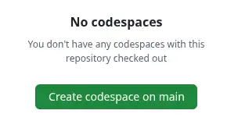
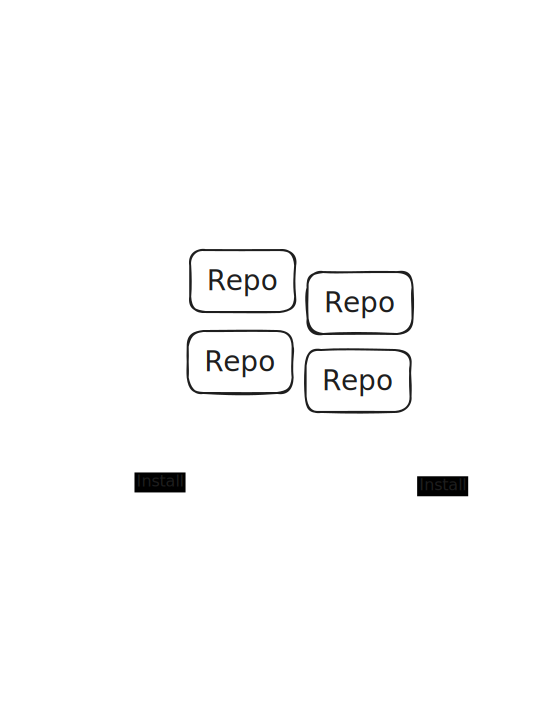
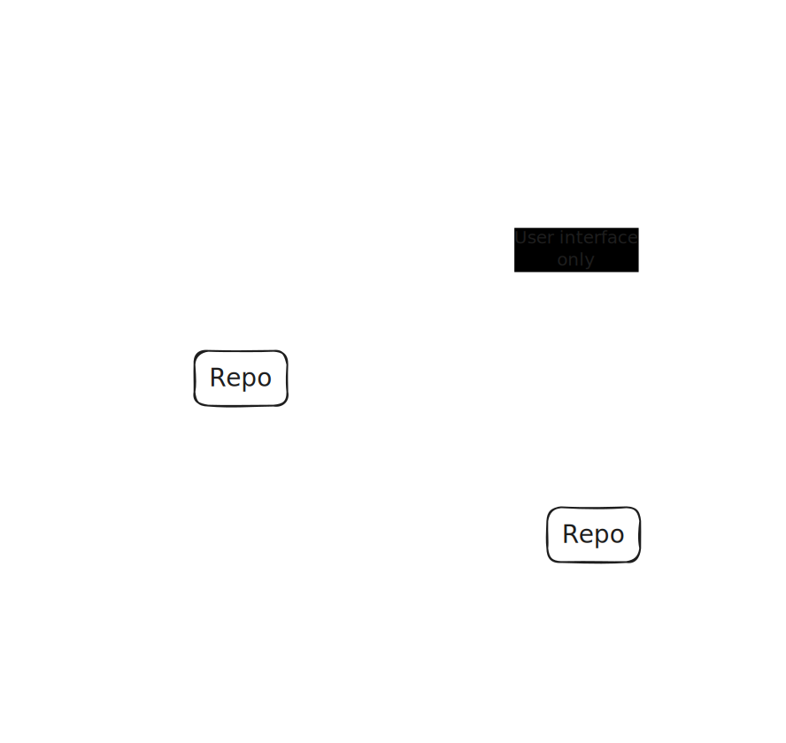
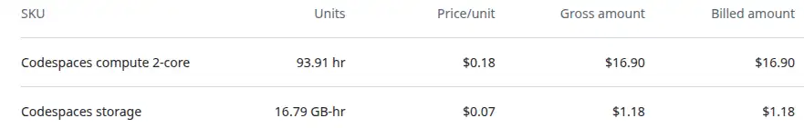

Back in early 2024 I tried GitHub Codespaces, and quickly ditched my local dev setup entirely. This post shares my experience going cloud-native for development: benefits for onboarding, agility, and security, alongside the real-world snags like network dependency and unexpected billing quirks.

<!-- more -->

A year ago, I wrote about [why I was giving GitHub Codespaces a serious try](../2024-04-23-codespaces/index.md) - mainly dealing with my security concerns. Fast forward to today, and that "try" has become my **exclusive** development environment. I have not touched my local VSCode setup for personal or professional work since then. From open-source contributions and evaluating new GitHub repos to building a product for a startup client who happened to be using GitHub, Codespaces has been my daily driver.

I found a few stumbling blocks here and there, but I see those as minor inconveniences. In my opinion, the benefits far outweigh the problems. Let's start with the rainbows before moving onto the rainclouds.

## Works on my machine, and yours

I joined a team and found another new team member who had been struggling to get their local development environment working correctly for a while. It was consuming a lot of their time, destroying their productivity, and the rest of the small team were unable to help.

[Codespaces uses the devcontainer spec](https://github.com/devcontainers). I had already created a [`devcontainer.json`](https://containers.dev/implementors/json_reference/) for the repo we were working on to get myself up and running. When I paired with my team-mate and saw the kinds of difficulties they were having, I suggested trying a Codespace. A couple of clicks plus a minute or so later, they were up and running in their web browser, able to start orienting themselves with the work in progress and very quickly started making significant contributions. It is not just the IDE - the OS version, supporting software like `gcloud` or `awscli` tooling to authenticate, IDE plugins - all of this can be quite easily managed as part of the repo.

There are different ways of running Codespaces, including plugging my local VSCode into the Codespace running in the cloud. (I think some [other IDEs like IntelliJ are supported by Codespaces](https://blog.jetbrains.com/blog/2022/11/09/remote-development-in-jetbrains-ides-now-available-to-github-codespaces-users/), but I have not tried them myself.) I used this option temporarily to continue working when an [obscure privacy setting I had enabled broke Codespaces and a number of other websites via a Chrome browser update back in October](../2024-10-20-google-chrome-oct-15-update-break/index.md). The devcontainer configuration can also be used with a local container runtime, although I was unable to get this working owing to my use of rootless Docker (and Podman) being unsupported at the time.

I've been using the browser-based VSCode option, and it places no more demand on my physical computer than Google Sheets. I can get away with a relatively cheap, light machine, and I have been stripping away software that I used to install and no longer need. The fact that I can source-control OS, software installation and configuration declaratively in the devcontainer setup and then anyone with a functional computer that can run a web browser can become productive in minutes feels like a huge step forward. I've certainly spent plenty of time over the years dealing with local environment problems on my own and other people's computers!

## Context-switching made easy

Switching between repos and branches was always a minor pain, occasionally a significant one. Do I have the repo cloned already? Is it up to date? Do I need to switch branches? Install dependencies? Urgh I have to stash everything before I can switch, and so on.

With Codespaces, I can stop what I'm doing and spin up a new instance on any branch at any point. I know I'm getting a consistent, isolated computing environment that's up to date. I can also keep a Codespace around for a while if I want, but I tend to spin one up for each new unit of work for team-based work. There's even a nice button to delete the associated Codespace when a PR is merged.

I automate dependency updates as part of my `devcontainer` initialization. I update OS packages when the Codespace starts, and I have scripts in the repos that automatically run to update project-specific packages every time I open a terminal. This ensures I and anyone else I'm working with are always using the latest versions, including security updates. I've talked about why in [how I do Python data supply chain security](../2024-05-01-how-i-do-python-supply-chain-security/index.md). A 30-second `pip` update and security scan is usually not noticeable running in the terminal window as I orient myself to the code and start thinking about how to proceed.

## Minimising blast radius

Before Codespaces, I felt that my local environment had a nasty concentrating effect on supply chain risk - all supply chains, for everything I'd worked on, brought together in once place.

<figure markdown="span">

<figcaption>Local development environments concentrate supply chain risk</figcaption>
</figure>

Now, with Codespaces, I feel that my local environment is well-isolated from each Codespace I use, exposed only to the user interface and interactions. Each Codespace is exposed to the minimal risk necessary for that specific piece of software.

<figure markdown="span">

<figcaption>Codespaces isolates supply chain risk to individual environments</figcaption>
</figure>

If I'm experimenting with a new library or evaluating an open-source repo that I don't trust, I can spin it up in a Codespace with a click. It has no access to anything other than what's in that empty Codespace. It's not the first time I've seen recommendations for software only to spin it up in a blank Codespace and find it's running three-year old dependencies that are riddled with critical vulnerabilities. Erm - I'll pass thanks.

Infostealing malware is all the rage for the bad actors these days. [A recent report says that infostealers stole 2.1 billion credentials in 2024](https://www.scworld.com/brief/most-credentials-stolen-using-infostealing-malware-report-finds). I'm scared of these things, I want to minimise the risk of being exposed to one, and the impact if it should happen.

If a package, IDE extension or some other software contains credential-stealing malware, it can only steal secrets that *that specific Codespace* has access to. There's still risk there as my Codespaces often contain powerful credentials like cloud authentication tokens, but I keep secrets Codespace-specific and I minimise the number of secrets and how long they are valid for. As far as I know, my local machine and web browser, logged into countless personal and professional services, is completely out of reach of malware that might slip into a Codespace.

The devcontainer setup for this website's repo is an example. [`devcontainer.json`](https://github.com/brabster/tw-site-mkdocs/blob/main/.devcontainer/devcontainer.json) points to a Dockerfile, setups up githooks and grants read access to a private fork of my mkdocs theme. Things are locked down by default and I need to explicity add permissions.

```json
{
  "build": { "dockerfile": "Dockerfile" },
  "postCreateCommand": "git config --local core.hooksPath .githooks/",
  "customizations": {
    "codespaces": {
      "repositories": {
        "brabster/mkdocs-material-insiders": {
          "permissions": {
            "contents": "read"
          }
        }
      }
    }
  }
}
```

The associated [Dockerfile](https://github.com/brabster/tw-site-mkdocs/blob/main/.devcontainer/Dockerfile) just updates the OS and installs a few packages related to image optimisation.

```dockerfile
FROM mcr.microsoft.com/devcontainers/python:3

# image processing dependencies for optimize plugin
RUN apt-get update && \
    apt-get install -y webp imagemagick bash-completion
```

I did not want to install those packages on my local machine, as I felt I couldn't justify the risk just to optimise my blog images, but in a Codespace, I don't see much risk. If one of those packages is compromised the bad actors might get credentials that let them read my private fork of my theme. Much less scary then the same compromise on my local machine.

Onto the rainclouds.

### The network tether

Codespaces, being cloud-based, demands consistent network connectivity. For me in the UK, on good home broadband or a stable phone hotspot, the latency is rarely noticeable. It feels just like working locally. There's no lag at the terminal, navigating directory structures, opening and scrolling through files is smooth. I've put together a [short video to illustrate what the experience of opening and starting work in a Codespace is like on a good network connection](https://www.youtube.com/watch?v=4sDDyr3Uhak).

When connectivity is slow or spotty, like when I'm on the train over to Manchester or up to Leeds, the experience deteriorates quickly. It's a bit of a "cliff edge": the terminal becomes laggy, file operations introduce noticeable spinners and delays, and eventually, Codespaces will pop up a "reconnecting" modal, halting all work. Working on trains over a patchy mobile network, for example, is usually frustrating. To be fair, I had already found working on the move through spotty network areas was frustrating. I normally need documentation or access to cloud-based services at some point - and that point will always be immediately after we head into a tunnel.

I've accepted the limitation and use that time for catching up on the reading I lament never having time to do, or working on Google Docs things in offline mode instead.

### The cost

GitHub offers a monthly free tier for personal accounts ([see GitHub Codespaces pricing](https://docs.github.com/en/billing/managing-billing-for-your-products/managing-billing-for-github-codespaces/about-billing-for-github-codespaces) for the latest details). Currently, this is 120 core hours and 15GB-month storage for Free plans, 180 core hours and 20GB for Pro plans. The smallest instance size you can get is two-core, so that's 60 hours by the clock on the wall, or about 3 hours a day for a 20-day working month (4.5 for the pro plan).

I did exceed these limits sometimes. You can get instances with more CPU cores and memory, and they are billed at higher rates, but I never needed to use one - the basic 2-core instance worked perfectly with the repos I needed. Codespaces automatically suspend after a configurable timeout (I think the default is 30 minutes, I reduced mine), but spending a lot of hours with a Codespace will eventually exceed the free tier. Running more than one Codespace at a time also runs up a bill faster, so I adapted to avoid doing that.

The 2-core instance bills at $0.18/hr (so the per-core price is currently $0.07/hr). Maybe a dollar a day for fairly heavy use, which aligns with the billing information I have available. GitHub changed their billing system in April 2025, and I've been unable to get any info from before that. What I do have is the bill for the startup I worked for, which came in at around $18 (orgs do not get the free tiers) for the heaviest month.

<figure markdown="span">
 
 <figcaption>GitHub codespaces billing</figcaption>
</figure>

So far, I've never run up enough usage or storage to get billed outside the free tier.

### Sharp edges in billing

I hit a particularly frustrating "sharp edge" with GitHub's billing system. Twice, despite being well within the free Codespaces tier, I was denied access to Codespaces because I had an insufficient balance to cover *other* minor GitHub charges (like sponsorships). Resolving this involved hours of contacting support to expedite the process. I now ensure my linked payment account always has enough to cover GitHub charges, and I've raised the issue with GitHub support. I'm sure they do not want to disincentivise people paying for the pro tier or sponsorships!

## Final thoughts and advice

If you're considering GitHub Codespaces as your primary development environment, here's my advice:

* Try it out on personal projects. Take advantage of the free tier. I write these blog posts in Codespaces!
* Codespaces (and [`devcontainer.json`](https://containers.dev/) in general) provide an environment that is far more similar to CI/CD systems like GitHub Actions than a traditional local setup. I'm experimenting with ways to reuse more between Codespaces and GitHub Actions.
* It's a far better experience than full virtual desktops. In my experience, full virtual desktop environments have always been sluggish and awkward to work with. Codespaces slots into my day-to-day working without getting in the way.
* Consider local devcontainers as a stepping stone. Using devcontainers for local development could bring some of the consistency and security benefits without, or before, fully shifting to the cloud. I tried local devcontainers first but ran into issues with my rootless container runtimes.
* Explore alternatives if GitHub isn't your ecosystem. While my experience has been tied to GitHub, similar concepts exist. For example, [Gitpod](https://www.gitpod.io/) is a cloud development environment that I've seen integrated with GitLab.

My year with GitHub Codespaces has been overwhelmingly positive. The day-to-day experience has been consistently good, sufficiently similar to local working that I've not been irritated by it. The challenges have not been a big deal and it's definitely my preferred option today given the choice!

--8<-- "ee.md"

--8<-- "blog-feedback.md"

