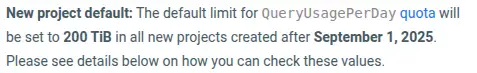

On September 1st 2025, Google will make BigQuery a lot safer by default, changing the default quotas for projects under the default on-demand pricing model. Instead of unlimited financial damage, the default for new projects will be around $1000 per day. Existing projects will be updated to a custom limit based on prior 30-day usage. No changes to existing limits.

--8<-- "ee.md"

<!-- more -->

I received an email entitled "[Action Advised] Review and set appropriate daily usage limit for BigQuery projects before Sep 1, 2025." yesterday. The content is a big step forward for making BigQuery safer by default. Unfortunately, Google's copyrighted the content so I can't share it in full here, and the quota documentation doesn't cover the full content, but I can summarize the key points.

## New projects

As of September 1st, 2025, new projects using the default on-demand BigQuery pricing model will have a daily usage limit 200TiB. The current model has no default limit, potentially leading to unlimited financial exposure as I've wrote about in [$1,370 Gone in Sixty Seconds](../2024-02-08-pypi-downloads-danger/index.md) and [The BigQuery Safety Net](../2024-02-16-bigquery-quotas/index.md).

Still, 200TiB is a lot, and at the $5/TiB current pricing, it's still $1000 per day. No big deal for most SMEs, but it'd hurt if I hit it! I see no indication that any smart adjustments will be made automatically based on usage patterns, so I'll still be setting my own values for these quotas anyway.

## Existing projects

If a project already has a quota value other than `unlimited` set for `QueryUsagePerDay` or `QueryUsagePerUserPerDay` then no changes will be made. Otherwise, Google will set a quota based on usage in the last 30 days.

## Auditing

THe changes will be visible in audit logs when they occur.

## Summary

There are a whole bunch of blog posts out there that are going to need updating!

Here are the [updated BigQuery quota-related docs](https://cloud.google.com/bigquery/quotas#query_jobs). BigQuery's defaults are about to get a lot safer, but could still hurt to the tune of $1000/day. I'll still be setting my own much lower values when I set up projects that use BigQuery.

--8<-- "blog-feedback.md"

