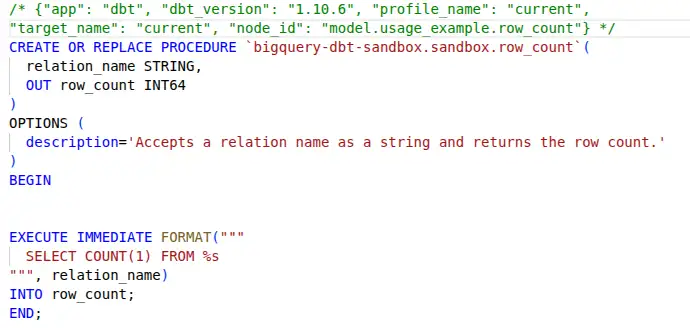
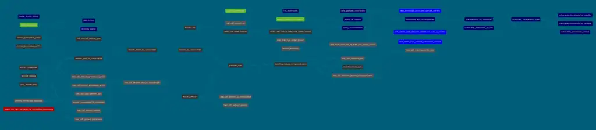

It's been over a year since I first wrote about [managing UDFs using custom dbt materializations](../2024-02-19-udf-dbt-models/index.md). The approach has held up well, but a recent project required me to go further and bring UDAFs (user-defined aggregate functions) and stored procedures into the fold. The same approach worked well, and [dbt Labs are considering adding formal support for UDFs](https://github.com/dbt-labs/dbt-core/blob/main/docs/roadmap/2025-05-new-engine-same-language.md#out-of-the-box-support-for-udfs)!

<!-- more -->

I've updated the `dbt_materialized_udf` repo with the updates and the new materializations. [`usage_example/README.md` covers examples of usage and testing for all the custom materializations](https://github.com/brabster/dbt_materialized_udf/blob/main/usage_example/README.md).

## New materializations

### User-defined aggregate function

Unlike UDFs that operate on a single row, UDAFs operate on groups of rows. My use case involved masking off groups that were too small for privacy reasons, and I wanted a single, testable, atomic function that took care of it to minimise the risk of accidents. `privacy_preserving_count` in use:

```sql
{{ config(
    materialized='udaf',
    parameter_list='threshold INT NOT AGGREGATE',
    description='Returns the count of rows, unless the count is less than threshold, when it returns NULL. NULL as threshold behaves as zero.'
) }}
IF(COUNT(1) < threshold, NULL, COUNT(1))
```

### Stored procedures and results

I've managed to largely avoid stored procedures in my career until recently, and I wrote about some of the [difficulties I found trying to find a clean approach for testing stored procedures](../2025-01-18-testing-stored-procedures/index.md) back in January. I wanted to use chi-squared hypothesis testing on several tables in a dataset, and I couldn't find a way of doing that without a lot of duplication or a stored procedure. The stored procedure is the only approach that allows me to parametrise the relation that is being tested, and [BigQuery has a community-provided chi-square procedure to do the job](https://github.com/GoogleCloudPlatform/bigquery-utils/blob/master/stored_procedures/README.md#chi_squaretable_name-string-independent_var-string-dependent_var-string-out-result-structx-float64-dof-float64-p-float64).

Stored procedures are just persistent objects in the database, so they fit into the pattern I've already established for other materializations pretty trivially. `row_count` in use:

```sql
{{
  config(
    materialized='procedure',
    parameter_list='relation_name STRING, OUT row_count INT64',
    description='Accepts a relation name as a string and returns the row count.'
  )
}}

EXECUTE IMMEDIATE FORMAT("""
  SELECT COUNT(1) FROM %s
""", relation_name)
INTO row_count;
```

On the other hand, stored procedures are scripts, and don't behave like anything else I've dealt with when they are executed. You `CALL` a stored procedure, and if it produces output, you have to pass in an "output variable" and then read it. Not a relation - an output variable. How can I incorporate that into a dbt pipeline?

The best solution I found is a custom materialization that creates or replaces a table, calls the procedure and then copies the result to the table. This example runs a hypothesis test over public data to see whether penguin species prefer specific islands (spoiler - they do). Here's model `test_penguins`:

```sql
{{ config(
    materialized='procedure_output',
    output_select='result.x AS chi_square_statistic, result.dof AS degrees_of_freedom, result.p AS p_value',
) }}
DECLARE result STRUCT<x FLOAT64, dof FLOAT64, p FLOAT64>;

CALL (bqutil.procedure.chi_square
    'bigquery-public-data.ml_datasets.penguins',
    'island',
    'species',
    result
);
```

The implementation uses the create-table-as-select approach, so the schema of the table is inferred. I'm sure there are nicer implementations - mine is minimal, but it works, and it enables testing of stored procedure output in a dbt-friendly style, like this:

```sql
SELECT
    *
FROM {{ ref('penguins') }}
WHERE
    degrees_of_freedom != 4.0
    OR p_value != 0
    OR FLOOR(chi_square_statistic) != 192
```

## Testing

I've [included tests for all the usage examples](https://github.com/brabster/dbt_materialized_udf/tree/main/usage_example/tests). They include revisiting the UDF materialization to cover the case of "generic" UDFs, where input types are `ANY TYPE` and you don't specify the output type, making BigQuery infer the return type. There are a few variants on the theme of UDF testing in there if you're struggling or looking for inspiration.

## Use in sources

I've also found that you can describe these custom materializations in dbt's source files. Example:

```yaml
version: 2

sources:
    - name: shared_functions
      database: my_db
      tables:
        - name: row_count
        - name: privacy_perserving_count
```

I can then reference them in the consumer project as `{{ source('shared_functions', 'row_count') }}`.

In a couple of larger projects, I've written the macros in one place and used them in another. Using a source definition helps me keep track of what is being used where and allows easy toggling between environments.

On one hand, using `sources` for this feels a bit weird. These aren't "data sources". However, they are "sources" in the sense of "source nodes for edges in the dbt graph". It feels like dbt's `sources` definition was intended more for the former meaning than the latter. More on the mental model later.

## Conclusion

These all work for me in BigQuery today, and based on the feedback I've had, they're easily converted to PostgreSQL and Snowflake, so likely others too. I set out to make sure my sharing of this work could help those who were looking for a solution without becoming part of anyone's supply chain, so I focused only on BigQuery and avoided generalisation.

Now, with dbt Labs expressing an intent to bring UDF support into the core product, I hope sharing that work and this update helps that effort happen and succeed. As a minimum, it'll need to be generalised to allow different types of adapters to implement the features for the various kinds of databases out there. I'll point out [this detailed set of generalisations over my work](https://github.com/dbt-labs/dbt-core/discussions/10395#discussioncomment-13967906) as a great start, and I look forward to making the repo an archive one day soon!

### Challenges

A few relatively minor challenges I've faced using this approach.

**Nodes like UDFs in the dbt graph aren't differentiated in the dbt docs visualisation**. In my pypi_vulnerabilities project, I have quite a few UDFs that build up a SQL-based semver parser. [I added in custom colours to try and differentiate the UDFs from other node types](https://brabster.github.io/pypi_vulnerabilities/#!/overview?g_v=1), but I'm no design whizz (although to be fair the [options for managing the colours in dbt config](https://docs.getdbt.com/reference/resource-configs/docs#custom-node-colors) are pretty limited...).

<figure markdown="span">
 
 <figcaption>A dbt docs graph where custom colours differentiate UDFs (brown) from other node types, clarifying the data pipeline's structure.</figcaption>
</figure>

In this figure, the network of UDFs is the brownish coloured nodes to the left and bottom. I think differentiating the different types of nodes (or maybe just differentiating between relations and non-relation nodes) helps understand how these pipelines hang together and function.

I also had a report of **breakage with the original UDF implementation on dbt Cloud**, which returned an empty array of relations. I didn't know what I should return for a UDF, the [documentation suggests that returning something for the "relation cache" is optional](https://docs.getdbt.com/guides/create-new-materializations?step=2#update-the-relation-cache) and the empty array worked and avoided assumptions. Creating a `relation` object and returning that fixed the problem, so it seems that returning something isn't actually optional in some execution contexts.

I've been unable to reproduce the problem myself, so I don't know more than that. I've updated the repo to return a `relation` object for each materialization type.

### On mental models

I think the other thing I should briefly mention to help this generalisation work is my mental model of dbt. Based on interactions with dbt Labs and the community over the last few years, I feel that the way dbt works and uses language can lead to a couple of different ways of thinking about it, and that might lead to difficulties in reaching consensus.

My mental model has dbt fulfilling a similar role to Terraform for the database. It creates persistent things, like tables, views, udfs, grants, stored procedures and so on. When I visualise what the dbt graph represents, it's mostly a description of how these kinds of objects are connected.

I think the other way of looking at it is from a data flow perspective, with the nodes representing how data moves through the pipeline. Given some of the internals of dbt, and the way "sources" are represented, I feel that this perspective might have been part of the original dbt thinking. It means that things that aren't relations don't feel like they fit well at the moment.

I'm sure I've read a blog post along these lines in the past, saying that it's hard to describe dbt due to it being a bit of a mix of the two. As dbt Labs consider incorporating non-relation elements as "first-class citizens" into the core of dbt, it may be important to recognise and resolve questions about how to think about dbt to avoid confusion and the forming of factions.

--8<-- "blog-feedback.md"

--8<-- "ee.md"
