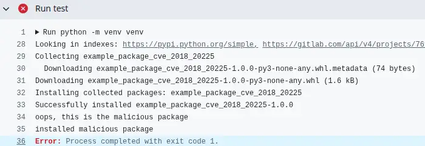

Python's built-in pip package manager has a dangerous behaviour when used with private package registries. If you specify your private registry with the `--extra-index-url` flag (there are other dangerous variants too), an attacker can publish a malicious package with the same name and a higher version to PyPI, and their package will be installed.

This post confirms that this is still a problem today and introduces [a test suite and publicly-available test packages](https://github.com/brabster/cve-2018-20225) that you can use to easily confirm the safety - or not - of your own setup.

<!-- more -->

## Two variants of package `example-package-cve-2018-20225`

I've written two variants of a new package that I'll use to demonstrate the problem. The package is essentially a single `__init__.py` file that prints a message to show which package has been installed, an empty `example.py` file and minimal metadata required to publish the package to a registry.

### The "safe" version

The "safe" version of the package is at version `0.0.1`. It prints `this is the safe, private package` when imported.

This package stands in for your intended, private package. I've [published it to GitLab](https://gitlab.com/api/v4/projects/76907979/packages/pypi/simple) and made the registry public for convenience of testing. I don't think the public accessibility of the registry affects the outcomes of my testing.

### The "malicious" version

The "malicious" version of the package is at version `1.0.0`. There's nothing special about that version, it's just a larger version than `0.0.1`.

This package prints "oops, this is the malicious package" when imported. It's [published to PyPI](https://pypi.org/project/example-package-cve-2018-20225/).

## Testing approach

I've created a matrix GitHub actions workflow to test a variety of install and update scenarios in parallel. There are far too many potential tools and combinations to even try to test them all, which is why I've made these packages available publicly. If you trust them, you can use them to test whatever specific scenario you want.

!!! warning
    Obviously if you use them, you're trusting, as a minimum, that my intentions are good and that my supply chain out to these packages is robust and under my control. I'd always recommend taking whatever precautions you can and I'm afraid I can't take any responsibility for anything bad that might happen :shrug:.

All the tests are run against the currently latest versions of the package management software. The tests report failure if the malicious package is installed. [You can see the current latest test run in the repo's GitHub actions tab.](https://github.com/brabster/cve-2018-20225/actions). You cal also see the packages and how I published them to PyPI and GitLab in the repo too.

## Test scenarios

I'm trying out a few scenarios I'm interested in. What happens when you specify various combinations of flags (including forgetting the flags) with pip?

### pip with and without flags

`pip install ${PACKAGE}`
: 🚨 Malicious (Default behaviour if the flags are forgotten)

`pip install ${PACKAGE} --index-url ${GITLAB_INDEX_URL}`
: ✅ Safe (Replaces PyPI with GitLab as the *only* source)

`pip install ${PACKAGE} --extra-index-url ${GITLAB_INDEX_URL}`
: 🚨 Malicious (Searches **both** PyPI and GitLab, installs highest version)

`pip install ${PACKAGE} --index-url ${PYPI_INDEX_URL} --extra-index-url ${GITLAB_INDEX_URL}`
: 🚨 Malicious (Sets PyPI as primary, GitLab as extra, same behaviour when flag order reversed)

`export PIP_EXTRA_INDEX_URL=${GITLAB_INDEX_URL}; pip install ...`
: 🚨 Malicious (Uses environment variable instead of CLI flag)

`pip install -r requirements.txt` (File contains `${PACKAGE}`)
: 🚨 Malicious (Installs from PyPI)

`pip install ${PACKAGE} --index-url ...; pip install -U ${PACKAGE} --extra-index-url`
: 🚨 Malicious (Installs "safe", then runs update (`-U`) with both indexes)

### GitLab's PyPI pass-through behaviour

[A GitLab registry will pass through requests for packages that it doesn't hold to PyPI. This is flagged as a security risk.](https://docs.gitlab.com/user/packages/pypi_repository/#package-request-forwarding-security-notice) I think it's actually a step forward from the various riskier alternatives, because you don't get the dependency confusion problem.

`pip install ${PACKAGE} requests --index-url ${GITLAB_INDEX_URL}`
: ✅ Safe (Installs target package + public lib (`requests`) from GitLab index only, succeeds and installs the right package)

### Is `uv` vulnerable?

There are many Python package managers and I'm not going to look at them all. `uv` is the current darling of the community and has [different  behaviour when this flag is used in a pip-like manner](https://docs.astral.sh/uv/reference/cli/#uv-pip-install--extra-index-url), so I'll take a look to confirm that.

`uv pip install ${PACKAGE} --extra-index-url ${GITLAB_INDEX_URL}`
: ✅ Safe (Uses `uv` with the risky flag)

`uv pip install ${PACKAGE} --index-strategy unsafe-best-match`
: 🚨 Malicious (Uses `uv` but forces legacy `pip` behavior)

## Summary

If you didn't know about this problem, don't feel bad. I wouldn't have known either had it not been for a [vulnerability scanner alerting me to it last year](../2024-05-18-handling-cve-2018-20225/index.md).

After twenty-odd years, I have opinions about the state of our industry and open source. I'll save that for another day, other than to say I wish we could stop handing the threat actors gifts and blaming the users of our software for not knowing about things that we *kinda* go out of our way not to tell them about. Sigh. Anyway...

- There are many ways to put yourself at risk of CVE-2018-20225; if you get it wrong, an attacker has a trivially easy route onto your computer or infrastructure.
- Being confident that what you're doing is safe isn't trivial; I've provided source code, a suite of scenario results and a test harness to help you.

### Avoid

- Using `--extra-index-url` with `pip`
- Using `--index-strategy` with `uv`

### Consider

- Using a private registry with a PyPI pass-through as the **only index**, which I demonstrated with GitLab.

--8<-- "blog-feedback.md"

--8<-- "ee.md"

