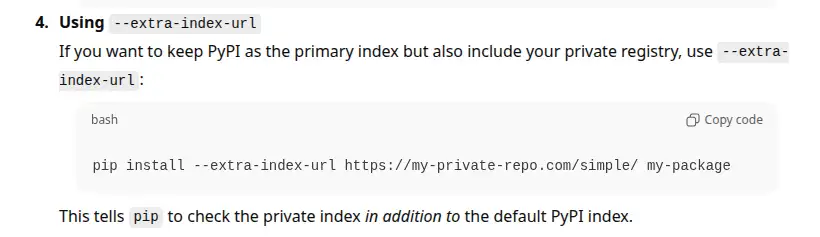

<figure markdown="span">
 ![A diagram illustrating a dependency confusion attack using Python's pip. The layout compares a "private registry" hosting a safe package (version 0.0.1) against a "public registry" hosting a malicious package of the same name (version 1.0.0). An arrow from the private registry is labeled "nope, too old," while an arrow from the public registry is labeled "winner!" pointing to the user's computer. The computer is stamped "COMPROMISED" because pip prioritized the higher version number found on the public index.](./assets/scenario.webp)
</figure>

Python's built-in pip package manager is unsafe when used with the `--extra-index-url` flag (there are other dangerous variants too). An attacker can publish a malicious package with the same name and a higher version to PyPI, and their package will be installed.

This post confirms that the vulnerability ([CVE-2018-20225](https://nvd.nist.gov/vuln/detail/cve-2018-20225)) is still a problem today. [Despite the CVSS 7.8 (High) CVSS score, the maintainers have refused to change the behaviour](https://github.com/pypa/pip/issues/12874).

I also introduce [a test suite and publicly-available test packages](https://github.com/brabster/cve-2018-20225) that you can use to more easily confirm the safety - or not - of your own setup.

<!-- more -->

## Two variants of package `example-package-cve-2018-20225`

I've written two variants of a new package that I'll use to demonstrate the problem. The package is essentially a single `__init__.py` file that prints a message to show which package has been installed when it's imported, along with minimal metadata required to publish the package to a registry.

### The "safe" variant

The "safe" variant of the package is at version `0.0.1`. It prints `this is the safe, private package` when imported.

This package stands in for your intended, usually private, package. I've [published it to GitLab](https://gitlab.com/api/v4/projects/76907979/packages/pypi/simple) and made the registry public for the convenience of testing.

### The "malicious" variant

The "malicious" variant of the package is at version `1.0.0`. There's nothing special about `1.0.0`, it's just "higher" than `0.0.1`.

This package prints `oops, this is the malicious package` when imported. It's [published to PyPI](https://pypi.org/project/example-package-cve-2018-20225/).

### Getting pwned

This is the kind of thing I’ve seen in the wild, thankfully without a malicious package hiding on PyPI waiting to pounce. This is **supposed** to install the safe package at version `0.0.1` from the private GitLab index, but...

```console title="Installing the wrong package" hl_lines="8 11"
$ pip install example_package_cve_2018_20225 --extra-index-url $GITLAB_INDEX
Looking in indexes: https://pypi.org/simple, https://gitlab.com/api/v4/projects/76907979/packages/pypi/simple
Collecting example_package_cve_2018_20225
  Obtaining dependency information for example_package_cve_2018_20225 from https://files.pythonhosted.org/packages/be/c3/801bbafdf280dde66839dd9ced6e95ffee8faf27174db2dff3fd8c943446/example_package_cve_2018_20225-1.0.0-py3-none-any.whl.metadata
  Using cached example_package_cve_2018_20225-1.0.0-py3-none-any.whl.metadata (74 bytes)
Using cached example_package_cve_2018_20225-1.0.0-py3-none-any.whl (1.6 kB)
Installing collected packages: example_package_cve_2018_20225
Successfully installed example_package_cve_2018_20225-1.0.0

$ python -c 'import example_package_cve_2018_20225'
oops, this is the malicious package
$ 
```

Oops. Hope that malicious package isn’t stealing your credentials, installing a backdoor, or some other nefarious activity…

## Testing approach

I've created a [GitHub actions workflow to test a variety of install and update scenarios](https://github.com/brabster/cve-2018-20225/blob/main/.github/workflows/test_cases.yml). There are far too many potential tools and combinations to test them all, which is why I've made these packages available publicly. You can use them to test whatever specific scenario you want.

!!! warning
    The usual disclaimers apply. My intentions are good, but that could change or I could be compromised in the future. Take whatever precautions you can to establish trustworthiness - I've kept the packages simple to aid manual audit.

All the tests are run against the latest versions (at time of writing) of the package management software. The tests report failure if the malicious package is installed. [You can see the current latest test run in the repo's GitHub actions tab](https://github.com/brabster/cve-2018-20225/actions). You can also see the packages and how I published them to PyPI and GitLab in the repo.

## Test scenarios

I'm trying out a few scenarios I'm interested in. What happens when you specify various combinations of flags (including forgetting the flags) with pip?

### pip with and without flags

- `pip install ${PACKAGE}`: 🚨 Malicious (Default behaviour if the flags are forgotten)
- `pip install ${PACKAGE} --index-url ${GITLAB_INDEX_URL}`: ✅ Safe (Replaces PyPI with GitLab as the only source)
- `pip install ${PACKAGE} --extra-index-url ${GITLAB_INDEX_URL}`: 🚨 Malicious (Searches both PyPI and GitLab, installs highest version)
- `pip install ${PACKAGE} --index-url ${PYPI_INDEX_URL} --extra-index-url ${GITLAB_INDEX_URL}`: 🚨 Malicious (Sets PyPI as primary, GitLab as extra, same behaviour when flag order reversed)
- `export PIP_EXTRA_INDEX_URL=${GITLAB_INDEX_URL}; pip install ...`: 🚨 Malicious (Uses environment variable instead of CLI flag)
- `pip install -r requirements.txt` (File contains `${PACKAGE}`): 🚨 Malicious (Installs from PyPI)
- `pip install ${PACKAGE} --index-url ...; pip install -U ${PACKAGE} --extra-index-url`: 🚨 Malicious (Installs "safe", then runs update with both indexes to get "malicious")

### GitLab's PyPI pass-through behaviour

[A GitLab registry will pass through requests for packages that it doesn't hold to PyPI. This is flagged as a security risk](https://docs.gitlab.com/user/packages/pypi_repository/#package-request-forwarding-security-notice). If you're exposed to this vulnerability, it seems like a solid step forward to me. It resolves the dependency confusion problem, works with different package managers and is easy for users.

- `pip install ${PACKAGE} requests --index-url ${GITLAB_INDEX_URL}`: ✅ Safe (Installs target package + public lib (`requests`) from GitLab index only, succeeds and installs the right package)

### Is `uv` vulnerable?

There are many Python package managers. `uv` is the current darling of the community and has [different behaviour when this flag is used in a pip-like manner](https://docs.astral.sh/uv/reference/cli/#uv-pip-install--extra-index-url). I've added a couple of tests to confirm the behaviour.

- `uv pip install ${PACKAGE} --extra-index-url ${GITLAB_INDEX_URL}`: ✅ Safe (Uses `uv` with the risky flag)
- `uv pip install ${PACKAGE} --index-strategy unsafe-best-match`: 🚨 Malicious (Uses `uv` but forces legacy `pip` behaviour)

### What about lockfiles?

Assuming you didn't already lock the malicious package, lockfiles only offer temporary protection. When you update, if you update unsafely, you get the malicious package.

## Summary

- There are many ways to put yourself at risk of CVE-2018-20225; if you get it wrong, an attacker has a trivially easy route onto your computer or infrastructure.
- Being confident that what you're doing is safe isn't trivial; I've provided source code, a suite of scenario results and a test harness to help you.

### Avoid

- Using `--extra-index-url` with `pip` 🚨
- Using `--index-strategy` with `uv` 🚨

### Consider

- Using a private registry with a PyPI pass-through as the **only index**, which I demonstrated with GitLab.

I doubt I would have known about this problem had it not been for a [vulnerability scanner alerting me to it last year](../2024-05-18-handling-cve-2018-20225/index.md). If you're currently exposed to this problem, you're certainly not alone. When I asked ChatGPT how to safely use a private package registry, the response it generated (based, of course on the content it's been trained on) included using `--extra-index-url` with no mention of this risk.

<figure markdown="span">
 
 <figcaption>ChatGPT recommending the vulnerable --extra-index-url approach</figcaption>
</figure>

--8<-- "blog-feedback.md"

--8<-- "ee.md"


